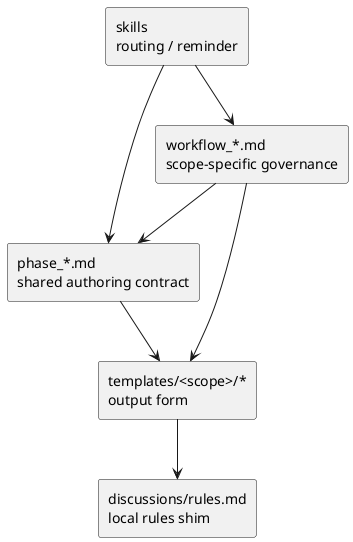
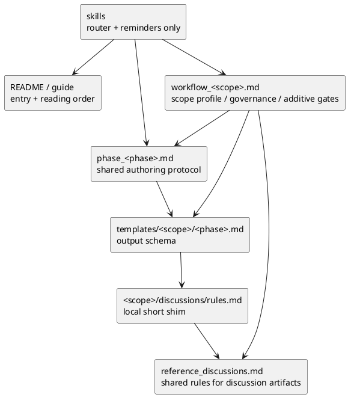
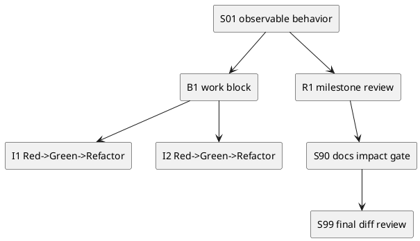

# 001-disc initiative epic issue の spec template と playbook の現状分析と理想形

## 議題
- 現在の `initiative / epic / issue` 向け requirement / design / plan template と、関連する playbook / workflow / rules / skill の責務分離が適切かを評価する。
- LLM / coding agent が日常的に読む前提で、どの情報をどこに置くのが最も実用的かを定義する。
- 特に Issue 実装計画の粒度、nested step、review / QA gate の計画埋め込みを、現行 template と `other-plan.md` を比較して再設計方針を出す。

## 結論サマリ
- 現状は「template は scope 差分を持つ」「`phase_*.md` は共通 authoring contract」「`workflow_*.md` は scope 固有 governance」という三層構造になっており、方向性自体は良い。
- 問題は構造そのものより、どのレイヤが何を正本として持つべきかの境界がまだ甘いことにある。
- 最善案は全面分割ではなく、**shared phase playbook をさらに共通 contract へ絞り、scope 固有の関心事・品質ゲート・読むべき観点を workflow 側へ厚く寄せ、template は出力フォームに徹する** ハイブリッドである。
- ただし plan だけは改善余地が大きい。Issue plan は `other-plan.md` に見られるような **nested step / milestone review gate / QA timing / final diff gate の明示** を取り込むべきで、Initiative / Epic plan も軽量な gate 設計を持つべきである。

## 調査範囲と方法
- 対象 template:
  - `src/spec_dock/assets/spec_dock/templates/{initiative,epic,issue}/{requirement,design,plan}.md`
  - `src/spec_dock/assets/spec_dock/templates/{initiative,epic,issue}/discussions/rules.md`
- 対象 playbook / workflow / guide:
  - `src/spec_dock/assets/spec_dock/docs/{phase_requirement,phase_design,phase_plan,workflow_initiative,workflow_epic,workflow_issue,guide,README}.md`
- 対象 skill:
  - `src/spec_dock/assets/codex_skills/spec-driven-tdd-workflow/SKILL.md`
  - `src/spec_dock/assets/codex_skills/spec-dock-{initiative-planning,epic-planning,issue-execution}.SKILL.md`
- 比較対象:
  - `spec-deps/completed/20260310t015028z-issue-iss-00019/discussions/006-disc-playbook-scope-splitting-analysis.md`
  - `spec-deps/completed/20260310t015028z-issue-iss-00019/discussions/other-plan.md`
- 追加視点:
  - consultant の既往分析
  - repo 内文書の line count / 見出し構造 / 責務の重なり

## 現状の棚卸し（As-Is）

### 1. 現在の文書レイヤ

- `README.md` / `guide.md` は入口。
- `workflow_initiative.md` / `workflow_epic.md` / `workflow_issue.md` は scope ごとの作業手順と品質ゲート。
- `phase_requirement.md` / `phase_design.md` / `phase_plan.md` は requirement / design / plan の共通作法。
- `templates/{initiative,epic,issue}/*` は実際に生成される文書の型。
- `discussions/rules.md` は各 scope 配下に置かれる運用ルール。
- skill は template ではなく docs を正本として参照している。

### 2. 文書量の偏り

| 文書 | initiative | epic | issue |
|---|---:|---:|---:|
| requirement template | 127行 | 114行 | 159行 |
| design template | 114行 | 151行 | 208行 |
| plan template | 86行 | 82行 | 169行 |

補足:
- `phase_requirement.md` 95行
- `phase_design.md` 97行
- `phase_plan.md` 105行
- `workflow_initiative.md` 63行
- `workflow_epic.md` 65行
- `workflow_issue.md` 77行

観測:
- Issue は requirement / design / plan の全てで最も重い。
- Initiative / Epic / Issue で関心事の差が大きく、特に plan は Issue だけ性質が明確に異なる。

### 3. scope ごとの差分

#### Initiative
- requirement:
  - `成功指標`
  - `ステークホルダー / 影響範囲`
  - `Initiative-level requirements`
- design:
  - `アーキテクチャ上の狙い`
  - `ガードレール`
  - `移行 / ロールアウト方針`
  - `ADR index`
- plan:
  - `ロードマップ`
  - `Epic 分解`
  - `計測計画`
  - `Epic Definition of Ready`

#### Epic
- requirement:
  - `E-RQ`
  - `E-AC`
  - `非機能要件`
  - `Initiative との紐づき`
- design:
  - `契約（API / Event / SoR）`
  - `データモデル設計`
  - `失敗設計`
  - `観測性`
  - `E-AC → テスト対応`
- plan:
  - `Issue 分割`
  - `Issue Definition of Ready`
  - `Epic 品質ゲート`
  - `ロールアウト / 移行`

#### Issue
- requirement:
  - `As-Is の観測点`
  - `AC / EC`
  - `用語`
  - `入力→出力例`
- design:
  - `既存実装/規約の調査結果`
  - `変更計画（ファイルパス単位）`
  - `要件 → 設計マッピング`
  - `テスト戦略`
- plan:
  - `1 step = 1 observable behavior`
  - `Red → Green → Refactor → review → fix → re-review`
  - `S90 docs impact`
  - `S99 final diff review quality gate`

### 4. 現在の責務分離

| レイヤ | 今やっていること | 評価 |
|---|---|---|
| `workflow_*.md` | scope 固有の再利用判定、作成、品質ゲート | 良いが、scope 差分をもっと明示してよい |
| `phase_*.md` | 共通の authoring 順、entry checklist、review / handoff gate | 方向性は良い |
| template | 実際の項目、必須/任意、frontmatter | 妥当 |
| `discussions/rules.md` | discussion docs の種別、命名、作成方法 | 内容が3本ほぼ同一で重複が大きい |
| skill | docs へのルーティング | 良い。template を正本にしていない点も良い |

## 現状の良い点

### 1. すでに「完全に1枚岩」ではない
- 旧来の「共通テンプレだけで全部吸収」ではなく、scope 別 template はすでに存在している。
- つまり issue の AC/EC と initiative の success metrics は分離済みであり、再構築の土台は悪くない。

### 2. skill が docs を正本としている
- leaf skill は `workflow_*.md` と `phase_*.md` を参照しており、template に運用ルールを押し込んでいない。
- これは「フォーム」と「ルール」を分ける設計として正しい。

### 3. issue workflow はすでに強い
- `workflow_issue.md` と issue plan template は、
  - plan upfront approval
  - docs impact
  - final diff review
  を持っており、GPT-5.2 時代の素朴な plan より成熟している。

## 現状の問題

### P1. shared と scope 固有の境界がまだ甘い
- `phase_*.md` は shared contract のつもりだが、scope 差分の匂いが残っている。
- 一方 `workflow_*.md` は scope 固有 governance のつもりだが、まだ「その scope で何を特に重視するか」の説明が薄い。
- 結果として、LLM は template を見ないと scope 差分を十分に掴めない場面がある。

### P2. template に「フォーム以上の意味」が乗りすぎている
- 実際の関心事の差は template に最も強く現れている。
- しかし template は読むための規約書ではなく、あくまで埋めるための器である。
- 読み手が template だけを頼る構造は、エージェント運用として弱い。

### P3. `discussions/rules.md` は3本ほぼ同じ
- scope 名と command 引数だけが違う。
- ルールの正本としては重複が大きい。
- 現状は discoverability のために各 scope に置いてあるが、SSOT の場所が曖昧。

### P4. plan だけは設計思想が古い部分が残る
- 現行 issue plan template は step ごとの review loop を要求するが、review の粒度設計は弱い。
- `other-plan.md` のような
  - nested step
  - 作業ブロック
  - マイルストーン review gate
  - QA / spec review の時点指定
  を持っていない。
- そのため、計画が「守るべき儀式の列挙」にはなるが、「どの粒度でレビューするのが最適か」の設計にはなっていない。

### P5. Initiative / Epic plan に review 設計がほぼない
- Initiative / Epic plan は roadmap / decomposition 中心で、レビューの配置や意思決定ゲートが弱い。
- その結果、Issue だけが重く、上位 scope は軽すぎるというバランスになっている。

## consultant / 第三者視点

### 1. 文書体系の観点
- consultant の要点:
  - 全面分割 `initiative/epic/issue × requirement/design/plan` は正本が増えすぎ、drift しやすい。
  - `shared playbook = 共通 contract`
  - `workflow = scope 固有 governance`
  - `template = 出力フォーム`
  という責務分離が最も保守しやすい。

### 2. 圧縮と LLM 可読性の観点
- 既往分析では、phase docs は 70〜80% 共通化可能とされた。
- 逆に言えば、共通 docs に scope 固有差分を書き始めるとすぐ膨らむ。
- LLM 向けには、共通 docs は「普遍ルールだけ」に寄せた方がよい。

### 3. plan 設計の観点
- `other-plan.md` は、現行 issue plan より次の点で優れている。
  - nested step / sub-step / iteration を明示する
  - review gate を計画に埋め込む
  - code review / QA / spec review の実施タイミングを事前に設計する
  - final diff review を branch 全体 gate として独立させる
- これは LLM にとっても良い。なぜなら「いつ何を検証すべきか」が plan に埋め込まれているため、手戻りとレビュー呼び出しのぶれが減る。

## 理想形（To-Be）

### 基本原則
- 1. ルール正本は docs に置く。template はフォームに徹する。
- 2. 共通原則は shared playbook に集約し、scope 固有差分は workflow に集約する。
- 3. requirement / design / plan の違いと、initiative / epic / issue の違いを別軸で整理する。
- 4. plan には「実行順」だけでなく「レビュー順」と「品質ゲート順」を埋め込む。
- 5. LLM が 1 回で読むべき文書は少なく、しかし必要な判断材料には必ず到達できる構造にする。

### 理想のレイヤ構造

## どうあるべきか

### A. shared phase playbook はさらに「共通 protocol」に寄せる

`phase_requirement.md`
- 固定するもの:
  - As-Is を事実で押さえる
  - WHAT / WHY / scope / success を固定する
  - ヒアリング前に discussion sheet を作る
  - reviewer loop を通して design へ handoff する
- 書かないもの:
  - initiative / epic / issue 固有の項目詳細
  - scope 固有の gate

`phase_design.md`
- 固定するもの:
  - requirement を HOW / guardrails へ落とす
  - 既存実装調査と比較を行う
  - disc / ADR の使い分け
  - plan に渡せる設計束を作る

`phase_plan.md`
- 固定するもの:
  - requirement / design を execution plan に変換する
  - 分解、順序、停止点、review point を決める
  - 実行前 reviewer loop を通す
- 書かないもの:
  - issue 固有の TDD 手順の詳細

### B. workflow は scope profile を明示する

`workflow_initiative.md` に強く書くべきこと
- 何を投資単位とみなすか
- どの success metrics が initiative の本質か
- 既存 initiative 再利用の判定軸
- Epic 分解へ handoff するための gate
- Initiative plan review の粒度

`workflow_epic.md` に強く書くべきこと
- E2E 能力と受け入れ条件
- 契約 / 移行 / 観測性 / NFR が epic の中心であること
- Issue 分割の原則
- Epic plan でどこまでレビュー設計を持つか

`workflow_issue.md` に強く書くべきこと
- AC / EC / 観測点中心で動くこと
- 実装前に requirement / design / plan 整合を取ること
- nested step と milestone gate の運用
- docs impact / final diff review / report の強制

### C. template は「出力 schema」に徹する

template に残すべきもの
- frontmatter
- 必須 / 任意の項目
- 各項目に何を書くかの短い指示
- 最低限の見出し

template から減らすべきもの
- 長い運用ルール
- workflow の繰り返し説明
- reviewer の呼び方の長文
- discussion docs の扱いの詳細説明

### D. discussions rules は shared SSOT を持つ

現状:
- `initiative/epic/issue/discussions/rules.md` はほぼ同一。

理想:
- shared な discussion ルールは 1 つの reference に集約する。
- 各 scope 配下の `discussions/rules.md` は短い shim にする。

shim に残す内容
- この `discussions/` は何のための場所か
- この scope に対する `new doc <type> --<scope> <id>` の代表例
- shared rule へのリンク

## plan 再設計の理想形

### 1. Initiative plan
- roadmap と epic decomposition だけでは不十分。
- 次を追加すべき:
  - milestone review gate
  - investment checkpoint
  - metric review timing
  - Epic 着手前に必要な意思決定

### 2. Epic plan
- Issue 一覧だけでなく、次を持つべき:
  - issue grouping
  - rollout tranche
  - epic integration review gate
  - E-AC をどの issue 群で閉じるか

### 3. Issue plan
- 現行テンプレより、次の形が望ましい。

望ましい設計:
- top-level step:
  - 観測可能な成果
- work block:
  - 同じ関心事や変更境界を持つ作業束
- iteration:
  - 小さな `Red → Green → Refactor`
- review gate:
  - 各 sub-step ごとではなく、計画で定義した milestone ごとに行う

### 4. Issue plan に入れるべき gate 種別
- `implementation review gate`
  - まとまった変更境界ごと
- `qa review gate`
  - テスト妥当性、境界条件、回帰漏れ
- `spec review gate`
  - requirement / design 逸脱確認
- `docs impact gate`
  - docs / shipped assets / workflow 差分の反映要否
- `final diff review gate`
  - branch 全体差分の承認

### 5. 現行 issue plan から改善すべき点
- 各 step 末尾の review ループを mandatory にする思想自体は悪くない。
- ただし、今の書き方だと
  - step と review 境界
  - micro TDD cycle と reviewer 呼び出し境界
  が分離されていない。
- 理想は、
  - `micro cycle は細かく`
  - `review gate は節目で`
  である。

## 推奨アーキテクチャ案

### 推奨案: hybrid strengthening
- 維持するもの:
  - shared `phase_*.md`
  - scope 別 `workflow_*.md`
  - scope 別 template
- 強化するもの:
  - workflow に scope profile を追加
  - discussion rules の shared SSOT
  - plan template の review planning

### 採らない案

#### 全面分割
- `initiative_requirement.md` など 9 文書以上へ増やす案
- 不採用理由:
  - drift しやすい
  - skill の参照先が増える
  - 共通原則更新が多点更新になる

#### template 中心運用
- template を見ればよい、という設計
- 不採用理由:
  - template は記入フォームであり、運用ルールの正本ではない
  - LLM の読み順として不安定

## 実務レベルの理想像

### Initiative
- requirement:
  - 投資理由
  - success metrics
  - stakeholder / impact
- design:
  - architectural drivers
  - target guardrails
  - migration / observability
- plan:
  - roadmap
  - epic decomposition
  - milestone gate

### Epic
- requirement:
  - E2E capability
  - E-AC
  - NFR
- design:
  - contract
  - data / failure / migration / observability
- plan:
  - issue slicing
  - integration order
  - epic gate

### Issue
- requirement:
  - As-Is facts
  - AC / EC
  - scope boundary
- design:
  - existing implementation understanding
  - file-level change plan
  - test strategy
- plan:
  - nested execution plan
  - milestone review design
  - docs impact / final diff gate

## 判断
- 現状は「壊れている」のではなく、「GPT-5.4 / consultant / multi-agent 前提に最適化し直す余地が大きい」状態である。
- 既存資産の中で最も再構築すべきなのは plan。
- その次が workflow の scope profile 強化。
- shared phase playbook は全面分割より、共通 protocol への純化がよい。

## 次アクション
- 1. To-Be に基づく文書責務の再定義シートを作る
- 2. 各 scope × phase の template redesign 案を作る
- 3. 先に issue plan template を再設計し、nested step / milestone gate の標準形を固める
- 4. その後 initiative / epic plan に軽量 gate 設計を反映する
- 5. workflow と discussion rules の整理を行う
