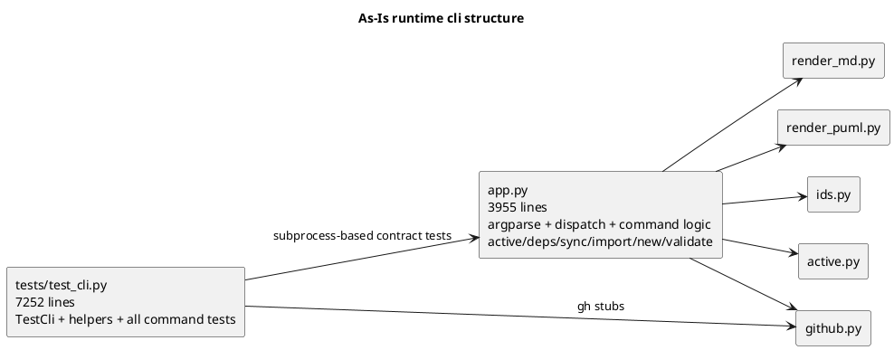
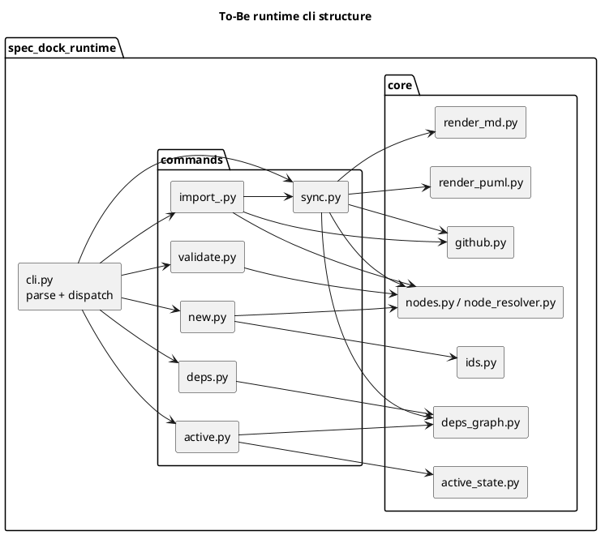
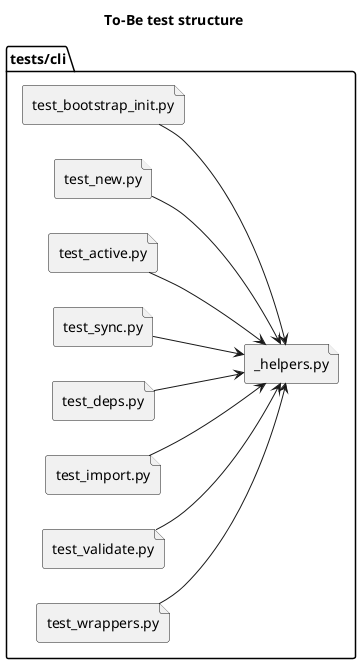

# disc-001 runtime cli 分割と cli テスト再編に向けた現状分析

## 議題 (必須)
- GitHub Issue #25 の着手前提として、runtime CLI と CLI テストの現状構造、課題、分割境界、あるべき状態を整理する。
- requirement.md を起こす前に、どの分割方針が最も低リスクで保守性改善に効くかを明確化する。
- `app.py` と `tests/test_cli.py` をどの粒度で再編すると、CLI 契約維持と将来の変更容易性を両立できるかを判断する。

## 背景 (必須)
- 現在のブランチは `chemitaro/issue25` で、GitHub Issue #25 は「巨大な `app.py` を複数 module に分割し `tests/test_cli.py` を領域別に再編する」ことを目的としている。
- Issue #25 の完了イメージは次の 4 点に要約できる。
  - `app.py` を orchestration 中心まで薄くする。
  - runtime CLI の主要責務を module 単位に整理する。
  - テストを領域別に分割し、変更点理解と回帰保証を両立しやすくする。
  - 既存 CLI 契約と green を維持する。
- 実測では [app.py](/srv/mount/spec-dock/src/spec_dock/assets/spec_dock/scripts/spec_dock_runtime/app.py) が 3955 行、[test_cli.py](/srv/mount/spec-dock/tests/test_cli.py) が 7252 行ある。
- 既に `ids.py` `github.py` `render_md.py` `render_puml.py` `active.py` などの補助 module は存在するが、主要な command orchestration と状態導出は依然として [app.py](/srv/mount/spec-dock/src/spec_dock/assets/spec_dock/scripts/spec_dock_runtime/app.py) に集中している。
- 本分析では、メインエージェントの repo 調査に加えて、`repo_analyst` からの構造分析、`consultant` からの分割戦略比較、`spark_worker` からの懐疑的レビューを統合した。

## 現状理解 (As-Is)

### 1. runtime CLI は command 実装と domain 処理が単一ファイルに集中している
- [app.py](/srv/mount/spec-dock/src/spec_dock/assets/spec_dock/scripts/spec_dock_runtime/app.py) には `new/import/active/sync/deps/validate` の command 実装、Git 連携、active manifest 操作、dependency 評価、artifact 出力、argparse 定義、main dispatch が同居している。
- とくに次がホットスポットになっている。
  - `_sync` 493 行: [app.py#L1886](/srv/mount/spec-dock/src/spec_dock/assets/spec_dock/scripts/spec_dock_runtime/app.py#L1886)
  - `_deps_evaluate_v2` 333 行相当の帯域の起点: [app.py#L2516](/srv/mount/spec-dock/src/spec_dock/assets/spec_dock/scripts/spec_dock_runtime/app.py#L2516)
  - `_build_deps_state` 帯域: [app.py#L2862](/srv/mount/spec-dock/src/spec_dock/assets/spec_dock/scripts/spec_dock_runtime/app.py#L2862)
  - `_parse_args` 167 行: [app.py#L3657](/srv/mount/spec-dock/src/spec_dock/assets/spec_dock/scripts/spec_dock_runtime/app.py#L3657)
  - `main` 126 行: [app.py#L3826](/srv/mount/spec-dock/src/spec_dock/assets/spec_dock/scripts/spec_dock_runtime/app.py#L3826)

### 2. command ごとの責務帯域はすでに見えている
- `_new_initiative` [app.py#L372](/srv/mount/spec-dock/src/spec_dock/assets/spec_dock/scripts/spec_dock_runtime/app.py#L372)
- `_new_epic` [app.py#L447](/srv/mount/spec-dock/src/spec_dock/assets/spec_dock/scripts/spec_dock_runtime/app.py#L447)
- `_new_issue` [app.py#L540](/srv/mount/spec-dock/src/spec_dock/assets/spec_dock/scripts/spec_dock_runtime/app.py#L540)
- `_new_doc` [app.py#L684](/srv/mount/spec-dock/src/spec_dock/assets/spec_dock/scripts/spec_dock_runtime/app.py#L684)
- `_active_set` [app.py#L1555](/srv/mount/spec-dock/src/spec_dock/assets/spec_dock/scripts/spec_dock_runtime/app.py#L1555)
- `_sync` [app.py#L1886](/srv/mount/spec-dock/src/spec_dock/assets/spec_dock/scripts/spec_dock_runtime/app.py#L1886)
- `_deps_check` [app.py#L2381](/srv/mount/spec-dock/src/spec_dock/assets/spec_dock/scripts/spec_dock_runtime/app.py#L2381)
- `_import_initiative` [app.py#L1391](/srv/mount/spec-dock/src/spec_dock/assets/spec_dock/scripts/spec_dock_runtime/app.py#L1391)
- `_import_epic` [app.py#L1429](/srv/mount/spec-dock/src/spec_dock/assets/spec_dock/scripts/spec_dock_runtime/app.py#L1429)
- `_import_issue` [app.py#L1487](/srv/mount/spec-dock/src/spec_dock/assets/spec_dock/scripts/spec_dock_runtime/app.py#L1487)
- `_validate` [app.py#L3646](/srv/mount/spec-dock/src/spec_dock/assets/spec_dock/scripts/spec_dock_runtime/app.py#L3646)
- つまり「何で切るか」が見えないのではなく、「切る順番と共通核の扱い」が未整理な状態である。

### 3. `_sync` と `active/deps` は結合の中心で、分割時の事故点でもある
- `repo_analyst` の指摘どおり、`import` 系 3 コマンドは `_sync(... update_active=False, migrate_active=False)` を直接呼ぶため、`_sync` の変更は import の副作用契約にも波及する。
- `_active_set` は `deps 評価 -> manifest 書込 -> active pointer 適用 -> agent state patch` の副作用順序を持ち、この順序自体が契約になっている。
- `_deps_check` は `ready=true -> exit 0`, `ready=false -> exit 3`, `--json` 時の stdout/stderr 分離など、CLI 契約として壊しやすい。

### 4. テストはすでに論理グループを持っているが、物理的には 1 クラスへ集中している
- [tests/test_cli.py](/srv/mount/spec-dock/tests/test_cli.py) は `TestCli` 1 クラスに helper と全 command 契約テストが集約されている。
- helper 集中帯:
  - `_run_runtime*` 群: [test_cli.py#L66](/srv/mount/spec-dock/tests/test_cli.py#L66)
  - `_make_gh_issue_*_stub` 群: [test_cli.py#L178](/srv/mount/spec-dock/tests/test_cli.py#L178), [test_cli.py#L213](/srv/mount/spec-dock/tests/test_cli.py#L213)
- テスト密集帯は明確に分かれている。
  - `test_new_*`: 33 件 / 1026 行相当
  - `test_sync_*`: 31 件 / 1758 行相当
  - `test_deps_*`: 27 件 / 999 行相当
  - `test_active_set_*`: 25 件 / 1509 行相当
  - `test_import_*`: 18 件 / 634 行相当
- つまり、再編は無理に新しい分類を発明する必要はなく、既存 prefix と helper 依存を整理する形で進められる。

### 5. すでに module 化されているものと、まだ混在しているものが不揃い
- 既存 module:
  - [ids.py](/srv/mount/spec-dock/src/spec_dock/assets/spec_dock/scripts/spec_dock_runtime/ids.py)
  - [github.py](/srv/mount/spec-dock/src/spec_dock/assets/spec_dock/scripts/spec_dock_runtime/github.py)
  - [render_md.py](/srv/mount/spec-dock/src/spec_dock/assets/spec_dock/scripts/spec_dock_runtime/render_md.py)
  - [render_puml.py](/srv/mount/spec-dock/src/spec_dock/assets/spec_dock/scripts/spec_dock_runtime/render_puml.py)
  - [active.py](/srv/mount/spec-dock/src/spec_dock/assets/spec_dock/scripts/spec_dock_runtime/active.py)
- ただし `_active_entry_id` のような helper は [active.py](/srv/mount/spec-dock/src/spec_dock/assets/spec_dock/scripts/spec_dock_runtime/active.py) と [render_puml.py](/srv/mount/spec-dock/src/spec_dock/assets/spec_dock/scripts/spec_dock_runtime/render_puml.py) に重複しており、責務境界がまだ安定していない。
- [deps.py](/srv/mount/spec-dock/src/spec_dock/assets/spec_dock/scripts/spec_dock_runtime/deps.py) は現状ほぼ re-export のみで、`app.py` 内の deps 本体ロジックが未抽出のままである。

## 現状の構造図

## あるべき状態 (To-Be)

### 1. `app.py` 相当は CLI orchestration に限定される
- `parse args`
- `dispatch`
- `top-level error/exit handling`
- 上記以外の command 固有処理は command module へ委譲する

### 2. 分割軸は「まず command-first、ただし共通核だけ先に安定 API 化」が最も低リスク
- `consultant` の整理では、純粋な layer-first は最終形としては美しいが、今のコードは command 手順と domain 操作が密結合なため最初の一歩が重い。
- 一方で file split だけの機械分割では hidden dependency を温存してしまう。
- そのため、
  - 第1軸は `new/import/active/sync/deps/validate` の command 境界
  - 第2軸は `node resolution / active manifest / github issue lookup / deps evaluation` の共通核
 という二段構えが適切である。

### 3. テスト再編は「振る舞い境界ベース」で行う
- `spark_worker` の懐疑的レビューでは、改善の証拠は「1テスト群=1責務」が明確になり、失敗時にどのコマンド契約が壊れたかを即断できることだと整理された。
- 追加の `consultant` 見解では、最初の大分割は `installer` と `runtime` を切り分けるのが自然で、`init/update` は [src/spec_dock/cli.py](/srv/mount/spec-dock/src/spec_dock/cli.py) 側に対応する bootstrap 契約、`new/active/sync/deps/import/validate/wrappers` は runtime 契約として分けるのがよいとされた。
- したがって、helper を一箇所に寄せつつ、テスト本体は command 契約ごとに分けるべきである。
- 推奨される整理原則:
  - `installer(init/update)`
  - `runtime(new/active/sync/deps/import/validate/wrappers)`
  - `new`
  - `active`
  - `sync`
  - `deps`
  - `import`
  - `validate`
  - `wrappers`

## 目標構造図

## テスト再編図

## 選択肢 (必須)

### Option A: command-first で分割する
- 内容:
  - `app.py` を CLI 薄層にし、`commands/new.py` `commands/active.py` `commands/sync.py` `commands/deps.py` `commands/import_.py` `commands/validate.py` のように command 単位で移す。
  - テストも command 契約単位で分ける。
- Pros:
  - 既存の関数境界、テスト prefix、Issue #25 の意図と最も整合する。
  - 段階移行しやすい。
  - CLI 契約を保ちながら `app.py` を速く薄くできる。
- Cons:
  - 共通処理を意識的に寄せないと duplicate helper を新 module に再生産しやすい。

### Option B: domain/service-first で分割する
- 内容:
  - `nodes/active/deps/github/render/validation` のような横断レイヤを先に固め、CLI はそれを呼ぶだけにする。
- Pros:
  - 長期的には依存方向がきれい。
  - 将来の別 UI や拡張にも耐えやすい。
- Cons:
  - 現在のコードの密結合度では初手の変更面積が大きい。
  - 抽象だけ増えて command の見通しが逆に悪化するリスクがある。

### Option C: まず file split だけ行い、中身は後で整理する
- 内容:
  - 関数を単に別ファイルへ移し、挙動改善や責務再定義は先送りにする。
- Pros:
  - 初回差分は小さく見える。
- Cons:
  - hidden dependency と `dict[str, Any]` の暗黙契約が温存される。
  - 「分けたのに読みにくい」状態を作りやすく、Issue #25 の本旨に届きにくい。

## consultant / analyst 見解の統合
- 一致点:
  - まずは command-first が現実的。
  - ただし共通核の API 化を伴わない機械分割は避けるべき。
  - テストは helper と振る舞い境界を分離し、失敗局所化を改善すべき。
- `repo_analyst` が特に重視した事実:
  - `_sync` と `main` と `_parse_args` が中心ボトルネックである。
  - `_active_set` の副作用順序と `_deps_check` の exit code 契約は移設時の最重要互換点である。
  - import 系が sync に直接依存しているため、sync 分割は import の回帰保証とセットで考える必要がある。
- `consultant` が特に重視した論点:
  - 低リスクで前進するには `Option A + 最小限の core 抽出` が最適。
  - `helpers.py` 的な雑多モジュールや、曖昧な共通化は避けるべき。
- `spark_worker` が特に重視した評価軸:
  - テスト失敗時の診断時間短縮
  - テスト間カップリング低下
  - 共通セットアップの重複削減

## 推奨案 (必須)
- 現時点の推奨は **Option A を主軸に、Option B の最小コアだけ先に抜く方針**。
- 具体的には次の順序がよい。
  1. `parse args` と `main` を CLI 薄層へ分離する。
  2. テストを `installer` と `runtime` に大別し、runtime 側 helper を抽出する。
  3. `new/import/active/sync/deps/validate` を command module へ移す。
  4. その過程で、再重複しやすい `node resolution / active manifest / deps evaluation / github lookup` だけを `core` に寄せる。
  5. runtime 契約テストを command ごとに物理分割する。
- この方針が Issue #25 に最も適合する理由:
  - `app.py` を早く薄くできる。
  - 既存 CLI 契約を守る検証単位をそのまま test file 構成に反映できる。
  - 将来さらに layer-first に深める余地を残せる。

## requirement 前に固定したい制約
- 既存コマンド名、引数、exit code、stdout/stderr 契約を変えない。
- `sync --force` や import 系の `update_active=False` 系契約を壊さない。
- 生成物パスとファイル名を変えない。
- shipped asset 配下の変更として扱い、installer/update/test 影響を常に確認する。
- テストは hermetic を維持し、`gh` 依存は引き続き stub で扱う。

## 未決事項 (任意)
- `commands/` と `core/` のディレクトリをこの issue で同時導入するか、まず `commands/` だけに留めるか。
- `init/update` テストを `bootstrap` 系として独立させるか、`test_init.py` / `test_update.py` に分けるか。
- helper の置き場を `tests/cli/_helpers.py` とするか、既存 `TestCli` を一時的な base class 化で凌ぐか。

## 次アクション (必須)
- この分析をもとに `spec-deps/current/requirement.md` を具体化する。
- requirement では少なくとも以下を明文化する。
  - scope: どの command/test 群まで今回の分割対象とするか
  - constraints: CLI 契約、artifact 契約、exit code 契約
  - acceptance criteria: `app.py` の責務縮小、テスト分割、green 維持
- 続く design では、`commands/` と `core/` の依存方向、移行順序、回帰テスト計画を確定する。
