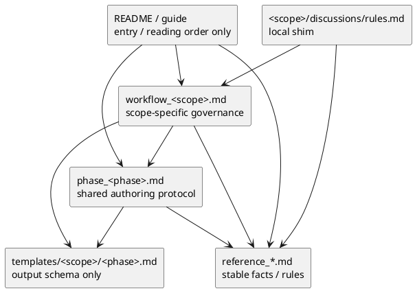

# 002-disc spec-dock 文書責務の再定義

## 結論
- spec-dock の文書体系は、**入口案内 / 運用ルール / 共通 authoring protocol / 出力 schema / 参照仕様 / local shim** の 6 層に分けるのが最も堅い。
- 判断基準は 2 つだけでよい。
  - LLM が最短で正しい正本に到達できるか
  - 同じ意味のルールが複数文書に重複して drift しないか
- この観点では、template をルール正本にしてはいけない。template はあくまで「書く器」であり、`workflow_*.md` と `phase_*.md` が運用の正本であるべき。

## 何を決めるか
- どの文書タイプが何の責務を持つか
- 各文書タイプに何を書いてよいか
- 何を書いてはいけないか
- LLM / coding agent がどう読むべきか
- 文書間の依存関係と SSOT の優先順位

## 再定義の原則

### 原則 1. 1 文書 1 責務
- 文書は「案内」「ルール」「フォーム」「参照仕様」を混ぜない。
- 1 文書が複数の役割を持つと、LLM がどの解釈を優先すべきか曖昧になる。

### 原則 2. template はフォームであってルールではない
- template は output schema。
- 「何を書くか」の短い補助は書いてよい。
- 「どう進めるか」「いつレビューするか」「どこを正本とするか」は書いてはいけない。

### 原則 3. workflow は scope 固有、phase playbook は phase 固有
- `workflow_*.md` は `initiative / epic / issue / adr` ごとの差分を持つ。
- `phase_*.md` は `requirement / design / plan` ごとの差分を持つ。
- 2 軸を混ぜてはいけない。

### 原則 4. reference は例外なく facts / rules の正本
- 命名規則、GitHub 挙動、deps / sync などの仕様は `reference_*.md` に固定する。
- workflow や README がそれを再説明してはいけない。

### 原則 5. README / guide は入口以上のことをしない
- 読み順と位置づけだけを提供する。
- 文書体系の正本になってはいけない。

### 原則 6. local shim は discoverability のためにだけ存在する
- `discussions/rules.md` は local context で迷わないための入口。
- shared ルールの正本ではない。

## 推奨アーキテクチャ

## 文書責務マトリクス

| 文書タイプ | 主責務 | 主読者 | 書いてよいこと | 書いてはいけないこと | 依存先 |
|---|---|---|---|---|---|
| `README.md` | 最短入口 | 初回起動の LLM / 人間 | 読み順、主要 docs への導線、最短コマンド | 詳細ルール、品質ゲート、項目定義 | `guide.md`, `workflow_*.md`, `reference_*.md` |
| `guide.md` | 全体像とレイヤ説明 | 初回理解の LLM / 人間 | docs の読み分け、概念、SSOT、代表構造 | 各 workflow の詳細、template 項目解説 | `workflow_*.md`, `phase_*.md`, `reference_*.md` |
| `workflow_*.md` | scope 固有 governance | 対象 scope を扱う LLM / 人間 | 再利用判定、作成導線、scope 固有 gate、scope profile、handoff 条件 | naming / GitHub / deps などの仕様詳細、template の全項目説明 | `phase_*.md`, `reference_*.md`, template |
| `phase_*.md` | phase 固有の共通 authoring protocol | requirement / design / plan を書く LLM | 前提入力、標準順、discussion / ADR の使い分け、shared gate | scope 固有 gate、scope 固有項目一覧の詳細再説明 | `workflow_*.md`, template, `reference_*.md` |
| `templates/<scope>/<phase>.md` | output schema | 実際に文書を書く LLM / 人間 | frontmatter、見出し、必須/任意、短い記入補助 | 運用ルール、レビュー手順、文書間責務の説明 | `workflow_*.md`, `phase_*.md` |
| `reference_*.md` | 安定仕様の正本 | 全読者 | naming、GitHub、副作用、sync、deps などの事実とルール | 進め方、phase の作法、scope 固有判断 | なし |
| `discussions/rules.md` | local shim | その node 配下で作業する LLM / 人間 | discussion docs の種類、代表コマンド、shared rule への導線 | 長い shared rule、背景説明、template 論 | shared discussion reference, `reference_naming.md` |
| skill (`SKILL.md`) | routing / reminder | agent | 入口 docs、優先参照先、注意点の short reminder | 実運用ルールの詳細、template 項目の再記述 | `workflow_*.md`, `phase_*.md`, `reference_*.md` |

## 文書タイプ別の再定義

### 1. `README.md`

責務
- 初回の「どこから読めばよいか」を決める。

書いてよいこと
- 最短の読み順
- 最短コマンド
- 高頻度ルールの見出しだけ

書いてはいけないこと
- quality gate の詳細
- template の項目説明
- naming / GitHub / deps の詳細

理由
- README が太ると、入口が第二の仕様書になる。
- 入口が重いと、LLM は最初の読み込みで不要な情報を抱える。

### 2. `guide.md`

責務
- 文書レイヤの全体像を説明する。

書いてよいこと
- `workflow / phase / reference / discussions` の読み分け
- Initiative / Epic / Issue / ADR の概念
- 代表構造
- SSOT の位置づけ

書いてはいけないこと
- 各 scope の具体品質ゲート
- requirement / design / plan の細かな書き方
- template の各節説明

理由
- guide は architecture map であり、manual ではない。

### 3. `workflow_*.md`

責務
- scope 固有 governance の正本。

書いてよいこと
- 再利用判定
- `new` / `import` / `active` の対象 scope での使い方
- scope 固有の関心事
- shared gate に対する additive gate
- どの template をどう読むべきかの短い説明

書いてはいけないこと
- naming / GitHub / sync の仕様詳細
- shared phase 順の再説明
- template の全項目の書き写し

理由
- scope 差分はここで初めて明示されるべき。
- ここが薄すぎると、LLM は template を読まないと差分を掴めない。

### 4. `phase_*.md`

責務
- requirement / design / plan という phase 自体の共通作法を定義する。

書いてよいこと
- 前提入力
- 標準順
- docs 化の原則
- ヒアリング前提
- review / handoff の shared minimum gate
- phase ごとに固定すべき thinking mode

書いてはいけないこと
- Initiative / Epic / Issue ごとの項目詳細
- scope ごとの review 詳細
- GitHub / naming / sync の仕様

理由
- phase playbook は横断的に再利用されるため、普遍ルールだけを置く方が圧縮効率が高い。

### 5. template

責務
- 実際に記入する文書の型。

書いてよいこと
- frontmatter
- 見出し
- その節に何を書くかの短い補助
- 必須 / 任意

書いてはいけないこと
- 「先に workflow を見ろ」のような運用指示
- review 手順
- discussion docs の詳説
- 文書体系の説明

理由
- template に運用ルールを書くと、正本の分散が始まる。

### 6. `reference_*.md`

責務
- 安定仕様の正本。

書いてよいこと
- naming rule
- GitHub create/import/update side effect
- deps / sync / validate の契約
- warning / fallback behavior

書いてはいけないこと
- 「いつどの文書を書くか」
- scope 固有判断
- template 項目設計

理由
- facts / rules は変化頻度が低く、複数 workflow に共通する。
- ここを正本にしないと、同じ仕様が README / workflow / template に散る。

### 7. `discussions/rules.md`

責務
- local directory で迷わないための薄い shim。

書いてよいこと
- `adr / disc / research / note` の簡潔な定義
- この scope に対する `new doc` の代表コマンド
- shared discussion ルールへの導線

書いてはいけないこと
- long-form の命名規則説明
- 例外処理の長文
- なぜこのルールなのかの背景

理由
- local shim は「その場で迷わない」ために存在する。
- SSOT まで背負わせると重複が増える。

### 8. skill

責務
- agent を正しい docs へ route する。

書いてよいこと
- 何の作業で使う skill か
- primary workflow
- shared phase docs
- skip してはいけない注意点の短い reminder

書いてはいけないこと
- 実運用ルールの詳細説明
- template の項目再記述
- reference 仕様のコピー

理由
- skill はルータであり、manual ではない。

## SSOT 優先順位

同じ論点に複数文書が触れる場合の優先順位:

1. `reference_*.md`
2. `workflow_*.md`
3. `phase_*.md`
4. template
5. `README.md` / `guide.md`
6. local shim
7. skill reminder

補足:
- ただし `workflow_*.md` と `phase_*.md` は競合ではなく別軸である。
- 競合したら、
  - scope 固有判断は `workflow_*.md`
  - phase 固有判断は `phase_*.md`
  を優先する。

## LLM 向け読み順

### 初回理解
1. `README.md`
2. `guide.md`
3. 対象 `workflow_*.md`
4. 対象 `phase_*.md`
5. 必要な `reference_*.md`
6. 対象 template

### 実務中
1. 対象 scope の `workflow_*.md`
2. 現在書いている phase の `phase_*.md`
3. 必要な reference
4. template

理由
- 先に workflow / phase を読むと「何のためにこの template を埋めるか」が分かる。
- template から入ると、項目差分は見えても文書責務が見えない。

## 誤読を防ぐための禁止事項

### 禁止 1. workflow に reference の詳細を書き写す
- 例:
  - naming 制約
  - GitHub import side effect
  - sync / validate の仕様

### 禁止 2. phase playbook に scope 固有 gate を書く
- 例:
  - issue の final diff review を plan playbook の一般論にしてしまう

### 禁止 3. template に運用ルールを持ち込む
- 例:
  - 「必ずこの順でレビューする」
  - 「次にこの doc を読め」

### 禁止 4. README / guide を第二の workflow にする
- 入口は案内だけに留める。

### 禁止 5. local shim を shared SSOT にしない
- `discussions/rules.md` は local convenience であり、shared rule の正本ではない。

## この分け方が最も堅い理由

### 1. retrieval path が安定する
- LLM は
  - 入口
  - scope
  - phase
  - 参照仕様
  - フォーム
  の順で自然に辿れる。
- 「どこを読めば何が分かるか」が固定される。

### 2. 重複が最小化される
- 同じルールを README / workflow / template / shim に重ねない。
- drift しやすいのは重複箇所なので、ここを削るほど運用は堅くなる。

### 3. LLM の context 効率が上がる
- 入口 docs は薄く
- shared docs は普遍ルールだけ
- scope docs は差分だけ
- template は schema だけ
という構造にすると、必要な層だけ読めばよい。

### 4. 人間にも自然
- 人間にとっても、
  - README は入口
  - guide は地図
  - workflow は仕事の流れ
  - phase playbook は書き方
  - template は器
  - reference は仕様書
  という役割分担は理解しやすい。

## 推奨
- `README.md` / `guide.md` は入口専用にする。
- `workflow_*.md` は scope profile と additive gate を正本化する。
- `phase_*.md` は shared minimum protocol に純化する。
- template は output schema として軽くする。
- `discussions/rules.md` は local shim に薄くする。
- stable な仕様は `reference_*.md` へ戻す。
- skill は routing / reminder だけに保つ。

## 次アクション
- この責務定義を土台に、次は `initiative / epic / issue × requirement / design / plan` の template redesign シートを作る。
- 特に plan は、この責務定義を守ったまま nested step / milestone gate をどの層に載せるかを設計する。
