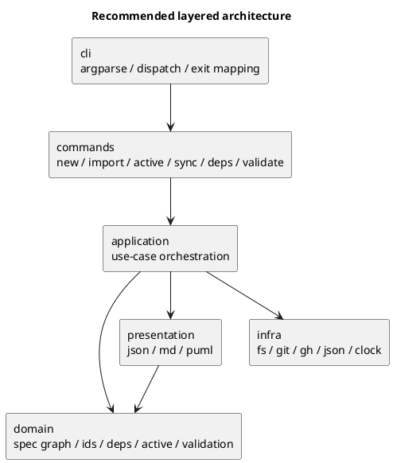

# disc-002 runtime cli アーキテクチャ方針の再検討 v2

## 議題 (必須)
- Issue #25 において、runtime CLI をどのアーキテクチャで再構成するのが最適かを再検討する。
- 「コマンド単位に分けるか」「ドメイン単位に分けるか」という二択ではなく、第一級の設計境界をどこに置くべきかを明確化する。
- 分割後の module tree が、単なる file split ではなく、今後の保守・テスト・拡張を支える構造になるようにする。

## 背景 (必須)
- 前回シート [001-disc-runtime-cli-refactor-analysis.md](/srv/mount/spec-dock/spec-deps/current/discussions/001-disc-runtime-cli-refactor-analysis.md) では、Issue #25 の初期方針として `command-first + small shared core` を低リスク案として整理した。
- その後の再議論で、ユーザーから「第一級の境界は command より domain/layer に置くべきではないか」という重要な論点が出た。
- この論点は妥当である。なぜなら現状の [app.py](/srv/mount/spec-dock/src/spec_dock/assets/spec_dock/scripts/spec_dock_runtime/app.py) は、subcommand ごとの入口を持ちながら、実際の不変条件は `node tree / id / deps / active / github state` といった横断概念に支配されているからである。
- 今回は `consultant` 2 名と `repo_analyst` に、アーキテクチャ視点で再分析を依頼した。

## 現状から見える本質

### 1. 現在の `app.py` は「command の集合」ではなく「workflow と rule と I/O の混合物」である
- `main` と `_parse_args` は CLI の顔である一方、`_new_*` `_import_*` `_active_set` `_sync` `_deps_check` は command policy と domain rule と infra 呼び出しを同時に持っている。
- 特に `_sync` は `scan/validate -> state derivation -> render/write -> legacy cleanup` を一塊で抱えており、layer 境界がほぼ存在しない。
- したがって、単に `new.py` `sync.py` に割るだけでは、「大きな関数の置き場所を変えただけ」になる危険がある。

### 2. 一方で、純粋な domain-first から始めるのも重い
- 現在のユーザー認知、CLI UX、argparse、テスト入口は明らかに subcommand ベースである。
- `new/import/active/sync/deps/validate` は、それぞれ引数契約・stdout/stderr・exit code・副作用順序を持つ。
- このため `domain/service/repository/usecase` の全面再設計から始めると、Issue #25 の本来目的である「app.py の薄化」と「test_cli.py の整理」より先に、抽象レイヤ導入が主目的化するリスクがある。

### 3. したがって最適解は pure command-first でも pure domain-first でもなく、hybrid layered である
- 外から見える入口は command。
- 内側の設計境界は layer。
- command は第一級の「利用インターフェース」だが、第一級の「設計分割単位」ではない。
- より正確には、**command-first で見せる / domain-first で守る / layered で固定する** のがよい。

## アーキテクチャ選択肢

### Option A: pure command-first
- Top-level を `commands/new.py` `commands/sync.py` など command 群に置き、共有関数は必要に応じて都度抽出する。
- Pros:
  - 今の関数境界と移行しやすい。
  - CLI の見通しは良い。
- Cons:
  - `scan_nodes` `deps evaluation` `active resolution` などの共通核が command ごとに再埋め込みされやすい。
  - いずれ `sync` や `active` が別ファイルの再モノリスになる。

### Option B: pure domain-first
- Top-level を `domain/active` `domain/deps` `domain/tree` などに置き、command は単なる薄い adapter とする。
- Pros:
  - 理論上は一番きれい。
  - 再利用性と rule の集中度は高い。
- Cons:
  - 現状の CLI workflow 中心のコードには重すぎる。
  - command policy と domain rule の分離コストが高く、Issue #25 のスコープで過設計になりやすい。

### Option C: hybrid layered
- Top-level 境界を `commands / application / domain / infra / presentation` に置く。
- `commands` は command-first で user-facing 契約をまとめる。
- `domain` は spec graph の不変条件を持つ。
- `application` は use case orchestration を持つ。
- `infra` は git/fs/gh/json/time などの外界接続を持つ。
- `presentation` は json/md/puml 生成を持つ。
- Pros:
  - CLI と domain の両方の現実を扱える。
  - `app.py` の薄化と shared core の育成を両立できる。
  - 将来の拡張でも依存方向を守りやすい。
- Cons:
  - いきなり全層を厳格に導入すると過設計になりうる。
  - 命名と責務を曖昧にすると、単に階層が増えるだけになる。

## consultant / analyst 見解の統合

### 一致点
- pure command-first は短期移行には向くが、第一級の設計境界としては弱い。
- pure domain-first は最終目標としては魅力があるが、Issue #25 の初手としては重い。
- 最も妥当なのは hybrid layered。

### 特に重要だった観点
- `consultant` A:
  - 第一境界は `commands / application / domain / infra / presentation` に置くべき。
  - command は入力契約、application は use case orchestration、domain は spec graph rule を担うべき。
- `consultant` B:
  - shipped asset の stdlib-heavy Python CLI には、hexagonal/DDD を強く入れるより `functional core, imperative shell` が適切。
  - `app -> commands -> core/services -> adapters/utilities` の一方向依存がよい。
- `repo_analyst`:
  - 既存関数はすでに layer へ再配置可能な形で塊を持っている。
  - 特に `_Node/_scan_nodes/_validate_nodes/_deps_evaluate_v2/_build_deps_state/_render_deps_puml` は command より内側に置くべき候補が明確。

## 推奨アーキテクチャ

### 結論
- 推奨は **hybrid layered architecture**。
- ただし導入原則は次の通り。
  - user-facing な第一印象は command
  - 実際の責務境界は layer
  - domain の中心概念は command ではなく `spec graph`

### レイヤ責務
- `cli`:
  - `argparse`
  - top-level dispatch
  - top-level error to exit-code mapping
- `commands`:
  - command ごとの入力整形
  - stdout/stderr 契約
  - command policy
- `application`:
  - use case orchestration
  - command をまたぐ再利用可能な処理順序
  - `sync_artifacts()` のような workflow の共有
- `domain`:
  - `Node`
  - tree invariant
  - id canonicalization
  - dependency graph
  - active target resolution
  - issue status / progress derivation
- `infra`:
  - git
  - gh
  - filesystem
  - json store
  - clock
- `presentation`:
  - index/tree/deps 用 JSON shape
  - markdown rendering
  - puml rendering

### 依存方向
- `cli -> commands -> application -> domain`
- `application -> infra`
- `application -> presentation`
- `presentation -> domain dto`
- `infra` は domain rule を知らない
- `domain` は `print` `subprocess` `Path.write_text` `gh` に依存しない

## 推奨 layer 図


## 現状関数の再配置案

### cli
- `main`
- `_parse_args`

### commands
- `new` command wrappers
- `import` command wrappers
- `active set/show/clear` wrappers
- `sync` wrapper
- `deps check` wrapper
- `validate` wrapper

### application
- `create_initiative/create_epic/create_issue/create_doc`
- `import_issue/import_epic/import_initiative`
- `set_active`
- `sync_state`
- `check_deps`
- `validate_tree`

### domain
- `_Node`
- `_scan_nodes`
- `_validate_nodes`
- `_resolve_active_node`
- `_resolve_parent_from_active`
- `_deps_evaluate_v2`
- `_build_progress_map`
- `_build_deps_state`
- `_build_effective_deps_map_all`
- `_validate_deps_cycles`

### infra
- `_git_*`
- `_gh_issue_checkout`
- `github.py` の gh 呼び出し
- `io_json.py` の JSON read/write と clock
- active manifest / pathfile の file I/O

### presentation
- `_render_context_pack`
- `render_md.py`
- `render_puml.py`
- `index/tree/deps` 出力 shape の assembler

## 推奨 module tree
```text
src/spec_dock/assets/spec_dock/scripts/spec_dock_runtime/
  app.py
  cli/
    __init__.py
    parser.py
    dispatch.py
  commands/
    __init__.py
    new.py
    import_.py
    active.py
    sync.py
    deps.py
    validate.py
  application/
    __init__.py
    create_node.py
    import_issue.py
    set_active.py
    sync_state.py
    check_deps.py
    validate_tree.py
  domain/
    __init__.py
    models.py
    tree.py
    ids.py
    deps.py
    active.py
    status.py
  infra/
    __init__.py
    fs_repo.py
    git_cli.py
    github_cli.py
    json_store.py
    clock.py
  presentation/
    __init__.py
    json_state.py
    markdown.py
    puml.py
```

## この構成で重要な設計判断

### 1. `commands` は薄くする
- command は「入力を束ねて use case を呼び、出力契約に変換する」までに留める。
- `commands` に domain rule や rendering detail を残さない。

### 2. `application` を省略しない
- ここを飛ばして `commands -> domain` にすると、`_sync` のような workflow が再び command 側へ肥大化する。
- `application` は「複数 domain rule と infra/presentation を安全な順序で組み合わせる場所」である。

### 3. `domain` は spec graph 中心に置く
- domain の中心語彙は `command` ではなく `Node / active / deps / status / tree invariant`。
- これにより、`sync` `validate` `active set` `new/import` が同じ rule を共有できる。

### 4. `presentation` を独立させる
- `sync` は「状態導出」と「成果物描画」が混ざると再び巨大になる。
- JSON shape / markdown / puml を分けることで、artifact 契約の検証もしやすくなる。

## テスト戦略への示唆
- `tests/test_cli.py` の再編は command 単位だけでなく layer 単位でも再配線する。
- 推奨:
  - CLI 契約テスト: command 層
  - use case テスト: application 層
  - invariant / deps / active 判定テスト: domain 層
  - renderer テスト: presentation 層
- ただし Issue #25 の初回では、まず既存 CLI 契約テストを保ったまま物理分割し、その後に pure domain test を追加する段階移行が安全。

## anti-pattern
- `helpers.py` `utils.py` に何でも寄せる
- `sync.py` を別ファイルの god-command にする
- `domain` から `gh` `git` `Path.write_text` `print` を呼ぶ
- `application` を飛ばして command に workflow を押し戻す
- `presentation` を省略して render logic を use case に混ぜる
- DDD/hexagonal 風の名前だけ導入して実質責務が変わらない

## 推奨案 (必須)
- **採用推奨は Option C: hybrid layered**。
- ただし実装順序は段階的にする。
  1. `cli` と `commands` を切り出し、`app.py` を薄くする。
  2. 最も再利用が明確な workflow を `application` に抜く。
  3. `spec graph` の rule を `domain` に寄せる。
  4. render/output を `presentation` へ移す。
  5. git/gh/fs/json/time を `infra` へ寄せる。
- これにより、Issue #25 の現実的な移行可能性と、長期的に持続するアーキテクチャの両立ができる。

## 未決事項 (任意)
- `cli/parser.py` と `cli/dispatch.py` を最初から分けるか、まず `cli.py` 1 ファイルに留めるか。
- `domain/ids.py` を既存 `ids.py` の rename と見るか、`util/ids.py` として残すか。
- `presentation/json_state.py` を導入するか、まずは `application` で JSON dto を返すだけに留めるか。

## 次アクション (必須)
- requirement では、この v2 方針を前提に「今回の issue で導入する layer 範囲」を明示する。
- design では、現行関数ごとの layer 帰属表と、段階移行順序を確定する。
- plan では、まず `sync` を application/domain/presentation に分割するか、あるいは `cli + commands` の骨格から先に入れるかを step として固定する。
