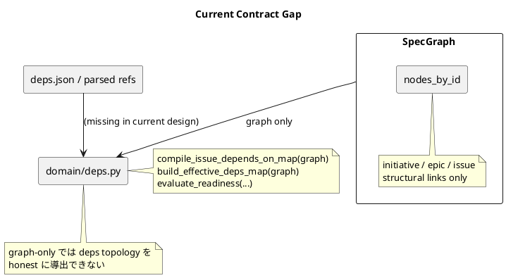
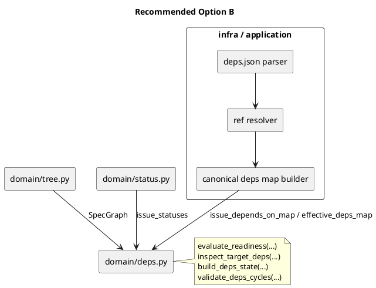

# deps topology 契約ギャップと対策案の比較

## 要旨
- `S03` で露出した問題は、`domain/deps.py` が `SpecGraph` だけから dependency map を導出できる前提になっている一方、現在の `SpecGraph` は構造ノードしか持たず、依存エッジを保持していないことです。
- そのため、設計上は `compile_issue_depends_on_map(graph)` を要求しているのに、実装上は正しく導出できません。
- このギャップを埋める案として `A / B / C` を比較すると、最も低リスクで設計全体とも整合するのは `B` です。

## 何が起きているか

### 現在の事実
- `SpecGraph` は `nodes_by_id: dict[str, SpecNode]` を持つ構造グラフです。
- `SpecNode` は `id/title/slug/path/parent_id/initiative_id/epic_id/github_issue_number` を持ちます。
- しかし dependency edge に相当する `depends_on` 情報は `SpecGraph` にありません。
- 一方、既存 runtime の deps 正本は `deps.json` の parse / ref 解決 / effective merge から得られています。

### 破綻点
- 設計では `domain/deps.py` が `compile_issue_depends_on_map(graph)` や `build_effective_deps_map(graph)` を持つ前提でした。
- しかし graph に edge 情報がないため、`graph -> deps topology` を純粋に計算することはできません。
- placeholder 実装で空 map を返すと、readiness 判定が常に甘くなり、将来 `deps check` や `active set` が誤判定します。

## 問題構造

## 対策案

### A. `SpecGraph` 自体を拡張して dependency edge を持たせる

#### 内容
- `SpecNodeSeed` / `SpecNode` / `SpecGraph` に `depends_on` または同等の topology 情報を追加する。
- `domain/deps.py` は引き続き graph-only API を維持する。

#### 利点
- 見た目は一貫します。
- 「domain の中心は graph」という説明は強くなります。
- `evaluate_readiness(graph, ...)` のような API は自然に見えます。

#### 欠点
- 影響範囲が大きいです。
- `S01` で固定した `SpecGraph` 契約を開き直す必要があります。
- `_Node` / `_scan_nodes()` / application mapper / validate path まで巻き込みます。
- `raw ref`、`issue direct deps`、`effective merged deps` のどれを graph が正本に持つかを再設計しないと、別の曖昧さが発生します。

#### 向いている場合
- いまこの issue で `SpecGraph` を「構造 + dependency topology の唯一の正本」に昇格させる意思がある場合。

### B. dependency map は `application / infra` が組み立て、domain はそれを受ける

#### 内容
- `SpecGraph` は構造グラフのまま維持する。
- `deps.json` の parse / ref 解決 / canonical map 化は `application / infra` 側で行う。
- `domain/deps.py` は `graph + dependency map + issue statuses` を受けて pure 判定だけを行う。

#### 利点
- 現行コードの事実に最も合っています。
- `deps.json` 由来の topology と、graph 由来の structural context を分離できます。
- `build_deps_state()` がすでに external map を受ける思想と整合します。
- `S03` の pure core と `S04/S06` の consumer 導入が素直につながります。
- `S01/S02` を壊さずに直せます。

#### 欠点
- `domain/deps.py` の API を少し見直す必要があります。
- 既存の design / plan の graph-only 記述を修正する必要があります。
- `validate_graph_and_deps()` の命名や境界もあわせて再整理が必要です。

#### 向いている場合
- 今回の step 境界を保ちつつ、最小の設計修正で前進したい場合。

### C. graph-only API は残し、`NotImplemented` として後続 step まで defer する

#### 内容
- いまの API 形は維持する。
- `compile_issue_depends_on_map(graph)` は未実装として明示失敗にする。
- `S03` は status 系だけを先に通し、deps topology 本体は後続へ送る。

#### 利点
- 嘘の placeholder を置かない、という点では安全です。
- 誤判定して進むよりはましです。

#### 欠点
- 設計不整合自体は解決しません。
- `S03` の deps pure core を完成させたことになりません。
- `S04/S06` に入る前に結局設計変更が必要になります。

#### 向いている場合
- どうしても docs を先に直せないが、間違った実装だけは避けたい場合。

## 比較表

| 案 | 説明 | 影響範囲 | リスク | 後続 step との整合 |
|---|---|---:|---:|---|
| A | graph に deps edge を持たせる | 大 | 高 | 再設計すれば高い |
| B | app/infra が deps map を作り、domain は受ける | 中 | 低 | 高い |
| C | 未実装を明示して defer | 小 | 中 | 低い |

## 推奨案

### 推奨: B
- `SpecGraph` は構造グラフのまま残す。
- dependency topology は `application / infra` が canonical map として供給する。
- `domain/deps.py` は pure rule に専念する。

### 推奨理由
1. 現行実装のデータ所有境界に合っているから
2. `S01/S02` の契約を壊さずに修正できるから
3. `S04` の `deps check` と `S06` の `active set` guard で同じ seam を再利用しやすいから
4. placeholder や未実装を残さず、正しい pure core を作れるから

## 推奨後のアーキテクチャ像

## step への影響

### S03
- `domain/deps.py` の API を `graph + supplied deps map` ベースへ修正する。
- `compile_issue_depends_on_map()` / `build_effective_deps_map()` は domain から外すか、少なくとも public contract から外す。
- テストは monkeypatch ではなく、map を直接渡す pure test に直せる。

### S04
- `application/check_deps.py` またはその内部 helper が canonical deps map を組み立てる責務を持つ。
- `deps check` は `status context + dependency map + domain.deps` の組み合わせで成立する。

### S06
- `active set` の readiness guard は S04 と同じ dependency map provider を再利用できる。
- readiness の正本が 1 つに揃う。

## 今回必要な修正

### 先に docs を直すべき理由
- いまの `design.md` / `plan.md` は graph-only deps API を前提にしており、実装可能性と矛盾しています。
- 先に docs を直さないと、コード修正が「設計逸脱」に見えてしまいます。

### 修正対象
- [design.md](/srv/mount/spec-dock/spec-deps/current/design.md)
  - `domain/deps.py` の公開 API
  - `validate_graph_and_deps()` の deps 境界説明
- [plan.md](/srv/mount/spec-dock/spec-deps/current/plan.md)
  - `S03` の goal / expected tests
  - `S04` / `S06` の dependency topology provider 前提
- [report.md](/srv/mount/spec-dock/spec-deps/current/report.md)
  - `S03` 着手時メモに今回の設計修正判断を残す

## 実施順の提案
1. `design.md` を `Option B` 前提に修正する
2. `plan.md` を同前提で修正する
3. `S03` の未コミット差分を作り直す
4. 再レビューして `S03` を通す
5. その後 `S04` の実装へ進む

## 結論
- 今回の問題は、実装ミスというより「設計の入力契約が足りていない」ことが原因です。
- `A` は大きくきれいに直す案、`C` は先送り案です。
- 今回の issue の進め方と既存 step 境界に最も適合するのは `B` です。
- よって、次の正しい一手は `Option B` で `design.md` / `plan.md` を先に修正し、その後 `S03` をやり直すことです。
