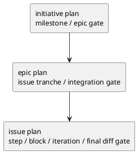
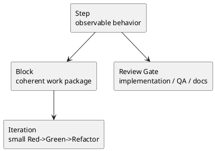

# 003-disc initiative epic issue plan template の再設計案

## 結論
- 3 本の plan template は、**同じ形に揃えるべきではない**。揃えるべきなのは「計画として固定すべき軸」であり、見出しや粒度は scope ごとに変えるべきである。
- 共通で持つべき軸は次の 6 つだけでよい。
  - 対象
  - 分解
  - 順序
  - gate
  - 依存
  - exit
- `other-plan.md` の良い点は、Issue plan に強く取り込むべきである。
  - nested step / sub-step / iteration
  - review gate の事前設計
  - QA / spec review の時点指定
  - final diff review の独立 step
- ただし、そのまま generic template にすると重い。**template では構造だけを標準化し、具体的な review scope や詳細な sub-step 群は実案件側で埋める**のが最適である。

## 何を最適化するか
- LLM が plan を読んだ時に、何から着手し、どこで止まり、いつレビューし、何をもって次へ進むかが即座に分かること
- plan が requirement / design の再説明にならないこと
- template が過度に重くならず、実案件で埋められる余白を残すこと

## 現状評価

### Initiative plan（現行）
良い点
- `ロードマップ`
- `Epic 分解`
- `計測計画`
- `Epic Definition of Ready`
があり、戦略から epic handoff までの骨格はある。

不足
- milestone review gate がない
- 投資判断の checkpoint がない
- docs / governance 更新の gate がない
- 「どこで止まって再判断するか」が弱い

### Epic plan（現行）
良い点
- `Issue 分割`
- `Issue Definition of Ready`
- `Epic 品質ゲート`
- `ロールアウト / 移行`
があり、Issue handoff 用の骨格はある。

不足
- issue を束としてどう review するかがない
- E-AC をどの issue 群で閉じるかが弱い
- integration review / rollout readiness の境界が弱い
- docs impact の扱いが明示されていない

### Issue plan（現行）
良い点
- `1 step = 1 観測可能な振る舞い`
- `AC / EC ↔ step` の対応
- `S90 docs impact`
- `S99 final diff review`
- step 末尾 checklist

不足
- nested step / work block / iteration の概念がない
- review gate の粒度が「各 step 末尾」に寄りすぎている
- code review / QA / spec review の timing 設計が弱い
- milestone と micro TDD cycle が分離されていない

## `other-plan.md` の良い点

### 取り込むべき点
- `ネスト運用ルール`
  - step
  - work block
  - iteration
  の 3 段構造を持つ
- `レビュー / QA ゲート方針`
  - R1, R2, QG-1, QG-2 のように、レビューの種類とタイミングを事前定義している
- `S06`
  - 品質ゲート工程を TDD と別物として扱っている
- `update_plan`
  - 各 step の作業ブロックを登録する前提がある

### そのまま template に入れるべきでない点
- ファイル単位の review scope の詳細列挙
- 実案件固有の block 名や iteration 名
- あまりに細かい review 人員の固定

理由
- これらは実案件で書くべき内容であり、template に埋め込むと重くなる。

## 理想形の基本原則

### 原則 1. plan は execution architecture を表す
- requirement は WHAT / WHY
- design は HOW
- plan は **HOW TO EXECUTE**

### 原則 2. gate は plan の一級要素
- review gate
- QA gate
- docs impact gate
- rollout / readiness gate
- final gate
は、plan の補足ではなく plan 本体である。

### 原則 3. nested は Issue にだけ深く持つ
- Initiative で nested step は不要
- Epic では「issue tranche」レベルまで
- Issue でのみ `step -> block -> iteration` を持つ

### 原則 4. docs impact は全 scope に存在しうるが、重さは変える
- Initiative:
  - governance / roadmap / metrics impact
- Epic:
  - contract / rollout / observability impact
- Issue:
  - docs / shipped assets / workflow / report impact

### 原則 5. final diff review は Issue で必須、上位 scope は spec pack review に置き換える
- Initiative / Epic は branch diff review より、spec bundle review が本質
- Issue は code + docs + tests を含む branch 全体 diff review が本質

## 理想の 3 層粒度

## 推奨 template 粒度

### Initiative plan

扱う単位
- milestone
- epic group
- review checkpoint

扱わない単位
- issue step
- test command
- micro review loop

必須で持つべきもの
- この計画が達成する initiative goal / metric
- milestone 一覧
- epic decomposition
- sequencing rationale
- investment / decision checkpoint
- metric review timing
- epic DoR
- initiative plan exit criteria

持つべき gate
- `G1 strategy review`
  - goal / metric / scope / roadmap の整合
- `G2 milestone readiness`
  - 次の milestone へ進めるか
- `G3 governance/docs impact`
  - roadmap / metric / rollout 方針更新の反映
- `G9 final initiative plan review`
  - initiative docs bundle review

DoR / DoD の扱い
- DoR:
  - Epic に求める ready 条件として持つ
- DoD:
  - metric / rollout / follow-up decomposition の完了条件として持つ

最適な見出し案
- `## この計画が達成する Goal / Metric`
- `## マイルストーン`
- `## Epic 分解`
- `## 順序と理由`
- `## 意思決定チェックポイント`
- `## 計測 / ロールアウト / governance 更新`
- `## Epic Definition of Ready`
- `## 依存 / ブロッカー`
- `## 最終レビュー条件`

### Epic plan

扱う単位
- issue tranche
- integration checkpoint
- rollout tranche

扱わない単位
- per-test micro plan
- step-by-step coding instruction

必須で持つべきもの
- この epic で閉じる E-RQ / E-AC
- issue slicing strategy
- issue list with order
- tranche / integration grouping
- epic gate plan
- rollout readiness
- issue DoR
- epic exit criteria

持つべき gate
- `G1 decomposition review`
  - issue 分割が妥当か
- `G2 integration readiness`
  - issue 群が E-AC を閉じる準備があるか
- `G3 rollout/docs impact`
  - contract / migration / observability の反映
- `G9 final epic spec review`
  - epic requirement / design / plan bundle review

DoR / DoD の扱い
- DoR:
  - Issue に求める ready 条件として持つ
- DoD:
  - E-AC と rollout / observability の達成条件として持つ

最適な見出し案
- `## この計画で閉じる E-RQ / E-AC`
- `## Issue 分割方針`
- `## Issue 一覧（順序 / tranche 付き）`
- `## 統合チェックポイント`
- `## 品質ゲート`
- `## ロールアウト / docs impact`
- `## Issue Definition of Ready`
- `## 依存 / ブロッカー`
- `## 最終レビュー条件`

### Issue plan

扱う単位
- step
- work block
- iteration
- review gate
- docs impact gate
- final diff review

必須で持つべきもの
- AC / EC / 制約への対応範囲
- step list
- step ↔ requirement mapping
- nested execution rule
- milestone review gate plan
- docs impact policy
- final diff review
- plan DoD

持つべき gate
- `G0 plan upfront approval`
  - requirement / design / plan の整合確認
- `G1 implementation review gate`
  - まとまった step / block 終了時
- `G2 qa review gate`
  - テスト妥当性と回帰漏れ確認
- `G3 docs impact gate`
  - docs / shipped asset 反映要否
- `G9 final diff review`
  - branch 全体差分の承認

DoR / DoD の扱い
- DoR:
  - 直接の節としては軽くしてよい
  - 代わりに `G0 plan upfront approval` を強くする
- DoD:
  - AC / EC
  - tests
  - docs impact
  - final diff review
  を plan の exit として明記する

最適な見出し案
- `## この計画で満たす要件ID`
- `## 実行モデル`
- `## ステップ一覧`
- `## 要件 ↔ ステップ ↔ gate 対応`
- `## レビュー / QA / docs impact / final gate 方針`
- `## 実装ステップ`
- `## S90 docs impact resolution`
- `## S99 final diff review quality gate`
- `## 未確定事項`
- `## 完了条件`

## Issue plan の理想的な nested 構造

定義
- Step:
  - 1 つの観測可能な振る舞い
- Block:
  - 同じ関心事、同じ変更境界を持つ作業束
- Iteration:
  - 最小の TDD cycle

重要
- reviewer を every iteration に呼ばない
- reviewer は step または milestone block の節目で呼ぶ

## 最適な review gate の重さ

### Initiative
- 軽い
- 人間 / stakeholder / spec reviewer 中心
- code review は不要

### Epic
- 中くらい
- spec reviewer 中心
- 必要なら consultant / architect 観点
- code review はまだ不要

### Issue
- 重い
- code reviewer
- qa engineer
- spec reviewer
- 必要に応じて docs reviewer

## docs impact の扱い

### Initiative での docs impact
- roadmap
- success metrics
- rollout guidance
- governance docs

### Epic での docs impact
- contract
- migration/runbook
- observability
- integration guide

### Issue での docs impact
- shipped docs
- workflow
- template
- skill reminder
- report

推奨
- 3 scope すべてに `impact check` は置く
- ただし dedicated step を持つのは Issue を標準とし、Initiative / Epic は条件付き section で十分

## final review の扱い

### Initiative
- `final spec pack review`
- requirement / design / plan / discussion bundle の整合確認

### Epic
- `final epic spec review`
- epic docs bundle と issue decomposition の整合確認

### Issue
- `final diff review quality gate`
- branch 全体差分、テスト、docs refresh、report まで確認

## どこまで template に書くべきか

### 書くべき
- gate の種類
- gate の目的
- gate をどのタイミングで実施するか
- 最低限の記入枠
- nested のルール

### 書くべきでない
- 実案件固有の review scope ファイル一覧
- 実案件固有の sub-step 名
- 実案件固有の reviewer 名
- 実案件固有の test command 羅列

理由
- template が重すぎると、毎回消す前提のノイズになる。
- 逆に gate の型だけがあれば、各案件で具体化できる。

## 推奨案

### 推奨 1
- Initiative / Epic / Issue の plan を「同じテンプレート」にはしない

### 推奨 2
- 3 本とも次の骨格で揃える
  - 対象
  - 分解
  - 順序
  - gate
  - 依存
  - exit

### 推奨 3
- nested step は Issue plan にだけ導入する

### 推奨 4
- `other-plan.md` の良い点は Issue plan の generic skeleton として取り込む
  - nested rule
  - review gate policy
  - quality gate step の分離

### 推奨 5
- final diff review は Issue 固有の mandatory gate に固定する
- Initiative / Epic では final spec pack review に置き換える

## 判断
- 最適な plan template 粒度は、
  - Initiative: coarse
  - Epic: medium
  - Issue: fine
 である。
- 3 本を同じ重さで揃えるより、**粒度を揃えず、軸だけ揃える** 方が LLM にとっても人間にとっても堅い。

## 次アクション
- この方針に基づき、次は `initiative/plan.md`, `epic/plan.md`, `issue/plan.md` それぞれの具体的な差し替え template draft を作る。
