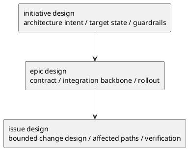

# 004-disc initiative epic issue design template の再分析と再設計方針

## 結論
- 3 本の design template は、方向性自体はかなり良い。
- ただし完成度は揃っていない。
  - `epic/design.md` は最も完成度が高く、**ほぼ現状維持でよい**
  - `initiative/design.md` は良いが、**欄の重複がある**
  - `issue/design.md` は情報量は強いが、**optional 欄が多く、LLM が「どこまで埋めるべきか」で迷いやすい**
- したがって、ゼロベースでの推奨は「全面作り直し」ではなく、
  - Epic は微修正
  - Initiative は整理
  - Issue は圧縮再設計
 である。

## 何を評価するか
- design template が、その scope に必要な HOW を固定できているか
- requirement / plan / discussions / ADR と責務が混線していないか
- LLM が過不足なく埋めやすい粒度か
- 重要な欄を残しつつ、不要な欄を別文書へ逃がせるか

## 評価基準
- 1. 責務適合
- 2. 重複の少なさ
- 3. LLM が埋めやすい粒度
- 4. reviewer が判断しやすい構造
- 5. scope 固有差分の表現力

## design template の本来責務
- requirement で固定した WHAT / WHY を、実行可能な HOW / guardrails に落とす
- 採用する構造、境界、契約、依存、移行、観測性、テスト方針を固定する
- 長い比較や生ログは持たない
- 実装手順の詳細は持たない

design template が持つべきでないもの
- 細かい実装手順
- every step の進め方
- 長い選択肢比較
- 生の調査ログ
- 運用ルールそのもの

## 現状の良い点

### 全体
- design が requirement / plan の中間にあることは明確
- Initiative / Epic / Issue で scope 差分が template に反映されている
- `phase_design.md` の共通作法と、大きく衝突していない

### initiative/design.md
- architecture driver から始まるのは正しい
- initiative が「実装詳細」ではなく「目指す姿と guardrail」を持つ設計になっている
- ADR index を持っているのも妥当

### epic/design.md
- context
- contract
- data model
- flow
- failure
- migration
- observability
- security
- test strategy
が揃っており、epic の設計責務に最も一致している

### issue/design.md
- As-Is の実装理解を強く要求している
- 変更計画（ファイルパス単位）を mandatory にしている
- requirement → design mapping がある
- plan へ渡す材料が多い

## 現状の問題

### 1. initiative/design.md は欄が少し重複している
- `ガードレール`
- `観測性`
- `非機能（NFR）設計`
の境界が近い
- `契約（外部I/F・データ境界）` も、initiative によっては detail が早すぎる

### 2. epic/design.md は強いが、やや重い
- 構造としては良い
- ただし every epic に
  - API
  - Event
  - Data model
  - Security
  - Observability
  を全部濃く要求すると、軽い epic では埋め草が増える
- ただし「削る」より「optional 条件を明確化する」方が良い

### 3. issue/design.md は欄が多すぎて迷いやすい
optional 節が多い。
- `主要フロー`
- `データ・バリデーション`
- `判断材料/トレードオフ`
- `インターフェース契約`
- `クラス/インターフェース詳細設計`
- `例外/エラー契約`
- `テスト戦略`
- `テストマトリクス`
- `リスク/懸念`
- `ディレクトリ/ファイル構成図`

問題
- どこまで書くかが案件依存すぎる
- LLM が「全部埋めるべきか」「本当に必要なところだけでよいか」で迷う
- 結果として、濃すぎる design か、逆にスカスカな design になりやすい

### 4. requirement との重複が一部ある
- `issue/design.md` の `目的・制約（要件から転記・圧縮）` は、圧縮コンテキストとしては有用
- ただし template として毎回厚く書かせると requirement の再記述になりやすい

## scope ごとの差をどう捉えるべきか

### Initiative design の本質
- architectural intent
- target state
- boundary / dependency policy
- rollout / observability principle

### Epic design の本質
- contract
- data / flow / failure
- migration
- observability
- test strategy

### Issue design の本質
- current implementation understanding
- affected boundaries
- chosen change shape
- file-level change plan
- verification handoff to plan

## どうあるべきか

### A. 共通 core を絞る
3 本すべてで本当に必要なのは次だけ。
- input snapshot
- as-is / context
- target shape
- boundary / contract
- migration / risk / observability の必要部分
- verification handoff
- open questions

これ以外は scope で差が出る。

### B. Initiative design は「高位設計」に純化する

残すべき欄
- `アーキテクチャ上の狙い`
- `現状の把握`
- `目指す姿`
- `システム境界 / 依存`
- `ガードレール`
- `移行 / ロールアウト方針`
- `主要リスクと軽減策`
- `ADR index`
- `未確定事項`

削るか統合すべき欄
- `契約（外部I/F・データ境界）`
  - Initiative では required ではなく conditional に落とすべき
- `観測性`
- `非機能（NFR）設計`
  - `ガードレール` の下位項目へ統合できる

理由
- Initiative は API 設計書ではない
- 実装詳細や詳細契約は Epic 以降で詰める方が自然

### C. Epic design はほぼ維持でよい

残すべき欄
- `全体像`
- `契約`
- `データモデル設計`
- `主要フロー`
- `失敗設計`
- `移行戦略`
- `観測性`
- `セキュリティ / 権限 / 監査`
- `テスト戦略`
- `E-AC → テスト対応`
- `ADR index`
- `未確定事項`

変えるならここだけ
- API / Event / Data の全部を every epic で必ず厚く書く前提は避ける
- 節は維持しつつ、「該当しない場合は明示して薄く済ませてよい」と template で分かるようにする

結論
- `epic/design.md` は **大きくは変えなくてよい**
- 根拠:
  - Epic の設計責務と section 構成がかなり一致している
  - reviewer に必要な論点もほぼ揃っている

### D. Issue design は mandatory core を減らす

残すべき mandatory core
- `設計入力サマリ`
  - requirement から引き継ぐ目的 / 制約 / 対象
- `既存実装 / 規約の調査結果`
- `変更の中心フロー`
- `変更計画（ファイルパス単位）`
- `要件 → 設計マッピング`
- `検証方針`
- `未確定事項`

conditional / appendix に落とすべき欄
- `データ・バリデーション`
- `判断材料/トレードオフ`
- `インターフェース契約`
- `クラス/インターフェース詳細設計`
- `例外/エラー契約`
- `テストマトリクス`
- `ディレクトリ/ファイル構成図`

理由
- Issue は bounded change なので、全案件で class detail や図が要るわけではない
- しかし As-Is 調査、変更ファイル、設計判断、検証方針は高頻度で要る

## LLM が埋めやすい粒度

### Initiative
- 6〜9 section 程度がよい
- 詳細 API / class / file path は持たない

### Epic
- 10〜12 section 程度でもよい
- ただし conditional guidance を明示する

### Issue
- mandatory は 6〜8 section に抑える
- appendix / conditional section は明確に分ける

理由
- design template は「埋めるための器」であり、設計論点のカタログではない
- mandatory が多すぎると、LLM は埋め草を作る
- optional が多すぎると、LLM は選択基準を失う

## 残すべき欄

### 全 scope 共通で残すべきもの
- As-Is / context
- target / boundary
- risk / open question

### Initiative で残す
- architecture intent
- target state
- dependency / guardrail
- rollout principle

### Epic で残す
- contract
- data
- flow
- failure
- migration
- observability
- test strategy

### Issue で残す
- current implementation understanding
- file-level change plan
- requirement mapping
- verification handoff

## 削るべき欄

### Initiative
- detailed contract を required にすること
- observability と NFR の分離しすぎ

### Epic
- every subsection を equally heavy に書く前提

### Issue
- default で class/interface detail を求めること
- default で directory tree を求めること
- default で full test matrix を求めること

## 他文書へ逃がすべき内容

### `research`
- 生の実装調査ログ
- 類似機能比較
- 外部仕様調査

### `disc`
- 採用前の選択肢比較
- トレードオフ比較表
- reviewer / user と議論したい未確定論点

### `adr`
- 長期に効く設計判断
- 境界 / 契約 / 移行方針の採択理由

### `plan`
- 実装順
- nested step
- review gate の実施順

### `phase_design.md`
- 共通の設計作法
- docs 化とヒアリングの原則

## 推奨 template 骨格

### initiative/design.md
- `## 設計の狙い`
- `## 現状の把握`
- `## 目指す姿`
- `## 境界 / 依存 / guardrails`
- `## 移行 / ロールアウト方針`
- `## 主要リスク / ADR / 未確定事項`

### epic/design.md
- 現状をほぼ維持
- ただし各節に「該当しない場合の薄い書き方」を許す

### issue/design.md
- `## 設計入力サマリ`
- `## 既存実装 / 規約の調査結果`
- `## 変更の中心フロー`
- `## 変更計画（ファイルパス単位）`
- `## 要件 → 設計マッピング`
- `## 検証方針`
- `## 未確定事項`
- `## appendix（条件付き）`

## 判断
- `initiative/design.md`:
  - 変えるべき
  - ただし全否定ではなく整理中心
- `epic/design.md`:
  - ほぼ変えなくてよい
  - 根拠は責務適合度の高さ
- `issue/design.md`:
  - 最も再設計価値が高い
  - mandatory core を絞り、conditional appendix を明示すべき

## 次アクション
- 次はこの方針に基づき、3 本の design template の具体的な差し替え draft を作る。
