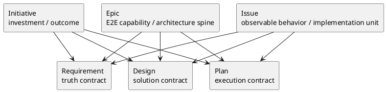
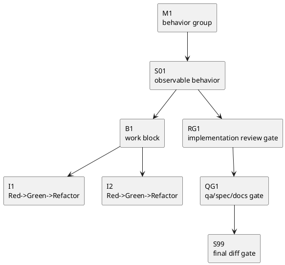

# 004-disc initiative epic issue template redesign のベストプラクティス案

## 議題
- `initiative / epic / issue × requirement / design / plan` の全 9 template を、現状改善ではなくゼロベースで再設計する。
- LLM / coding agent が迷わず埋められ、かつ reviewer が判定しやすい template family を定義する。
- 特に plan template を、review gate と nested structure を含む「実行可能な計画」に再設計する。

## このシートの結論
- template family は「同じ見出しを共有する」ことよりも、「同じ責務原則を共有する」ことを優先すべきである。
- したがって、9 template の見出しはある程度違ってよい。ただし、次の共通原則は必須にする。
  - requirement は `truth contract`
  - design は `solution contract`
  - plan は `execution contract`
- 最善案は、**共通プロトコルは phase playbook に残し、template は scope × phase ごとの最適 schema に振り切る** こと。
- その前提として、generic な `Definition of Ready/Done` や長い運用説明は template から外し、shared gate は `phase_*.md` / `workflow_*.md` に戻す。
- とくに plan は、Issue だけでなく Initiative / Epic も含めて「review / decision gate を埋め込む template」へ進化させるべきである。

## 前提
- 責務分離の前提は [002-disc-document-responsibility-redefinition.md](/srv/mount/spec-dock/spec-deps/current/discussions/002-disc-document-responsibility-redefinition.md) に従う。
- したがって、このシートは template をルール正本として扱わない。
- template は output schema であり、運用の進め方や文書の読み順は `workflow_*.md` / `phase_*.md` に残す。

## template family の設計原則

### 原則1: requirement / design / plan は役割を混ぜない
- requirement:
  - 何を達成するか
  - なぜ必要か
  - 何がスコープか
  - 何をもって達成とみなすか
- design:
  - どう解くか
  - 何を採り、何を採らないか
  - どこが境界か
  - どのようにテスト/移行/観測するか
- plan:
  - どの順で進めるか
  - どの粒度で止まるか
  - どこでレビューするか
  - どう完了判定するか

### 原則2: template は「短い schema」である
- 見出しと短い記入指示は必要。
- 長い運用説明は不要。
- 各欄の prose は 1〜3 行程度に抑える。
- generic gate checklist は持たない。必要なら scope 固有の downstream contract だけを持つ。

### 原則3: scope によって欄は変わってよい
- Initiative に AC/EC を要求しない。
- Issue に success metrics を主語として要求しない。
- Epic は E2E 能力と契約 / migration / observability を中心に持つ。

### 原則4: reviewer が判定しやすい template にする
- すべての template は、埋めた結果として「何がまだ足りないか」が見える構造であるべき。
- そのため、TBD / risks / gate / mapping を必要なところに置く。

### 原則5: plan は review plan を含む
- 実行順だけでなく、どの粒度で review / QA / final gate を行うかを plan に埋め込む。
- これは Issue で最も重く、Epic / Initiative では軽量に持つ。

## consultant 視点の統合

### 視点1: template は「説明書」ではなく「判断結果の器」
- consultant の要点:
  - template はフォームに徹するべき
  - 進め方や運用ルールは workflow / phase に戻すべき
  - とくに issue design / issue plan には運用説明が入りすぎている

### 視点2: generic DoR/DoD は template に不要
- generic な gate checklist は shared gate と重複しやすい
- 必要なのは、
  - initiative plan の `epic readiness contract`
  - epic plan の `issue readiness contract`
  - issue plan の `final exit contract`
  のような downstream contract である

### 視点3: plan の最大改善余地は review boundary 設計
- 現行 issue plan は review を要求しているが、review 境界の設計はまだ粗い
- `other-plan.md` のように
  - top-level step
  - work block
  - iteration
  - milestone review gate
  を分けると、LLM の実行安定性が上がる

## template family の全体像

## template 共通ルール

### 共通で残すべきもの
- frontmatter
- タイトル
- 必須 / 任意
- 未確定事項

### 共通で減らすべきもの
- 長い説明文
- workflow の再説明
- reviewer の呼び方の長文
- `discussions/` の運用詳細
- reference の引用要約
- `Definition of Ready/Done` の generic checklist
- `省略/例外メモ`

### 文章の粒度
- section intro は 1〜2 行
- bullet は flat
- 例示は 1 つで十分
- 記入欄は「問い」に近い形にする

## redesign の判断基準

### 良い template の条件
- 埋める順が自然
- 書くべきことと書くべきでないことが分かる
- LLM が空欄を見て不足情報を判断できる
- reviewer が pass / fail を判断しやすい
- scope ごとの差が template に自然に表現される

### 悪い template の兆候
- 進め方と記入欄が混ざる
- 欄が多いが意思決定に寄与しない
- 他文書の説明をコピペしている
- scope 固有差分が薄く、何を書けばよいか分からない

## template redesign 案

## A. Initiative templates

### Initiative requirement

#### 主目的
- Initiative を「投資単位 / outcome 単位」として固定する。

#### 必須セクション
1. 目的 / outcome
2. なぜ今やるか
3. success metrics
4. scope / non-scope
5. stakeholders / impact
6. non-negotiable constraints
7. risks / dependencies
8. open questions

#### 削除 / 縮小すべき現行要素
- `Initiative-level requirements` は optional のままでよいが、長く機能列挙しない
- 背景欄の自由記述を短くし、`why now` を独立させる

#### あるべき見出し案
- `目的（Outcome）`
- `背景と Why now`
- `成功指標`
- `スコープ`
- `ステークホルダー / 影響範囲`
- `非交渉制約`
- `リスク / 依存`
- `未確定事項`

### Initiative design

#### 主目的
- Initiative を実現するための architectural direction と guardrail を固定する。

#### 必須セクション
1. architectural drivers
2. As-Is / To-Be
3. target boundary / context
4. guardrails
5. rollout / migration principles
6. observability / NFR principles
7. ADR index
8. risks
9. open questions

#### 削除 / 縮小すべき現行要素
- template 内で細かな API 形式まで要求しない
- detailed solution より principles を優先する

#### あるべき見出し案
- `アーキテクチャ上の狙い`
- `現状と目指す姿`
- `対象境界 / 依存`
- `ガードレール`
- `ロールアウト原則`
- `観測性 / NFR 原則`
- `主要リスク`
- `ADR index`
- `未確定事項`

### Initiative plan

#### 主目的
- roadmap と epic portfolio を意思決定可能な形で固定する。

#### 必須セクション
1. roadmap / milestones
2. epic portfolio
3. sequencing rationale
4. decision / review gates
5. metrics review plan
6. rollout window
7. dependencies / blockers
8. open questions

#### 現行からの最大改善点
- `review / decision gate` を明示する
- `Epic Definition of Ready` のような generic checklist ではなく、`epic readiness contract` を短い gate table として持つ

#### あるべき見出し案
- `ロードマップ`
- `Epic ポートフォリオ`
- `順序と理由`
- `意思決定ゲート`
- `指標レビュー計画`
- `ロールアウト計画`
- `依存 / ブロッカー`
- `未確定事項`

## B. Epic templates

### Epic requirement

#### 主目的
- Initiative に紐づく E2E capability と acceptance を固定する。

#### 必須セクション
1. initiative linkage
2. target capability
3. user journeys
4. E-RQ
5. E-AC
6. scope
7. NFR
8. dependencies / impact
9. open questions

#### 削除 / 縮小すべき現行要素
- 背景の重複説明
- Initiative と同型の success metric 欄

#### あるべき見出し案
- `目的（Initiative との紐づき）`
- `提供する能力`
- `ユースケース`
- `Epic requirements`
- `Epic acceptance criteria`
- `スコープ`
- `非機能要件`
- `依存 / 影響範囲`
- `未確定事項`

### Epic design

#### 主目的
- E2E 能力を支える architecture spine を固定する。

#### 必須セクション
1. context / scope
2. contract
3. data model
4. main flows
5. failure / idempotency
6. migration / rollout
7. observability / security
8. test strategy
9. ADR index
10. open questions

#### 現行からの評価
- 現在の epic design はかなり良い。
- 再設計では「これを残しつつ、1欄1責務をさらに明瞭にする」方向がよい。

#### あるべき見出し案
- `全体像`
- `契約`
- `データモデル`
- `主要フロー`
- `失敗設計`
- `移行戦略`
- `観測性 / セキュリティ`
- `テスト戦略`
- `ADR index`
- `未確定事項`

### Epic plan

#### 主目的
- Issue 群をどの順でどう切るかを execution-ready にする。

#### 必須セクション
1. slicing principle
2. issue groups / sequence
3. integration / review gates
4. rollout / migration sequence
5. issue readiness contract
6. commands / validation hooks
7. open questions

#### 現行からの最大改善点
- `品質ゲート（Epic）` を、単なる checklist ではなく gate plan として持つ
- `Issue 一覧` だけでなく、grouping と milestone を持つ
- `Issue Definition of Ready` は generic checklist ではなく、`issue readiness contract` として圧縮する

#### あるべき見出し案
- `Issue 分割方針`
- `Issue 群と順序`
- `統合 / レビューゲート`
- `ロールアウト順`
- `Issue 着手条件`
- `検証コマンド`
- `未確定事項`

## C. Issue templates

### Issue requirement

#### 主目的
- observable behavior と boundary を固定する。

#### 必須セクション
1. user-visible outcome
2. As-Is evidence
3. scope / boundary
4. constraints / assumptions
5. AC
6. EC
7. examples
8. terminology
9. open questions

#### 現行からの評価
- 現在の issue requirement はかなり良い。
- ただし `判断材料/トレードオフ` は optional のままでよく、主線は AC/EC と As-Is に置くべき。

#### あるべき見出し案
- `目的`
- `背景・現状`
- `スコープ`
- `境界`
- `非交渉制約`
- `前提`
- `受け入れ条件`
- `例外・エッジケース`
- `入力→出力例`
- `用語`
- `未確定事項`

### Issue design

#### 主目的
- 実装前に、solution と impact surface を固定する。

#### 必須セクション
1. requirement recap
2. As-Is code / rules understanding
3. chosen approach / trade-offs
4. interfaces / data / error contract
5. file-level change plan
6. requirement-to-design mapping
7. test strategy
8. risk / migration / rollback if needed
9. open questions

#### 現行からの改善点
- `詳細設計` は必要な時だけ書く方針を維持する
- `ディレクトリ/ファイル構成図` は optional のままでよい
- `目的・制約（転記）` は短くする

#### あるべき見出し案
- `目的・制約`
- `既存実装 / 規約の理解`
- `採用方針とトレードオフ`
- `インターフェース契約`
- `変更計画`
- `要件 → 設計マッピング`
- `テスト戦略`
- `リスク / 移行 / ロールバック`
- `未確定事項`

### Issue plan

#### 主目的
- 実装、レビュー、QA、docs impact、final diff review まで含めた execution contract を固定する。

#### 必須セクション
1. target requirement ids
2. milestone map
3. step tree
4. review / QA plan
5. docs impact plan
6. final gate plan
7. open questions
8. DoD

#### 現行からの最大改善点
- 現行の `S01 ... S99` 構造は維持しうるが、step の内部に **work block** と **iteration** を持てるようにする
- review を「各 micro step の義務」にせず、「milestone gate」に設計し直す
- `other-plan.md` の長所を取り込む

#### あるべき見出し案
- `この計画で満たす要件ID`
- `マイルストーン一覧`
- `ステップ一覧`
- `要件 ↔ ステップ対応`
- `レビュー / QA ゲート方針`
- `実装ステップ`
- `docs impact gate`
- `final diff review gate`
- `未確定事項`
- `Definition of Done`

## Issue plan の理想構造

### Issue plan に追加すべき設計
- `マイルストーン`:
  - どこで reviewer を呼ぶか
- `work block`:
  - 同じ変更境界をまとめる
- `iteration`:
  - 最小 TDD cycle
- `gate plan`:
  - code review
  - QA review
  - spec review
  - docs impact
  - final diff

## 9 template のまとめ

| template | 中心概念 | 一番重要な欄 |
|---|---|---|
| initiative requirement | outcome / investment | success metrics |
| initiative design | architectural direction | guardrails |
| initiative plan | roadmap / portfolio | decision gates |
| epic requirement | E2E capability | E-AC |
| epic design | architecture spine | contract / migration / observability |
| epic plan | issue slicing | integration / review gates |
| issue requirement | observable behavior | AC / EC / As-Is evidence |
| issue design | solution contract | file-level change plan + test strategy |
| issue plan | execution contract | milestone gate + step tree |

## いまの template から他文書へ逃がすべき内容

### `workflow_*.md` へ逃がす
- 再利用判定
- 新規作成判断
- scope 固有 gate の運用
- review の実施ポリシー

### `phase_*.md` へ逃がす
- docs 化の原則
- ヒアリング前の整理
- reviewer loop の共通順
- handoff の原則

### `reference_*.md` へ逃がす
- naming
- GitHub
- deps
- sync
- discussion docs の採番

## 推奨案
- 推奨は、全 9 template を **zero-base redesign** すること。
- ただし書き方は、
  - Initiative: outcome / investment oriented
  - Epic: capability / architecture oriented
  - Issue: observable behavior / execution oriented
 で明確に分ける。
- 中でも最優先は `issue/plan.md` の再設計。
- 次点で `epic/plan.md` と `initiative/plan.md` に review / decision gate を導入する。

## 判断
- 現状 template は「悪い」わけではない。
- ただし GPT-5.4 / consultant / multi-agent 前提で最適化するなら、もっとはっきり役割を分けた schema にできる。
- 真に理想的な状態は、**template を見ただけで、その文書が何を固定するための文書かが一目で分かる状態** である。

## 次アクション
- 1. この redesign 方針をもとに、9 template の具体文言 draft を作る
- 2. 特に `issue/plan.md` は milestone gate 付きの concrete draft を先に作る
- 3. その後 `initiative/plan.md`, `epic/plan.md` を gate-aware template へ揃える
