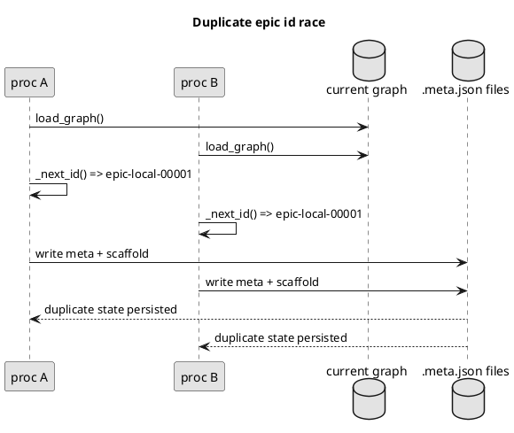
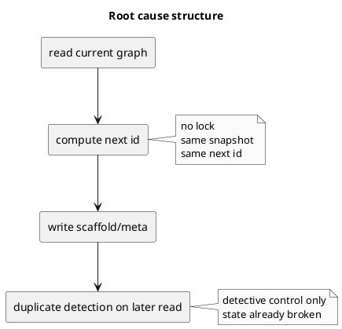
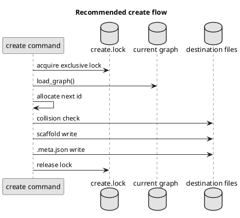

# duplicate epic id race condition の原因分析と対策比較

## 結論
- 今回の `duplicate epic id` は単なる採番ミスではなく、`read -> compute -> write` の間に排他制御が存在しないことによる race condition である。
- これは dogfooding 中の偶発事故ではなく、agent 的に並列実行されると構造的に再発しうる。
- 最も良い対策は、`new initiative|epic|issue|doc` の create 系操作全体を repo-level file lock で直列化すること。
- 第一段階では `create lock` を入れて `load_graph() -> _next_id() -> collision check -> scaffold write -> meta write` を 1 つの critical section にする。
- 第二段階として、必要なら atomic create / rollback / doctor による lock 診断まで拡張する。

## 事故の概要
- `new epic --no-github` を並列に実行したところ、別ディレクトリなのに同じ `epic-local-00001` を持つ `.meta.json` が複数生成された。
- その結果、次の create は `Duplicate id detected` で失敗した。
- 事故の本質は「重複を検知できなかった」ことではなく、「重複状態を一度ディスクへ成立させてしまった」ことにある。

### UML: 事故の再現イメージ

## 調査結果

### 1. create 系は既存 graph を 1 回読んでから採番する
- `create_node.py` の `load_graph()` は、現在の `spec-dock` ツリーから graph を構築する。
- `_next_id()` はその graph 上の最大番号を見て `max + 1` を返す。
- つまり採番の正本は中央カウンタではなく、既存ファイル集合の scan 結果である。

参照:
- [create_node.py](/srv/mount/spec-dock/src/spec_dock/assets/spec_dock/scripts/spec_dock_runtime/application/create_node.py)

### 2. 採番と書き込みの間に排他制御がない
- `plan_node_creation()` で `node_id` を決める。
- `execute_create_plan()` は scaffold をコピーし、最後に `.meta.json` を書く。
- この一連の流れに file lock, mutex, transaction, compare-and-swap のような保護が入っていない。

参照:
- [create_node.py](/srv/mount/spec-dock/src/spec_dock/assets/spec_dock/scripts/spec_dock_runtime/application/create_node.py)

### 3. duplicate 検知は事後検出であり防止策ではない
- `fs_repo.load_node_records()` は `.meta.json` 群を読みながら `seen_ids` を持ち、重複 ID があれば `Duplicate id detected` を投げる。
- ただしこれは「次に読む時に壊れていると分かる」だけで、書き込み時に壊れた状態を止めるものではない。

参照:
- [fs_repo.py](/srv/mount/spec-dock/src/spec_dock/assets/spec_dock/scripts/spec_dock_runtime/infra/fs_repo.py)

### 4. 現在の保存モデルは単一プロセスには簡単だが並列作成に弱い
- `parse_id()` / `format_id()` / `_next_id()` による連番生成自体は単純で分かりやすい。
- しかし中央採番機構を持たず、既存ファイル scan に依存しているため、同時実行では同じ snapshot を見た複数プロセスが同じ次番号を採る。

参照:
- [ids.py](/srv/mount/spec-dock/src/spec_dock/assets/spec_dock/scripts/spec_dock_runtime/domain/ids.py)
- [create_node.py](/srv/mount/spec-dock/src/spec_dock/assets/spec_dock/scripts/spec_dock_runtime/application/create_node.py)

### 5. 今回の直接トリガーは並列 create 実行
- 今回は `new epic` を複数本同時に投げたため、同じ graph snapshot に対して `_next_id()` が走った。
- したがって、今回の事故は「一度に複数 create が走る」という agentic CLI で現実に起こりうる使い方に対して脆弱であることを示している。

## 根本原因の構造化

### A. 直接原因
- `_next_id()` が排他なしに `max + 1` を計算している。

### B. 設計原因
- `read`, `compute`, `write` が単一 transaction ではない。

### C. 保存モデルの弱点
- ID の正本が中央カウンタではなくファイル scan であり、並列性に弱い。

### D. 防御層の不足
- duplicate 検知はあるが preventive control ではなく detective control に留まっている。

### UML: 原因の構造

## 影響
- Epic, Issue, Initiative, discussion doc の create 系に同種の race が潜在している。
- 破損した state が一度成立すると、以後の `validate`, `sync`, `active`, `deps` などの上位 command が壊れた状態に引きずられる。
- dogfooding だけでなく、将来の multi-agent 実行、wrapper 経由、automation 経由でも再発しうる。

## 対策案の比較

### 案A. 並列 create を運用で禁止する
- 内容:
  - docs や AGENTS.md に「create 系を並列実行しない」と書く。
- 利点:
  - すぐできる。
  - 実装コストがない。
- 欠点:
  - 根本解決ではない。
  - agent 主体の利用に逆行する。
  - 守られなければ再発する。
- 評価:
  - 暫定注意喚起としては有効だが、恒久策としては不適。

### 案B. create 前に再読込して重複確認する
- 内容:
  - `execute_create_plan()` 前にもう一度 graph を読み、ID がまだ空いているか確認する。
- 利点:
  - 現行構造に近い。
  - 変更量が少ない。
- 欠点:
  - TOCTOU は残る。
  - 再読込後に別プロセスが書けば still race。
- 評価:
  - 改善はするが、安全性保証にはならない。

### 案C. 中央カウンタファイルを導入する
- 内容:
  - 例: `spec-dock/.agent/id-counters.json` を持ち、そこを更新して採番する。
- 利点:
  - 採番ロジックは単純になる。
  - scan より高速。
- 欠点:
  - カウンタ更新にも lock が必要。
  - 正本が増える。
  - repair/migration が必要になる。
- 評価:
  - lock なしでは意味がなく、lock ありでも状態管理コストが増える。

### 案D. create 全体を file lock で直列化する
- 内容:
  - repo 単位または `spec-dock` 単位の lock file を導入し、create 全体を critical section に入れる。
  - 例: `spec-dock/.agent/create.lock`
- 利点:
  - 根本原因に直接効く。
  - 現行 ID モデルを維持できる。
  - 後方互換性が高い。
  - migration 不要。
- 欠点:
  - lock 取得/解放、timeout、stale lock を設計する必要がある。
- 評価:
  - 最もバランスが良い第一段階の修正案。

### 案E. file lock + atomic create + rollback
- 内容:
  - 案D に加え、temp dir への scaffold、最後の rename、途中失敗時 cleanup まで入れる。
- 利点:
  - duplicate だけでなく partial create にも強い。
  - reliability 改善にもつながる。
- 欠点:
  - 実装コストが上がる。
  - 既存 create path を大きく触る。
- 評価:
  - 理想形だが、最初の修正としては重い。

## 技術候補の絞り込み

### 候補 1. POSIX `flock` / `fcntl`
- 利点:
  - Unix 系では自然。
- 欠点:
  - Windows 差分が大きい。
  - shipped asset / stdlib-only CLI としては portability が弱い。

### 候補 2. 依存ライブラリ導入 (`portalocker` 等)
- 利点:
  - cross-platform lock の実装を借りられる。
- 欠点:
  - 現在 `spec-dock` は依存なし構成であり、shipped runtime に新依存を持ち込みたくない。
  - 配布・保守・テスト面の影響が増える。

参照:
- [pyproject.toml](/srv/mount/spec-dock/pyproject.toml)

### 候補 3. stdlib-only の lock file 方式
- 内容:
  - `Path.open("x")` や `os.open(..., O_CREAT | O_EXCL)` 相当で lock file を排他的に作る。
  - lock file には owner / pid / timestamp を書く。
  - timeout と stale lock cleanup policy を入れる。
- 利点:
  - 依存追加が不要。
  - local file-based CLI と相性が良い。
  - repo-level create lock に十分。
- 欠点:
  - stale lock 回復を自前で設計する必要がある。

### 技術選定
- 第一候補:
  - stdlib-only の repo-level lock file 方式
- 理由:
  - 依存を増やさず、後方互換を保ち、現行 create path に最小差分で入れやすい。
  - 今回のバグは create の linearizability 欠如が本質なので、repo-level lock で十分に効く。

### UML: 推奨アーキテクチャ

## 推奨案
- 第一段階:
  - create 系操作に repo-level create lock を導入する。
  - critical section は少なくとも次を含める。
    - `load_graph()`
    - `_next_id()`
    - destination collision check
    - scaffold write
    - `.meta.json` write
- 第二段階:
  - create path を atomic / rollback 可能に寄せる。
  - `doctor` で lock 異常、partial create、duplicate state を診断できるようにする。

## 実装上の注意
- lock 範囲を採番だけに限定しない。
- duplicate 検知は削除せず、第二防御層として残す。
- timeout と stale lock policy を決める。
- `initiative|epic|issue|doc` で lock を共有し、graph 全体に対する create を 1 つの直列化単位として扱う。

## 検証観点
- 同一 initiative に対して `new epic --no-github` を 3 並列で実行しても、`epic-local-00001`, `00002`, `00003` になること。
- duplicate id が発生しないこと。
- 途中失敗時に partial create が残らない、または説明可能で回復可能であること。
- lock timeout / stale lock の異常系が分かりやすく表現されること。

## 最終判断
- 採るべき方針は `create 系操作の repo-level file lock 化`。
- これは今回の duplicate epic id バグに対する最小で正しい修正であり、後方互換・実装負荷・拡張性のバランスが最も良い。

## 参考
- [create_node.py](/srv/mount/spec-dock/src/spec_dock/assets/spec_dock/scripts/spec_dock_runtime/application/create_node.py)
- [fs_repo.py](/srv/mount/spec-dock/src/spec_dock/assets/spec_dock/scripts/spec_dock_runtime/infra/fs_repo.py)
- [ids.py](/srv/mount/spec-dock/src/spec_dock/assets/spec_dock/scripts/spec_dock_runtime/domain/ids.py)
- [workflow_epic.md](/srv/mount/spec-dock/spec-dock/docs/workflow_epic.md)
- [workflow_issue.md](/srv/mount/spec-dock/spec-dock/docs/workflow_issue.md)
- consultant synthesis in this session
