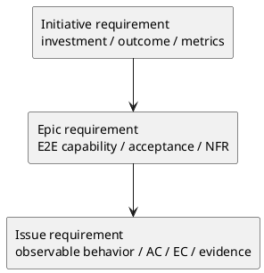

# 005-disc initiative epic issue requirement template の徹底分析

## 議題
- `templates/{initiative,epic,issue}/requirement.md` を、plan と同じ密度で再分析する。
- 現行 requirement template がすでに良いのか、削るべきものがあるのか、追加すべきものがあるのかを、scope ごとの差と LLM 利用を前提に評価する。
- 「ほとんど変えない」が結論なら、それを根拠つきで固定する。

## 結論
- requirement template 群は、**plan ほど大きく作り直す必要はない**。
- ただし、ゼロベースで見直した結果としても、次の調整は推奨される。
  - generic な `Definition of Ready/Done` は template から外す
  - 空の UML 枠は削除し、必要時だけ条件付き appendix にする
  - background / context の自由記述を少し圧縮し、問いベースに寄せる
  - optional section を整理し、「なくても requirement の核が成立する」構造を明確にする
- 要するに、requirement template は **構造自体は強いが、軽量化と責務純化が必要** という結論である。

## requirement template に求める本質

### requirement は何を固定する文書か
- 何を達成するか
- なぜ必要か
- 何がスコープか
- 何をもって達成とみなすか
- どの条件が非交渉か
- どこに未確定が残っているか

### requirement がやるべきでないこと
- HOW を先取りしすぎること
- implementation details を設計すること
- 実行順や review 手順を持つこと
- generic な運用 checklist を大量に埋め込むこと

## 現状評価

### Initiative requirement

#### 現在の強み
- `成功指標` が明示されている
- `ステークホルダー / 影響範囲` がある
- `なぜ今やるか` が背景の中に入っている
- 投資判断に必要な要素が概ね揃っている

#### 現在の弱み
- `Definition of Ready/Done` が generic すぎる
- `Initiative-level requirements` は optional でよいが、使い方を誤ると機能要求の羅列になりやすい
- `背景・現状` が少し広く、`why now` と `current problem` が混ざりやすい
- 空の UML は不要なノイズになりやすい

### Epic requirement

#### 現在の強み
- `Initiative との紐づき`
- `E-RQ`
- `E-AC`
- `NFR`
- `依存 / 影響範囲`
があり、epic requirement としてかなり筋が良い

#### 現在の弱み
- `Definition of Ready/Done` は template でなく gate 側に寄せたい
- `ユースケース` と `E-AC` の役割分担が曖昧になることがある
- 背景が薄くても書けてしまうため、「なぜこの epic が必要か」が `目的` に寄りすぎる

### Issue requirement

#### 現在の強み
- `背景・現状` が As-Is 証拠ベースになっている
- `AC / EC` が明確
- `観測点` を要求している
- `スコープ / 境界 / 制約 / 前提` が揃っている
- issue requirement としては現行 3 本の中で最も成熟度が高い

#### 現在の弱み
- `Definition of Ready/Done` は generic
- `対象ユーザー / 利用シナリオ`, `入力→出力例`, `用語` は毎回必須級ではない
- `判断材料/トレードオフ` は useful だが requirement の主線ではなく、条件付きでもよい

## scope ごとの requirement の違い

### Initiative の本質
- investment thesis
- outcome
- success metrics
- stakeholder impact

### Epic の本質
- E2E capability
- acceptance
- non-functional commitment
- downstream issue decomposition のための境界

### Issue の本質
- observable behavior
- As-Is evidence
- AC / EC
- strict scope boundary

## あるべき姿（To-Be）

### Initiative requirement は「投資判断の契約」に寄せる

残すべきもの
- `目的`
- `背景と Why now`
- `成功指標`
- `スコープ`
- `ステークホルダー / 影響範囲`
- `非交渉制約`
- `リスク / 依存`
- `未確定事項`

削る / 外へ逃がすべきもの
- generic `Definition of Ready/Done`
- 空 UML
- `Initiative-level requirements` の長い列挙

補足
- `Initiative-level requirements` 自体は残してもよいが、標準 section ではなく optional appendix に近づけるのがよい。

### Epic requirement は「E2E capability contract」に寄せる

残すべきもの
- `Initiative との紐づき`
- `提供する能力`
- `ユースケース`
- `E-RQ`
- `E-AC`
- `スコープ`
- `NFR`
- `依存 / 影響範囲`
- `未確定事項`

削る / 外へ逃がすべきもの
- generic `Definition of Ready/Done`
- 空 UML
- 汎用リスク欄の肥大化

補足
- `ユースケース` は残す価値が高い。Epic は E2E を扱うため、AC だけでなく narrative が必要だからである。

### Issue requirement は「observable behavior contract」に寄せる

残すべきもの
- `目的`
- `背景・現状`
- `スコープ`
- `境界`
- `非交渉制約`
- `前提`
- `受け入れ条件`
- `例外・エッジケース`
- `未確定事項`

条件付きで残すもの
- `対象ユーザー / 利用シナリオ`
- `入力→出力例`
- `用語`
- `判断材料/トレードオフ`

削る / 外へ逃がすべきもの
- generic `Definition of Ready/Done`
- 空 UML

補足
- Issue requirement は、3 本の requirement の中で最も「現状の骨格を維持してよい」。
- 主な改善は軽量化と optional 化で足りる。

## requirement template 共通で減らすべきもの

### 1. generic `Definition of Ready/Done`
- これは shared gate と重複しやすい。
- requirement template に必要なのは、generic DoR/DoD ではなく「文書本文の核が揃っているか」である。
- gate は `phase_requirement.md` / `workflow_*.md` 側で持つ方が整合性が高い。

### 2. 空の UML section
- requirement は図を必要としないことが多い。
- 空欄の PlantUML 枠はコンテキストのノイズになりやすい。
- 必要な時だけ appendix 的に追加できれば十分。

### 3. 長い説明 prose
- template は schema であり、説明書ではない。
- 各 section の導入は 1〜2 行で十分。

## requirement template 共通で残すべきもの

### 1. 未確定事項
- requirement phase では、TBD を隠さず構造化することが重要。
- これは全 scope に共通して残す価値が高い。

### 2. scope / boundary / constraints
- scope の明示は requirement の核であり、3 scope とも残すべき。

### 3. success / acceptance の中心欄
- Initiative なら success metrics
- Epic なら E-AC
- Issue なら AC / EC

## ベストプラクティス提案

### 提案1: requirement template は「測る / 切る / 固定する」に集中する
- 測る:
  - metrics / acceptance / observable behavior
- 切る:
  - scope / out-of-scope / boundary
- 固定する:
  - constraints / assumptions / open questions

### 提案2: requirement では optional section をはっきり扱う
- 毎回不要な欄は最初から conditional section として扱う。
- とくに Issue requirement の `用語` や `入力→出力例` は常設 mandatory にしない。

### 提案3: Epic requirement は現状の骨格を大きく崩さない
- もっともバランスが良いのは Epic requirement。
- 変更は軽量化が中心でよい。

### 提案4: Issue requirement は「最も成熟している」前提で軽量化する
- AC / EC / evidence の構造は維持する。
- 削るべきは運用系 checklist と optional section の常設感である。

## 判断
- requirement template 群は、plan ほどの抜本再構築は不要。
- ただし「変えなくてよい」ではなく、**骨格は維持しつつ、generic gate と空欄ノイズを削って schema として純化する** のが最適である。

## 次アクション
- 1. `initiative/requirement.md` の簡潔版 draft を作る
- 2. `epic/requirement.md` は現行骨格を維持したまま軽量化 draft を作る
- 3. `issue/requirement.md` は optional section の整理版 draft を作る
