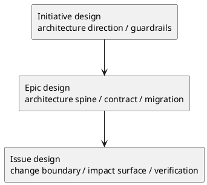

# 006-disc initiative epic issue design template の徹底分析

## 議題
- `templates/{initiative,epic,issue}/design.md` を、plan と同じ密度で再分析する。
- design template の現状がどこまで良くできているか、どこが過剰か、どこが不足かを整理する。
- redesign が必要なら、その方向性を固定する。不要なら不要と明言する。

## 結論
- design template 群も、**plan ほど抜本的な再設計は不要**。
- ただし、requirement よりは調整余地が大きい。
- 全体としての結論は次のとおり。
  - `epic/design.md` は現行の完成度が最も高く、骨格は大きく崩さなくてよい
  - `initiative/design.md` は少し抽象度を整理し、`guardrails / observability / NFR` の重なりを圧縮したい
  - `issue/design.md` は有用だが、optional detail が多く、template としてはやや重い
- UML については、requirement と違って design では **placeholder を残す価値が高い**。ただし乱立ではなく、図種と配置場所を絞るべきである。
- 要するに、design template 群は **再構築ではなく、役割の純化、UML 配置の明確化、optional detail の整理** が主な論点である。

## design template に求める本質

### design は何を固定する文書か
- requirement を満たす solution の方向
- 境界
- 契約
- データ / 整合性 / 失敗時挙動
- テスト / 移行 / 観測の方針
- 採用理由と未確定論点

### design がやるべきでないこと
- 実装順を計画すること
- 進め方や reviewer 運用を説明すること
- 具体コードの作業ログになること

## 現状評価

### Initiative design

#### 現在の強み
- `アーキテクチャ上の狙い`
- `現状の把握`
- `目指す姿`
- `システム境界 / 依存`
- `ガードレール`
- `移行 / ロールアウト方針`
があり、initiative design に必要な「方向づけ」がきれいに揃っている

#### 現在の弱み
- `ガードレール`, `観測性`, `非機能（NFR）設計` に重なりがある
- `契約` は initiative レベルでは抽象度がやや低い場合がある
- UML は残す価値があるが、initiative では毎回 2 枠は不要
- `ADR index` は useful だが、template では短い `関連 ADR` でも十分なケースがある

### Epic design

#### 現在の強み
- 3 本の design の中で最も完成度が高い
- `契約`, `データモデル`, `主要フロー`, `失敗設計`, `移行戦略`, `観測性`, `セキュリティ`, `テスト戦略`
の並びが、epic design の責務に非常に合っている
- `E-AC → テスト対応` まで持っている点も強い

#### 現在の弱み
- `API / Event / SoR` の全サブセクションが常設だと重い
- UML は有効だが、何の図を置く欄かが弱い
- `ADR index` は有効だが常設 mandatory でなくてもよい
- `テスト戦略` と `E-AC → テスト対応` は場合によっては統合できる

### Issue design

#### 現在の強み
- `既存実装/規約の調査結果`
- `変更計画（ファイルパス単位）`
- `マッピング（要件 → 設計）`
- `テスト戦略`
があり、Issue 実装前の設計文書として実用性が高い

#### 現在の弱み
- optional section が多く、template としてはやや肥大化している
- `クラス/インターフェース詳細設計`, `例外/エラー契約`, `ディレクトリ構成図` は毎回不要
- `テスト戦略` と `テストマトリクス` の重なりがある
- UML は残したいが、placement が散っている

## scope ごとの design の違い

### Initiative の本質
- target architecture の方向
- guardrails
- rollout principle
- observability / NFR principle

### Epic の本質
- E2E capability を支える architecture spine
- contract
- migration
- observability
- security
- verification

### Issue の本質
- 現状理解
- 選択した approach
- 変更境界
- テスト / rollback / impact

## あるべき姿（To-Be）

### Initiative design は「direction + guardrails」に純化する

残すべきもの
- `アーキテクチャ上の狙い`
- `現状と目指す姿`
- `対象境界 / 依存`
- `ガードレール`
- `ロールアウト原則`
- `観測性 / NFR 原則`
- `主要リスク`
- `未確定事項`

縮小すべきもの
- `契約（外部I/F・データ境界）` は、initiative では optional へ寄せてもよい
- `ADR index` は `関連 ADR` 程度に圧縮可能
- initiative では UML は 1 箇所まででよい。置くなら `現状と目指す姿` 直下の high-level context / target-state 図に絞る

結論
- Initiative design は現在も良いが、少し抽象度を上げて整理した方が強い。

### Epic design は「現状をかなり維持してよい」

残すべきもの
- `全体像`
- `契約`
- `データモデル`
- `主要フロー`
- `失敗設計`
- `移行戦略`
- `観測性`
- `セキュリティ / 権限 / 監査`
- `テスト戦略`
- `未確定事項`

条件付きに寄せるべきもの
- `API（ある場合）`
- `Event（ある場合）`
- Flow / data の UML は必要時のみ
- `ADR index`

調整提案
- `テスト戦略` と `E-AC → テスト対応` はまとめてもよい
- ただし「E-AC と test の対応」は残す価値が高い

結論
- Epic design は、今回の 9 template 群の中でも最も「現状を大きく変えなくてよい」。
- ただし UML は残す。とくに `全体像` 直下の module/context 図は標準で置く価値が高い。

### Issue design は「強いが少し重い」ので、軽量化が必要

残すべきもの
- `目的・制約`
- `既存実装 / 規約の理解`
- `採用方針 / トレードオフ`
- `インターフェース契約`
- `変更計画`
- `要件 → 設計マッピング`
- `テスト戦略`
- `未確定事項`

条件付きにすべきもの
- `データ・バリデーション`
- `API`
- `関数・クラス境界`
- `クラス/インターフェース詳細設計`
- `例外/エラー契約`
- `テストマトリクス`
- `ディレクトリ/ファイル構成図`

削るべきもの
- 意味の弱い UML placeholder の乱立
- 常設の詳細設計欄

結論
- Issue design は、「必要な時だけ詳細を追加する」conditional appendix 構造に寄せるのがよい。
- ただし `関数・クラス境界` 直下、`クラス/インターフェース詳細設計` 直下には UML 欄を残す価値が高い。前者は module / dependency 図、後者は class / interface 図を置く場所として明示する。

## design template 共通で減らすべきもの

### 1. 意味の弱い UML placeholder の乱立
- design では図が useful なことは多い。
- ただし「どんな図を置く欄か」が弱い placeholder を増やすべきではない。
- 残すなら次に絞る。
  - Initiative: high-level context / target-state 図
  - Epic: module / context 図、必要に応じて flow / data 図
  - Issue: module / dependency 図、class / interface 図

### 2. mandatory すぎる詳細欄
- とくに Issue design の詳細クラス設計や error contract は、毎回は不要。
- template に常設すると、埋める側がノイズ欄として扱い始める。

### 3. index / appendix の常設
- `ADR index` や directory tree は useful だが、常設 mandatory でなくてもよい。

## design template 共通で残すべきもの

### 1. As-Is 理解
- Initiative / Epic / Issue で粒度は違っても、現状理解は全 design に必要。

### 2. 選択した solution の核
- どの方式を採るか
- 何を採らないか
- どこが境界か

### 3. verification / migration / observability
- 設計は「作る形」だけでなく「壊さず出す方法」まで持つべき。

## ベストプラクティス提案

### 提案1: design template は「solution contract」に徹する
- 実行手順は plan に送る
- 進め方は phase / workflow に送る
- 残すのは solution boundary と verification principle

### 提案2: Epic design を基準形とみなす
- Epic design は現状でもっとも完成度が高い
- 将来の design template family は、Epic design の責務の切り方を基準にしてよい

### 提案3: UML は設計書だけ「作る場所を明示して残す」
- requirement では不要
- design では残す
- とくに Epic は module/context、Issue は module/class/interface を促す

### 提案4: Issue design は appendix 化で軽くする
- いまの Issue design は useful だが、標準形としては少し重い
- 「詳細設計は必要時のみ」の思想を template にも反映する

### 提案5: Initiative design は principle レベルを崩さない
- Initiative で詳細 API や詳細エラー設計を求めすぎない
- Initiative design は direction と guardrails を固定する場とする

## 判断
- design template 群は、requirement よりは調整余地があるが、plan ほど抜本再設計は不要。
- 特に `epic/design.md` は現状骨格を維持してよい。
- 主な改善は、
  - 空 UML 削除
  - optional detail の条件付き化
  - principle / spine / change-boundary の役割をさらに明確にする
ことである。

## 次アクション
- 1. `initiative/design.md` の整理版 draft を作る
- 2. `epic/design.md` は維持前提の軽量化 draft を作る
- 3. `issue/design.md` は conditional appendix 前提の新 draft を作る
