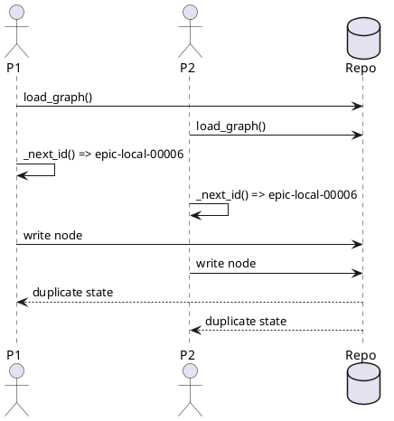

# Discussion: create allocator race による duplicate id 分析

## 問題

`new epic` と `new issue` を並列実行すると、同じ id が複数回採番される。

確認済み症状:

- `epic-local-00006` の重複
- `iss-local-00004` の重複
- その後 `validate/sync` が `Duplicate id detected` で失敗

根拠:

- `manual-tests/reports/2026-03-15-manual-regression-sweep/summary.md`
- `spec-deps/current/discussions/005-disc-duplicate-epic-id-race-analysis.md`

## 現状分析

`create_node.py` は次の順で create を行う。

1. 現在の graph を読む
2. `_next_id()` で `max + 1` を計算する
3. directory / `.meta.json` を書く

この間に排他制御がないため、複数プロセスが同じ `max + 1` を同時に採用できる。

## あるべき状態

- 並列 create でも id が重複しない
- create は成功か失敗かが atomic に扱われる
- 失敗時に partial state を残しにくい

## 対策案

### 案 A: create 前後で validate して重複時に失敗

利点:

- 実装は比較的軽い

欠点:

- duplicate 自体は発生する
- cleanup と rollback が必要
- race の根本解決にならない

### 案 B: create 系を repo-level file lock で直列化

利点:

- 実装が比較的シンプル
- root cause に直接効く
- `initiative/epic/issue/doc` に横展開しやすい

欠点:

- create の同時実行性能は落ちる
- lock file の扱いを明確にする必要がある

### 案 C: グローバル allocator file を導入して番号予約だけ atomic 化

利点:

- 番号採番は強くなる

欠点:

- 親スコープや doc sequence など複数ルールに拡張しにくい
- create 全体の atomicity は担保しない

### 案 D: DB 的な transaction layer を導入

利点:

- 将来的な堅牢性は高い

欠点:

- prototype 段階では過剰
- 既存 file-based runtime からの乖離が大きい

## 推奨案

`案 B: repo-level file lock` を first fix として採用するのが最善。

理由:

- 現在の file-based runtime を維持できる
- `new initiative/epic/issue/doc` 全てに同じパターンで適用できる
- duplicate id/seq の両方に効く
- prototype の修正として十分現実的

## consultant view

consultant も同じ結論で、`load_graph() -> _next_id() -> write` の gap を埋めるには create 全体を lock/transaction 扱いにするのが最も費用対効果が高い、という評価だった。

## 補足

将来的には `lock + atomic write + rollback guidance` の組み合わせへ進化させる余地があるが、第一段階では lock 導入が最も費用対効果が高い。
