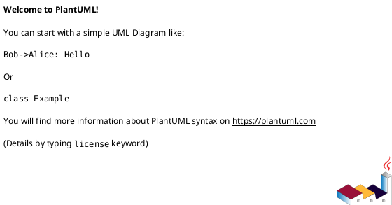

# 007-disc initiative epic issue 9 template の具体ドラフト案

## このシートの位置づけ
- これは 9 template の「具体文言 draft」である。
- まだ shipped template 本体は変更していない。
- 目的は、実際に template を差し替える前に、見出し構成と欄の粒度を固定することにある。

## 共通方針
- template は output schema に徹する
- 長い運用説明は書かない
- generic な `Definition of Ready/Done` は置かない
- `未確定事項` は全 template に残す
- UML は requirement では置かず、design では必要な位置に残す
- `省略/例外メモ` は廃止する

---

## 1. initiative requirement draft

```md
---
種別: 要件定義書（Initiative）
ID: "<INIT_ID>"
タイトル: "<INIT_TITLE>"
関連GitHub: ["<GITHUB_ISSUE_NUMBER_OR_URL>"]
状態: "draft | approved"
作成者: "<YOUR_NAME>"
最終更新: "YYYY-MM-DD"
---

# <INIT_ID> <INIT_TITLE> — 要件定義（WHAT / WHY）

## 目的（Outcome）
- Primary:
  - ...
- Secondary:
  - ...

## 背景と Why now
- 現状の課題:
  - ...
- 影響:
  - ...
- なぜ今やるか:
  - ...
- 情報源:
  - ...

## 成功指標
- Metric-001:
  - Baseline:
  - Target:
  - 計測方法:
  - 判定時期:
- Metric-002:
  - ...

## スコープ
- MUST:
  - ...
- MUST NOT:
  - ...
- OUT OF SCOPE:
  - ...

## ステークホルダー / 影響範囲
- 利用者:
  - ...
- 運用者:
  - ...
- 開発者:
  - ...
- 影響システム / 領域:
  - ...

## 非交渉制約
- 互換性:
  - ...
- セキュリティ / 監査:
  - ...
- 性能 / 可用性:
  - ...
- 運用:
  - ...

## リスク / 依存
- R-001: ...
- R-002: ...

## 未確定事項
- Q-001:
  - 質問:
  - 選択肢:
    - A: ...
    - B: ...
  - 推奨案:
  - 影響範囲:
```

### 補足
- `Initiative-level requirements` は常設しない。
- 必要なら `disc` または appendix で扱う。

---

## 2. initiative design draft

```md
---
種別: 設計書（Initiative）
ID: "<INIT_ID>"
タイトル: "<INIT_TITLE>"
関連GitHub: ["<GITHUB_ISSUE_NUMBER_OR_URL>"]
状態: "draft | approved"
作成者: "<YOUR_NAME>"
最終更新: "YYYY-MM-DD"
依存: ["requirement.md"]
---

# <INIT_ID> <INIT_TITLE> — 設計（HOW / Guardrails）

## アーキテクチャ上の狙い
- ...

## 現状と目指す姿
- As-Is:
  - ...
- To-Be:
  - ...

### UML（任意: high-level context / target-state）


## 対象境界 / 依存
- in scope:
  - ...
- external dependency:
  - ...
- boundary policy:
  - ...

## ガードレール
- 互換性:
  - ...
- セキュリティ:
  - ...
- データ境界:
  - ...
- 品質条件:
  - ...

## ロールアウト原則
- rollout strategy:
  - ...
- rollback principle:
  - ...
- feature flag principle:
  - ...

## 観測性 / NFR 原則
- observability:
  - ...
- performance / reliability:
  - ...
- audit / compliance:
  - ...

## 主要リスク
- R-001: ...
- R-002: ...

## 関連 ADR
- adr-...:
  - ...

## 未確定事項
- Q-001:
  - 質問:
  - 選択肢:
  - 推奨案:
  - 影響範囲:
```

### UML 方針
- initiative では 1 箇所まで。
- 高レベル図だけを置く。

---

## 3. initiative plan draft

```md
---
種別: 計画書（Initiative）
ID: "<INIT_ID>"
タイトル: "<INIT_TITLE>"
関連GitHub: ["<GITHUB_ISSUE_NUMBER_OR_URL>"]
状態: "draft | approved"
作成者: "<YOUR_NAME>"
最終更新: "YYYY-MM-DD"
依存: ["requirement.md", "design.md"]
---

# <INIT_ID> <INIT_TITLE> — 計画（Roadmap / Epics）

## この計画が達成する Goal / Metric
- Goal:
  - ...
- 対象 metric:
  - ...

## マイルストーン
- M1:
  - deliverable:
  - exit:
- M2:
  - ...

## Epic ポートフォリオ
- epic-xxxx-...:
  - 目的:
  - deliverable:
  - metric link:
  - depends on:
- epic-xxxx-...:
  - ...

## 順序と理由
- sequencing rationale:
  - ...
- parallelizable:
  - ...

## 意思決定ゲート
- G1 strategy review:
  - ...
- G2 milestone readiness:
  - ...
- G3 governance/docs impact:
  - ...
- G9 final initiative plan review:
  - ...

## 指標レビュー計画
- review timing:
  - ...
- dashboard / source:
  - ...

## ロールアウト計画
- rollout window:
  - ...
- release / communication:
  - ...

## Epic readiness contract
- Epic に要求する最低条件:
  - ...

## 依存 / ブロッカー
- D-001: ...
- D-002: ...

## 未確定事項
- Q-001:
  - 質問:
  - 選択肢:
  - 推奨案:
  - 影響範囲:
```

---

## 4. epic requirement draft

```md
---
種別: 要件定義書（Epic）
ID: "<EPIC_ID>"
タイトル: "<EPIC_TITLE>"
関連GitHub: ["<GITHUB_ISSUE_NUMBER_OR_URL>"]
状態: "draft | approved"
作成者: "<YOUR_NAME>"
最終更新: "YYYY-MM-DD"
親: ["<INIT_ID>"]
---

# <EPIC_ID> <EPIC_TITLE> — 要件定義（WHAT / WHY）

## 目的（Initiative との紐づき）
- initiative goal / metric:
  - ...
- この epic が提供する能力:
  - ...

## ユースケース
- happy path:
  - ...
- exception / operation scenario:
  - ...

## Epic requirements
- E-RQ-001:
  - ...
- E-RQ-002:
  - ...

## Epic acceptance criteria
- E-AC-001:
  - Given:
  - When:
  - Then:
  - 観測点:
- E-AC-002:
  - ...

## スコープ
- MUST:
  - ...
- MUST NOT:
  - ...
- OUT OF SCOPE:
  - ...

## 非機能要件
- performance:
  - ...
- reliability / consistency:
  - ...
- security:
  - ...
- operations:
  - ...

## 依存 / 影響範囲
- impacted components:
  - ...
- external dependency:
  - ...
- compatibility:
  - ...

## 未確定事項
- Q-001:
  - 質問:
  - 選択肢:
  - 推奨案:
  - 影響範囲:
```

---

## 5. epic design draft

```md
---
種別: 設計書（Epic）
ID: "<EPIC_ID>"
タイトル: "<EPIC_TITLE>"
関連GitHub: ["<GITHUB_ISSUE_NUMBER_OR_URL>"]
状態: "draft | approved"
作成者: "<YOUR_NAME>"
最終更新: "YYYY-MM-DD"
依存: ["requirement.md"]
親: ["<INIT_ID>"]
---

# <EPIC_ID> <EPIC_TITLE> — 設計（HOW）

## 全体像
- target boundary:
  - ...
- impacted area:
  - ...
- existing relation:
  - ...

### UML（推奨: module / context）


## 契約
### API（必要時）
- API-001:
  - Request:
  - Response:
  - Errors:

### Event（必要時）
- EVT-001:
  - Producer:
  - Consumer:
  - Payload:

### Data boundary
- SoR:
  - ...
- consistency model:
  - ...

## データモデル
- model / table changes:
  - ...
- invariants:
  - ...

### UML（任意: data model）


## 主要フロー
- Flow-A:
  1. ...
  2. ...
  3. ...
- Flow-B:
  - ...

### UML（任意: sequence / flow）


## 失敗設計
- failure mode:
  - ...
- retry:
  - ...
- idempotency:
  - ...
- partial failure:
  - ...

## 移行戦略
- migration strategy:
  - ...
- dual write/read if needed:
  - ...
- rollback:
  - ...

## 観測性 / セキュリティ
- observability:
  - ...
- role / auth:
  - ...
- audit / pii:
  - ...

## テスト戦略
- Unit:
  - ...
- Integration:
  - ...
- E2E:
  - ...
- E-AC mapping:
  - E-AC-001 -> ...

## 関連 ADR
- adr-...:
  - ...

## 未確定事項
- Q-001:
  - 質問:
  - 選択肢:
  - 推奨案:
  - 影響範囲:
```

### UML 方針
- epic design では UML を残す。
- 最低 1 箇所、できれば `全体像` に module/context 図を置く。

---

## 6. epic plan draft

```md
---
種別: 計画書（Epic）
ID: "<EPIC_ID>"
タイトル: "<EPIC_TITLE>"
関連GitHub: ["<GITHUB_ISSUE_NUMBER_OR_URL>"]
状態: "draft | approved"
作成者: "<YOUR_NAME>"
最終更新: "YYYY-MM-DD"
依存: ["requirement.md", "design.md"]
親: ["<INIT_ID>"]
---

# <EPIC_ID> <EPIC_TITLE> — 計画（Issues / Order）

## この計画で閉じる E-RQ / E-AC
- E-RQ:
  - ...
- E-AC:
  - ...

## Issue 分割方針
- slicing principle:
  - ...
- exceptions:
  - ...

## Issue 一覧（順序 / tranche 付き）
- iss-xxxx-...:
  - 目的:
  - deliverable:
  - tranche:
  - closes:
  - depends on:
- iss-xxxx-...:
  - ...

## 統合チェックポイント
- G1 decomposition review:
  - ...
- G2 integration readiness:
  - ...
- G3 rollout/docs impact:
  - ...
- G9 final epic spec review:
  - ...

## 品質ゲート
- test / observability / migration / docs:
  - ...

## ロールアウト / docs impact
- rollout order:
  - ...
- contract / docs refresh:
  - ...

## Issue readiness contract
- Issue に要求する最低条件:
  - ...

## 依存 / ブロッカー
- D-001: ...
- D-002: ...

## 未確定事項
- Q-001:
  - 質問:
  - 選択肢:
  - 推奨案:
  - 影響範囲:
```

---

## 7. issue requirement draft

```md
---
種別: 要件定義書（Issue）
ID: "<ISS_ID>"
タイトル: "<ISS_TITLE>"
関連GitHub: ["<GITHUB_ISSUE_NUMBER_OR_URL>"]
状態: "draft | approved"
作成者: "<YOUR_NAME>"
最終更新: "YYYY-MM-DD"
親: ["<EPIC_ID>", "<INIT_ID>"]
---

# <ISS_ID> <ISS_TITLE> — 要件定義（WHAT / WHY）

## 目的
- （1〜3行）...

## 背景・現状
- 現状の挙動:
  - ...
- 現状の課題:
  - ...
- 再現手順:
  1. ...
  2. ...
- 観測点:
  - UI:
  - HTTP:
  - DB:
  - Log:
- 情報源:
  - ...

## スコープ
- MUST:
  - ...
- MUST NOT:
  - ...
- OUT OF SCOPE:
  - ...

## 境界
- Always:
  - ...
- Ask:
  - ...
- Never:
  - ...

## 非交渉制約
- ...

## 前提
- ...

## 受け入れ条件
- AC-001:
  - Actor:
  - Given:
  - When:
  - Then:
  - 観測点:
- AC-002:
  - ...

## 例外・エッジケース
- EC-001:
  - 条件:
  - 期待:
  - 観測点:
- EC-002:
  - ...

## 入力→出力例（必要時）
- EX-001:
  - Input:
  - Output:

## 用語（必要時）
- TERM-001:
  - ...

## 未確定事項
- Q-001:
  - 質問:
  - 選択肢:
  - 推奨案:
  - 影響範囲:
```

### 補足
- `対象ユーザー / 利用シナリオ`, `判断材料/トレードオフ` は必要時だけ appendix でよい。

---

## 8. issue design draft

```md
---
種別: 設計書（Issue）
ID: "<ISS_ID>"
タイトル: "<ISS_TITLE>"
関連GitHub: ["<GITHUB_ISSUE_NUMBER_OR_URL>"]
状態: "draft | approved"
作成者: "<YOUR_NAME>"
最終更新: "YYYY-MM-DD"
依存: ["requirement.md"]
親: ["<EPIC_ID>", "<INIT_ID>"]
---

# <ISS_ID> <ISS_TITLE> — 設計（HOW）

## 目的・制約
- 目的:
  - ...
- MUST / MUST NOT:
  - ...
- 非交渉制約:
  - ...
- 前提:
  - ...

## 既存実装 / 規約の理解
- 参照した実装 / docs:
  - ...
- 現状理解:
  - ...
- 採用するパターン:
  - ...
- 採用しないもの:
  - ...
- 影響範囲:
  - ...

## 採用方針 / トレードオフ
- 論点:
  - ...
- 選択肢:
  - ...
- 決定:
  - ...

## インターフェース契約
- API / function / protocol / data boundary:
  - ...

### UML（推奨: module / dependency）


## クラス / インターフェース詳細設計（必要時）
- Class / Interface:
  - ...
- responsibility:
  - ...
- collaboration:
  - ...

### UML（任意: class / interface）


## 変更計画
- Add:
  - ...
- Modify:
  - ...
- Delete:
  - ...
- Move/Rename:
  - ...
- Read only:
  - ...

## 要件 → 設計マッピング
- AC-001 -> ...
- EC-001 -> ...
- constraint -> ...

## テスト戦略
- Unit:
  - ...
- Integration:
  - ...
- E2E / manual:
  - ...
- migration / rollback / feature flag if needed:
  - ...

## リスク / 移行 / ロールバック（必要時）
- ...

## 未確定事項
- Q-001:
  - 質問:
  - 選択肢:
  - 推奨案:
  - 影響範囲:
```

### UML 方針
- issue design では UML を残す。
- `インターフェース契約` の下は module / dependency 図。
- `クラス / インターフェース詳細設計` の下は class / interface 図。

---

## 9. issue plan draft

```md
---
種別: 実装計画書（Issue）
ID: "<ISS_ID>"
タイトル: "<ISS_TITLE>"
関連GitHub: ["<GITHUB_ISSUE_NUMBER_OR_URL>"]
状態: "draft | approved"
作成者: "<YOUR_NAME>"
最終更新: "YYYY-MM-DD"
依存: ["requirement.md", "design.md"]
親: ["<EPIC_ID>", "<INIT_ID>"]
---

# <ISS_ID> <ISS_TITLE> — 実装計画（Execution Contract）

## この計画で満たす要件ID
- AC:
  - ...
- EC:
  - ...
- 制約:
  - ...

## マイルストーン一覧
- M1:
  - 対象:
  - exit:
- M2:
  - ...

## ステップ一覧
- S01:
  - 観測可能な振る舞い:
  - closes:
  - review gate:
- S02:
  - ...

## 要件 ↔ ステップ対応
- AC-001 -> S01
- EC-001 -> S02

## レビュー / QA ゲート方針
- RG1 implementation review:
  - timing:
  - scope:
- QG1 QA review:
  - timing:
  - scope:
- SG1 spec review:
  - timing:
  - scope:

## 実装ステップ

### S01 — <observable behavior>
- target:
  - ...
- design refs:
  - ...
- step boundary:
  - ...

#### B1 — <work block>
- purpose:
  - ...
- files:
  - ...

##### I1 — <iteration>
- Red:
  - ...
- Green:
  - ...
- Refactor:
  - ...

##### I2 — <iteration>
- ...

#### milestone gate
- review:
  - ...
- expected tests:
  - ...
- report update:
  - ...

### Sxx — <next observable behavior>
- ...

## docs impact gate
- 対象:
  - docs / assets / workflow / skill / none
- 対応:
  - ...

## final diff review gate
- branch diff scope:
  - ...
- required validation:
  - ...
- reviewer approvals:
  - ...

## 未確定事項
- Q-001:
  - 質問:
  - 選択肢:
  - 推奨案:
  - 影響範囲:

## final exit contract
- AC/EC 達成:
  - ...
- docs impact resolved:
  - ...
- final diff approved:
  - ...
```

---

## まとめ
- requirement:
  - 骨格維持 + 軽量化
- design:
  - UML 方針を明示しつつ optional detail を整理
- plan:
  - 最も大きく刷新

## 次アクション
- この draft pack をもとに、次は shipped template へ反映するための差し替え文言案に落とす
