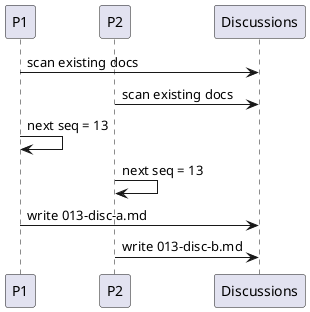

# Discussion: discussion sequence race による duplicate seq 分析

## 問題

`new doc disc` を並列実行すると、discussion 番号が重複する。

確認済み症状:

- `013-disc-*` が重複作成された
- 以後の `new doc` が duplicate sequence error で停止

根拠:

- `manual-tests/reports/2026-03-15-manual-regression-sweep/summary.md`

## 現状分析

discussion の採番も id allocator と同じく `現在値の走査 -> max + 1 -> write` で動いている。  
そのため `issue` / `epic` の id race と同型の問題である。

## あるべき状態

- 同一親の discussions で seq が一意になる
- 並列 create でも discussion doc が壊れない
- duplicate seq は作成時に予防される

## 対策案

### 案 A: post-write validate で duplicate seq を検知する

利点:

- validator を強化できる

欠点:

- duplicate 自体を防げない
- create の再実行や cleanup が必要

### 案 B: create allocator race と同じ repo-level lock に統合する

利点:

- 既存 runtime に対して最も整合的
- 実装パターンを共通化できる

欠点:

- create 全般が直列になる

### 案 C: discussion 専用 counter file を置く

利点:

- discussion だけは局所的に直せる

欠点:

- allocator が分裂する
- 将来の保守性が悪い

## 推奨案

`案 B` を採用し、discussion seq も create transaction の一部として扱うのがよい。

理由:

- 問題の本質が create allocator race と同じ
- 局所対処より共通基盤化の方が再発防止に強い

## consultant view

consultant も、discussion 専用の小手先修正ではなく、id allocator race と同じ lock 基盤に統合する案を推奨した。

## 補足

validator には duplicate seq 検知を追加するべきだが、それは予防ではなく safety net と位置づける。
