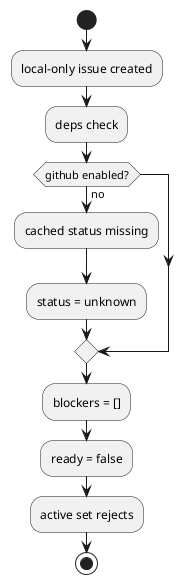

# Discussion: local-only issue の deps/active readiness 不整合分析

## 問題

local-only issue で `deps check --json` は `blockers=[]` なのに `ready=false` / `state=unknown` を返し、`active set` が通常拒否される。

根拠:

- `manual-tests/reports/2026-03-15-manual-regression-sweep/summary.md`

## 現状分析

status 解決は `github_enabled` と cached projection に依存しており、local-only issue の初期状態が `open` として deterministic に解釈されていない。

## あるべき状態

- local-only issue の初期 status が明示的に決まっている
- `deps check` と `active set` が同じ readiness contract を使う
- blockers がなければ少なくとも通常操作で進められる

## 対策案

### 案 A: local-only issue の初期 status を `open` に固定する

利点:

- 最も分かりやすい
- `deps/active` の整合を取りやすい

欠点:

- status source を設計上明示しないと拡張で曖昧になりうる

### 案 B: `unknown` のままでも blockers がなければ ready 扱いにする

利点:

- 変更が軽い

欠点:

- `status` と `ready` が直感的に噛み合いにくい

### 案 C: local-only issue に authority/effective status を導入する

利点:

- 将来の `close/reopen` や `link/unlink` と整合する

欠点:

- 実装範囲がやや広い

## 推奨案

`案 C` を採用しつつ、初期 effective status は `open` とするのが最善。

理由:

- 今後の status lifecycle 設計と自然につながる
- `deps` と `active` を同一 contract に揃えやすい
- local-only / GitHub-linked の両方を整理できる

## consultant view

consultant も、暫定的に `unknown` を ready 扱いするより、local-only issue に authority/effective status を導入して初期 effective status を `open` に固定する方が正しいと評価した。

## 補足

最小修正としては `案 A` でも効くが、今後の linked/unlinked 論点を考えると authority/effective の明示まで踏み込んだ方がよい。
