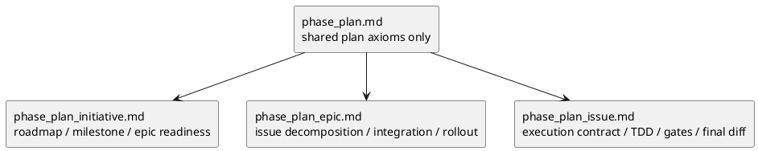

# 009-disc plan playbook は shared のまま維持すべきか scope split すべきかの分析

## 結論
- `plan` だけは requirement / design と同じ shared playbook 運用を続けない方がよい。
- 推奨は **hybrid split** である。
  - [phase_plan.md](/srv/mount/spec-dock/src/spec_dock/assets/spec_dock/docs/phase_plan.md) は shared axiom に縮小する
  - `initiative / epic / issue` ごとに plan 固有 playbook を持つ
- とくに `issue plan` は roadmap ではなく execution contract であり、shared playbook の additive rule だけで扱うには差分が大きすぎる。
- ただし `plan` を完全分割して shared を廃止するのも勧めない。`target / decomposition / sequence / gate / dependency / exit` の共通軸は shared に残す価値がある。

## このシートの目的
- 現在の `plan` 文書体系が Initiative / Epic / Issue の差を適切に扱えているかを再評価する。
- とくに issue 実装計画の `TDD cadence`, `review / QA / spec gate`, `docs impact`, `final diff review`, `report / commit rhythm` を、shared `phase_plan` に残すべきかを判断する。
- 第三者の consultant 視点も踏まえて、あるべき target architecture を提案する。

## 背景
- requirement / design は scope が違っても比較的同じ問いを扱う。
  - requirement は WHAT / WHY
  - design は HOW
- 一方で plan は scope が変わると「計画の意味」そのものが変わる。
  - initiative plan は roadmap / milestone / epic readiness
  - epic plan は issue slicing / integration / rollout
  - issue plan は step / block / iteration / review / QA / final diff
- そのため、template を分けるだけでなく、plan authoring rule 自体の責務設計を見直す必要がある。

## 現状の観測

### 観測 1. shared `phase_plan.md` に issue semantics が流入している
- [phase_plan.md](/srv/mount/spec-dock/src/spec_dock/assets/spec_dock/docs/phase_plan.md) は shared playbook を名乗っているが、実際には次のような issue 寄りの意味論を持っている。
  - `1 step = 1 つの観測可能な振る舞い`
  - nested `block / iteration`
  - `review / test / commit / report`
  - `docs impact gate`
  - `final diff review gate`
- これらは initiative / epic の読者には不要であり、LLM にとっても context 汚染になりやすい。

### 観測 2. shipped template はすでに強く非対称である
- [initiative/plan.md](/srv/mount/spec-dock/src/spec_dock/assets/spec_dock/templates/initiative/plan.md) は roadmap / milestone / epic readiness が中心
- [epic/plan.md](/srv/mount/spec-dock/src/spec_dock/assets/spec_dock/templates/epic/plan.md) は issue decomposition / integration checkpoint / rollout readiness が中心
- [issue/plan.md](/srv/mount/spec-dock/src/spec_dock/assets/spec_dock/templates/issue/plan.md) は execution contract であり、粒度も gate も別物である
- つまり template は split 方向に進んでいるが、playbook はまだ shared に寄っている。

### 観測 3. `workflow_issue.md` だけに寄せるのも足りない
- [workflow_issue.md](/srv/mount/spec-dock/src/spec_dock/assets/spec_dock/docs/workflow_issue.md) は lifecycle / governance / active set / handoff を扱う正本である。
- 一方で、issue plan 固有の
  - step の切り方
  - review / QA timing
  - nested execution structure
  - docs impact gate
  - final diff review
  - report / commit rhythm
は workflow ではなく **plan authoring rule** の領域である。
- したがって「shared `phase_plan` を薄くして全部 `workflow_issue` に寄せる」だけでは責務分離が弱い。

### 観測 4. issue template は protocol を前提にしている
- [issue/plan.md](/srv/mount/spec-dock/src/spec_dock/assets/spec_dock/templates/issue/plan.md) は単なる見出し集ではない。
- すでに次を前提とした execution contract の器になっている。
  - `マイルストーン一覧`
  - `ステップ一覧`
  - `レビュー / QA ゲート方針`
  - nested `step / block / iteration`
  - `S90 docs impact resolution`
  - `S99 final diff review quality gate`
- したがって issue plan は、上位 scope の計画より protocol 性がはるかに強い。

## 問題の本質
- requirement / design では「同じ phase を shared playbook で扱い、scope 差は workflow と template で吸収する」がまだ機能する。
- plan ではそれが崩れ始めている。
- 理由は、plan だけが単なる文書ではなく **execution semantics の契約** になるからである。
- とくに issue plan は、詳細を削ると簡潔になるのではなく、**実行品質が落ちる**。

## consultant 所見
- 独立した consultant 2 本の評価でも、shared のままでは弱いという点で一致した。
- 共通していた論点は次のとおりである。
  - plan は scope 差が構造差に変わる
  - issue plan は execution contract であり roadmap とは別物である
  - shared `phase_plan.md` に issue semantics を書くほど、initiative / epic 側にはノイズになる
  - ただし完全 split にすると共通軸の drift が起きやすい
- 2 本の差分はここにあった。
  - consultant A:
    - `initiative / epic / issue` ごとに plan playbook を持つべき
    - shared は shared axiom に縮小すべき
  - consultant B:
    - issue execution rule は `workflow_issue.md` に強く寄せるべき
    - shared minimum protocol と workflow / template の三層を明確化すべき
- この差分は競合ではなく、**phase plan の split と workflow 境界の再整理を同時に行うべき**という補完関係と解釈できる。

## 既存議論との整合
- [003-disc-plan-template-redesign.md](/srv/mount/spec-dock/spec-deps/current/discussions/003-disc-plan-template-redesign.md) では、
  - 3 本の plan template は同じ形に揃えるべきではない
  - 揃えるべきなのは `対象 / 分解 / 順序 / gate / 依存 / exit` だけ
  - nested execution は issue にだけ深く持つ
  という整理を採っている。
- [007-disc-nine-template-draft-pack.md](/srv/mount/spec-dock/spec-deps/current/discussions/007-disc-nine-template-draft-pack.md) でも、`issue plan` だけ execution contract として強い構造を持たせている。
- つまり今回の論点は新方針ではなく、**template 側で認めていた差分を playbook 側でも正本化する**話である。

## 選択肢

### Option A. shared `phase_plan.md` を維持する
概要
- 現状の構造を保ち、scope 差は template と workflow のみで吸収する

利点
- ファイル数が増えない
- 共通ルールを 1 箇所で参照できる

欠点
- shared の抽象度が壊れる
- issue 固有ルールが initiative / epic 側のノイズになる
- LLM が scope ごとの計画粒度を誤適用しやすい

評価
- requirement / design なら成立する
- plan では限界がある

### Option B. `plan` を完全 split し shared `phase_plan.md` を廃止する
概要
- `initiative / epic / issue` ごとに plan playbook を持ち、shared doc は置かない

利点
- 各 scope に完全最適化できる
- issue execution contract を最も強く書ける
- LLM の context 汚染が最小になる

欠点
- `gate / dependency / exit` の共通原則が drift しやすい
- routing と保守の負荷が上がる
- requirement / design との体系差が大きくなりすぎる

評価
- 分離性能は高い
- ただし保守性は落ちる

### Option C. hybrid split
概要
- shared `phase_plan.md` は plan の共通原則だけを残す
- 具体的な authoring / gate / granularity は scope 別 plan playbook に分ける
- `workflow_*.md` は lifecycle / governance / handoff を担い、plan playbook と責務を切り分ける

利点
- shared 原則は 1 箇所に残る
- issue 固有の execution semantics を独立させられる
- initiative / epic は軽く、issue は深く書ける
- 現行資産を活かしながら移行できる

欠点
- shared と scope-specific の境界設計を誤ると二重管理になる
- 導線設計が弱いと参照先が増えて見える

評価
- 一番バランスがよい
- 今回の問題に最も整合する

## 比較表

| 観点 | A. shared 維持 | B. 完全 split | C. hybrid split |
|---|---|---|---|
| LLM 可読性 | 低い | 高い | 高い |
| issue execution 品質 | 中 | 高い | 高い |
| 共通原則の保守 | 高い | 低い | 中〜高 |
| 文書責務の明確さ | 低い | 高い | 高い |
| drift リスク | 低い | 高い | 中 |
| 移行容易性 | 高い | 低い | 中 |

## 推奨案
- **Option C: hybrid split** を推奨する。

### 推奨理由 1. plan だけは scope 差が構造差に変わる
- requirement は WHAT / WHY
- design は HOW
- plan は HOW TO EXECUTE
- execution の粒度と gate は scope によって本質的に変わるため、plan は shared authoring rule に押し込めない。

### 推奨理由 2. issue plan は template より protocol を必要とする
- issue plan の品質は見出し数ではなく、実行順序と gate の意味論で決まる。
- その意味論は shared checklist では弱い。
- したがって issue には専用 playbook が必要である。

### 推奨理由 3. 完全 split は shared contract まで失う
- `target / decomposition / sequence / gate / dependency / exit` の最低限の共通軸は shared に残す価値がある。
- そのため shared をゼロにはしないほうがよい。

## 理想形

## 責務分離

### `phase_plan.md`
ここに書く
- plan の目的
- 固定すべき共通軸
  - target
  - decomposition
  - sequence
  - gate
  - dependency
  - exit
- shared minimum gate

ここに書かない
- issue 固有の nested execution
- TDD cadence
- final diff review
- commit rhythm
- rollout tranche の詳細

### `phase_plan_initiative.md`
ここに書く
- milestone の切り方
- epic ポートフォリオの粒度
- strategy / investment review gate
- epic readiness contract

### `phase_plan_epic.md`
ここに書く
- issue slicing 方針
- integration checkpoint
- rollout / observability / migration gate
- issue readiness contract

### `phase_plan_issue.md`
ここに書く
- `step -> block -> iteration`
- TDD cadence
- review / QA / spec gate の timing
- docs impact gate
- final diff review
- report / commit rhythm
- final exit contract

## workflow との境界
- scope 固有 plan playbook を追加しても、`workflow_*.md` を置き換えるわけではない。
- 境界は次のように切るのがよい。
  - `workflow_*.md`: lifecycle / governance / active set / handoff / validate / sync
  - `phase_plan*.md`: plan 文書をどう書くか、その gate をどこに置くか
  - `templates/*/plan.md`: 実案件で埋める schema
- issue では、
  - `workflow_issue.md` が実行の全体規律
  - `phase_plan_issue.md` が実装計画書の authoring contract
  - `templates/issue/plan.md` が execution contract の器
 という 3 層にすると迷いにくい。

## issue plan で正本化すべきもの
- これは template の説明文ではなく、issue plan playbook 側に持つべきである。
- 正本化候補:
  - `1 step = 1 observable behavior`
  - nested `block / iteration` の使用条件
  - Red -> Green -> Refactor -> review -> fix -> re-review -> report -> commit/no-op
  - レビューを毎 sub-step ではなく milestone / gate 単位で設計すること
  - `S90 docs impact`
  - `S99 final diff review quality gate`
  - verdict の `report.md` 反映

## 反対案を採ると起きること

### shared 維持を選ぶ場合
- issue semantics を `phase_plan.md` に書き戻すことになる
- initiative / epic plan の読者は常に issue 実装契約を読むことになる
- LLM 観点では、ユーザーが懸念している context 汚染が再発する

### 完全 split を選ぶ場合
- plan 間の最低限の共通軸まで散らばる
- 以後の保守で drift が起きやすい

## 提案する次アクション
1. `phase_plan.md` を 1 screen 程度の shared axiom に縮小する
2. `phase_plan_initiative.md` `phase_plan_epic.md` `phase_plan_issue.md` を新設する
3. `workflow_initiative.md` `workflow_epic.md` `workflow_issue.md` から plan authoring rule を整理し、playbook と workflow の責務を切り直す
4. `initiative/plan.md` `epic/plan.md` `issue/plan.md` template を新しい plan playbook の節名に合わせて微調整する
5. `guide.md` と `README.md` の導線を更新し、plan だけは shared + scope-specific の二段参照だと明示する
