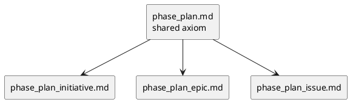

# 010-disc phase_plan.md の縮退案

## 結論
- [phase_plan.md](/srv/mount/spec-dock/src/spec_dock/assets/spec_dock/docs/phase_plan.md) は、shared playbook ではなく **shared axiom** に縮退するのがよい。
- 目標は 1 screen 前後で読めること、かつ `initiative / epic / issue` のどれを読む前にも最低限の plan 契約が揃うことにある。
- issue 固有の execution semantics はこの文書から除去し、scope 別 plan playbook に移す。

## なぜ縮退が必要か
- 現行の `phase_plan.md` は shared を名乗りつつ、issue 固有の detail をかなり含んでいる。
- その結果:
  - initiative / epic 読者には不要な detail が混ざる
  - LLM が issue semantics を上位 scope に誤適用しやすい
  - `workflow_issue.md` と責務が競合しやすい
- shared doc の役割は「何を plan で固定するか」を揃えることまでで十分である。

## shared `phase_plan.md` に残すべきこと
- phase の位置づけ
- plan の責務
- 前提入力
- 固定する共通軸
  - target
  - decomposition
  - sequence
  - gate
  - dependency
  - exit
- shared terminology
  - `shared minimum gate`
  - `scope-specific readiness contract`
  - `final exit contract`
- shared minimum gate
- 論点を `disc / research / adr` に逃がす原則

## shared `phase_plan.md` から外すべきこと
- issue 固有の `1 step = 1 observable behavior`
- nested `step / block / iteration`
- TDD cadence
- `review / test / commit / report` の cadence
- `S90 docs impact`
- `S99 final diff review`
- scope ごとの template section の詳細列挙

## before / after

| 項目 | 現行 | 縮退後 |
|---|---|---|
| plan の目的 | ある | 残す |
| shared entry | ある | 残す |
| scope ごとの粒度説明 | ある | 最小化する |
| issue 実行 cadence | ある | scope 別へ移す |
| issue gate 詳細 | ある | scope 別へ移す |
| template section 詳細 | ある | 削る |

## target architecture



## 提案する本文構成

```md
# phase playbook: plan

Initiative / Epic / Issue に共通する plan の shared axiom です。
scope 固有の plan authoring rule は `phase_plan_<scope>.md`、lifecycle / governance は `workflow_*.md` を参照します。

関連:
- 全体像: [guide.md](guide.md)
- Scope workflow: [workflow_initiative.md](workflow_initiative.md), [workflow_epic.md](workflow_epic.md), [workflow_issue.md](workflow_issue.md)
- Scope plan playbook: [phase_plan_initiative.md](phase_plan_initiative.md), [phase_plan_epic.md](phase_plan_epic.md), [phase_plan_issue.md](phase_plan_issue.md)

## phase contract

- 位置: `調査分析 → requirement → design → plan → 実装/品質ゲート` の `plan`
- 責務: 確定した requirement / design を、実行可能な分解・順序・停止点・品質ゲートへ変換する
- 前提入力: reviewer 承認レベルの `requirement.md` / `design.md`、依存、ブロッカー、対象 scope の workflow / phase plan
- 固定すること:
  - target
  - decomposition
  - sequence
  - gate
  - dependency
  - exit
- 出力: reviewer が handoff できる `plan.md` と必要な `disc` / `research` / `adr`
- 非ゴール: requirement / design の再議論、設計不足の隠蔽、将来作業の過剰先読み

## shared terminology

- `shared minimum gate`: 全 scope に共通して満たす最小 gate
- `scope-specific readiness contract`: 次の実行単位へ handoff するために対象 scope が追加で満たす条件
- `final exit contract`: この plan が閉じたと判断する最終条件

## shared entry checklist

- `requirement.md` と `design.md` が reviewer 承認レベルにある
- この plan が扱う単位を明確にした
- 依存、ブロッカー、外部制約を露出した
- 分割案や順序案の比較が必要なら `disc` に逃がすと決めた
- 対象 scope の `phase_plan_<scope>.md` と `workflow_<scope>.md` を確認した

## shared review / handoff gate

- 順序の理由が説明できる
- 粒度が対象 scope に対して妥当である
- 依存とブロッカーが plan に露出している
- gate と exit が plan に反映されている
- `plan.md` と必要な `disc` / `research` / `adr` を束で渡せる
- reviewer が「この計画で次へ進める」と判断できる

## escape hatch

- 分割案 / 順序案 / gate 案の比較は `disc`
- 外部制約や運用条件は `research`
- 恒久化すべき運用方針は `adr`
```

## ベストプラクティス
- shared doc では「何を plan で固定するか」だけを説明し、どう実行するかは scope 別へ逃がす。
- shared checklist は短く保ち、対象 scope の読み分けを必須導線にする。
- issue 専用 detail を shared に書き戻さない。
- 用語は shared 側で固定し、scope 別 playbook では再定義しない。

## この案で解決できること
- initiative / epic 側の context 汚染を抑えられる
- issue 側の detail を削らずに shared の読みやすさを上げられる
- `workflow_*.md` と `phase_plan*.md` の境界を切りやすくなる
