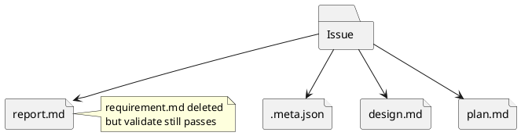

# Discussion: required artifact 欠損を validate/sync が未検知な問題の分析

## 問題

`issue/requirement.md` のような required artifact を削除しても、`validate` と `sync` が異常として検知しない。

根拠:

- `manual-tests/reports/2026-03-15-manual-regression-sweep/summary.md`

## 現状分析

現行 validator は主に meta/tree の整合を見るが、node kind ごとの required artifact matrix を持っていない。

## あるべき状態

- node kind ごとに必要ファイルが定義されている
- `validate` が欠損を検知する
- `sync` も安全上重要な欠損を見逃さない

## 対策案

### 案 A: validator に required artifact matrix を追加する

利点:

- 問題に直接効く
- acceptance criteria を書きやすい

欠点:

- matrix 管理が必要

### 案 B: sync 時にだけ欠損を補完する

利点:

- ユーザー体験は楽に見える

欠点:

- ユーザーの削除を勝手に戻す可能性がある
- validate の責務が薄いまま

### 案 C: doctor のみで検知する

利点:

- 実装は局所化できる

欠点:

- 通常の validate で守れない

## 推奨案

`案 A` を採用し、validator に artifact contract を持たせるべき。

理由:

- runtime contract を明文化できる
- 欠損検知は validate の責務として自然
- 将来 doctor へも同じ contract を再利用できる

## consultant view

consultant も、required artifact 欠損は validate で守るべきであり、node kind ごとの required artifact matrix を正式 contract として持つ案を推奨した。
