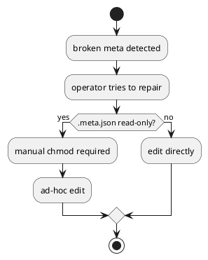

# Discussion: read-only `.meta.json` と repair 導線不足の分析

## 問題

`.meta.json` が read-only で保護されているため、壊れた状態や手動修復が必要な状態で運用上の摩擦が大きい。一方で正式な `doctor/repair` 導線がない。

根拠:

- `manual-tests/reports/2026-03-15-manual-regression-sweep/summary.md`

## 現状分析

保護自体は「人が不用意に壊しにくい」という利点があるが、障害時に正規ルートがないため、chmod して手修正するしかなくなる。

## あるべき状態

- 通常時はメタデータを不用意に壊しにくい
- 障害時は supported path で診断・修復できる
- human と agent の両方が同じ手順で復旧できる

## 対策案

### 案 A: `.meta.json` を writable に戻す

利点:

- 手元で直しやすい

欠点:

- 平時の accidental edit リスクが上がる

### 案 B: read-only は維持し、`doctor/repair` を追加する

利点:

- safety と recoverability を両立しやすい
- agentic CLI として相性がよい

欠点:

- 実装量は増える

### 案 C: validate だけ強化して修復は手動のまま

利点:

- 実装は軽い

欠点:

- 実際の運用復旧が改善しない

## 推奨案

`案 B` が最善。

理由:

- いま必要なのは単なる writable 化ではなく recoverability の正式化
- dogfooding で問題を見つけたときにも、再現性のある修復導線が必要

## consultant view

consultant も、read-only 自体は維持しつつ `doctor/repair` を追加するのが、安全性と recoverability の両立として最も妥当だと評価した。
