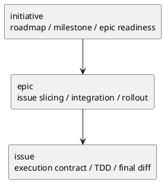

# 011-disc scope 別 plan playbook のドラフト案

## 結論
- `plan` は `initiative / epic / issue` ごとに別 playbook を持つべきである。
- ただし分けるのは template ではなく **authoring rule と gate の正本** である。
- 各 playbook は 2 screen 前後で読める長さに抑え、template への記入粒度を固定する。

## 共通方針
- 3 本とも `phase_plan.md` の shared axiom を前提にする
- 各文書は「この scope の計画書をどう書くか」にのみ集中する
- lifecycle / governance / active set / sync は `workflow_*.md` に書く
- 実案件の本文欄そのものは template に残し、playbook は埋め方と gate を示す

## 1. `phase_plan_initiative.md` draft

### 役割
- initiative plan を roadmap / milestone / epic handoff の契約として書くための playbook

### 想定読者
- initiative を新設 / 更新する agent
- initiative plan reviewer

### 提案する本文構成

```md
# phase playbook: plan (initiative)

Initiative plan の playbook です。
shared axiom は [phase_plan.md](phase_plan.md)、Initiative の lifecycle / governance は [workflow_initiative.md](workflow_initiative.md) を参照します。

## scope contract

- plan の単位: roadmap / milestone / epic portfolio
- plan の責務: initiative requirement / design を、epic 分解、順序、意思決定ゲート、指標レビューへ変換する
- plan が固定するもの:
  - milestone
  - epic portfolio
  - sequencing rationale
  - investment / strategy gate
  - epic readiness contract
  - final exit contract
- plan が固定しないもの:
  - issue 単位の実装順
  - test command
  - per-step review cadence

## entry focus

- 目的と成功指標が requirement で固定されている
- target architecture / guardrails が design で整理されている
- epic 分解前提と外部依存が見えている

## authoring checklist

- `この計画が達成する Goal / Metric` を先に埋める
- `マイルストーン` を exit 付きで置く
- `Epic ポートフォリオ` に目的 / deliverable / metric link / depends on を入れる
- `順序と理由` で並行可能性と停止点を書く
- `意思決定ゲート` で strategy / milestone / governance review を固定する
- `Epic readiness contract` を置く
- `final exit contract` を置く

## review gate

- Epic へ handoff できる粒度まで分解されている
- 指標レビューの timing がある
- 投資判断 / milestone 継続判断の gate がある
- governance / rollout 更新の必要性が露出している
```

### ベストプラクティス
- initiative plan は実装計画ではなく、投資と分解の契約として保つ
- epic 数を並べるだけでなく、順序の理由と停止点を必ず持つ

## 2. `phase_plan_epic.md` draft

### 役割
- epic plan を issue decomposition / integration / rollout readiness の契約として書くための playbook

### 提案する本文構成

```md
# phase playbook: plan (epic)

Epic plan の playbook です。
shared axiom は [phase_plan.md](phase_plan.md)、Epic の lifecycle / governance は [workflow_epic.md](workflow_epic.md) を参照します。

## scope contract

- plan の単位: issue tranche / integration checkpoint / rollout tranche
- plan の責務: epic requirement / design を、issue 分割、統合順、ロールアウト準備、issue readiness へ変換する
- plan が固定するもの:
  - issue slicing strategy
  - issue order / tranche
  - integration checkpoint
  - rollout / docs impact gate
  - issue readiness contract
  - final exit contract
- plan が固定しないもの:
  - issue 内 step の切り方
  - TDD cadence
  - commit rhythm

## entry focus

- E-RQ / E-AC が requirement で固定されている
- 契約 / 移行 / 観測性 / rollback が design にある
- integration risk が見えている

## authoring checklist

- `この計画で閉じる E-RQ / E-AC` を先に置く
- `Issue 分割方針` を置く
- `Issue 一覧（順序 / tranche 付き）` を置く
- `統合チェックポイント` を置く
- `品質ゲート` に observability / migration / docs を置く
- `ロールアウト / docs impact` を置く
- `Issue readiness contract` を置く
- `final exit contract` を置く

## review gate

- issue 群で E-AC を閉じられる説明がある
- integration checkpoint がある
- rollout / docs impact が露出している
- issue handoff に必要な readiness がある
```

### ベストプラクティス
- epic plan は issue の列挙ではなく、統合順序の設計書として扱う
- rollout / observability / migration を late stage の補足にしない

## 3. `phase_plan_issue.md` draft

### 役割
- issue plan を TDD ベースの execution contract として書くための playbook
- nested semantics の正本は [013-disc-issue-plan-tdd-embedding-best-practice.md](/srv/mount/spec-dock/spec-deps/current/discussions/013-disc-issue-plan-tdd-embedding-best-practice.md) を採用する

### 提案する本文構成

```md
# phase playbook: plan (issue)

Issue plan の playbook です。
shared axiom は [phase_plan.md](phase_plan.md)、Issue の lifecycle / governance は [workflow_issue.md](workflow_issue.md) を参照します。

## scope contract

- plan の単位: milestone / step / block / iteration / quality gate
- plan の責務: issue requirement / design と `workflow_issue.md` の execution policy を、実行順、review / QA / spec gate、docs impact、final diff review を持つ `plan.md` に変換する
- plan が固定するもの:
  - 満たす要件 ID
  - milestone
  - step 一覧
  - 要件 ↔ step 対応
  - review / QA / spec gate 方針
  - nested execution structure
  - docs impact gate
  - final diff review quality gate
  - final exit contract

## execution axioms

- `1 step = 1 observable behavior`
- `block` は optional concern group とする
- `iteration` は 1 回の完全な TDD cycle とする
- `Red / Green / Refactor` は iteration の内部フェーズとする
- `workflow_issue.md` が定義する execution cadence を plan に反映する
- cadence そのものは workflow の正本であり、この playbook では gate / step / report / commit decision を plan.md にどう埋め込むかを扱う
- レビューは sub-step ごとではなく、step / milestone / final gate の粒度で設計する
- 最初にその step の test を全部書かず、iteration ごとに failing test を 1 本ずつ進める

## entry focus

- AC / EC / constraints が requirement で固定されている
- 変更点、境界、verification strategy が design にある
- 実行前に review / QA / docs impact の位置が決まっている

## authoring checklist

- `この計画で満たす要件ID` を先に固定する
- `マイルストーン一覧` を置く
- `ステップ一覧` と `要件 ↔ ステップ対応` を置く
- `レビュー / QA ゲート方針` を置く
- `実装ステップ` を step / block / iteration で書く
  - 単純な step では `block` は最小 1 個の wrapper でよい
  - 複雑な step では `block` で concern group を分ける
- `S90 docs impact resolution / docs refresh` を必要時に入れる
- `S99 final diff review quality gate` を必須で置く
- `final exit contract` を置く

## review gate

- step 粒度で review / test / report / commit が回る
- AC / EC と step の対応が取れている
- docs impact と final diff review が計画に埋め込まれている
- reviewer が「この plan で実装してよい」と判断できる
```

### ベストプラクティス
- issue plan では読みやすさより execution quality を優先する
- ただし detail を無制限に増やさず、block / iteration は必要時だけ使う
- quality gate は本文の後置き補足ではなく、計画そのものとして埋め込む
- cadence の正本は `workflow_issue.md` に置き、この playbook では cadence を plan に埋め込む粒度と配置を決める
- TDD の nested semantics は `block = optional concern group`, `iteration = 1 tdd cycle`, `Red / Green / Refactor = iteration 内部フェーズ` で統一する

## 比較図


