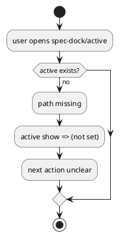

# Discussion: active 未設定時の pathway gap 分析

## 問題

active 未設定時に `spec-dock/active` が存在せず、`active show` も `(not set)` を返すだけで、利用者が次に何を見ればよいか分かりにくい。

根拠:

- `manual-tests/reports/2026-03-15-manual-regression-sweep/summary.md`

## 現状分析

「active がない」こと自体は仕様としてありえるが、fallback 導線がないため onboarding/UX 上の gap になっている。

## あるべき状態

- active 未設定でも「今は未設定だ」と一目で分かる
- 次に使うコマンドや fallback docs への導線がある
- human と agent の両方が迷いにくい

## 対策案

### 案 A: `active show` の文言だけ改善する

利点:

- 実装が軽い

欠点:

- filesystem 上の入口は依然としてない

### 案 B: `spec-dock/active -> system/active-none` のような一貫した symlink を持つ

利点:

- パスを常に開ける
- onboarding に強い

欠点:

- symlink 管理の分岐が増える

### 案 C: A と B を両方入れる

利点:

- CLI と filesystem の両面で迷いを減らせる

欠点:

- 実装範囲は少し広がる

## 推奨案

`案 C` が最善。

理由:

- この問題は機能不足というより導線不足
- 表示と path の両方を揃える方が人間にも agent にも優しい

## consultant view

consultant も、`active show` の fallback 表示だけでなく、`spec-dock/active` 自体を未設定時も開ける入口にする方が onboarding 効果が高いと評価した。
