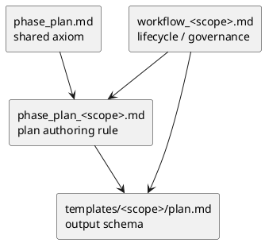

# 012-disc plan playbook と workflow/template の責務再配分案

## 結論
- `plan` 再設計で重要なのは、ファイルを増やすことではなく **責務を重ねないこと** である。
- 提案する最終形は次の 4 層である。
  - `phase_plan.md`: shared axiom
  - `phase_plan_<scope>.md`: plan authoring rule
  - `workflow_<scope>.md`: lifecycle / governance / active set / handoff
  - `templates/<scope>/plan.md`: output schema

## 4 層モデル

## 責務マトリクス

| 論点 | phase_plan.md | phase_plan_<scope>.md | workflow_<scope>.md | template |
|---|---|---|---|---|
| plan の目的 | ○ | - | - | - |
| fixed axes | ○ | - | - | - |
| scope ごとの粒度 | - | ○ | - | - |
| lifecycle / active set | - | - | ○ | - |
| sync / validate | - | - | ○ | - |
| authoring rule | - | ○ | - | - |
| gate timing | △ shared only | ○ plan への配置 | △ 実行 policy / lifecycle gate | - |
| template field | - | - | - | ○ |
| execution cadence | - | △ plan への反映方法 | ○ issue workflow が正本 | - |

## issue scope の明示ルール
- issue では、同じ論点を `workflow_issue.md` と `phase_plan_issue.md` に二重に書かない。
- ownership は次で固定する。
  - `workflow_issue.md`: execution policy の正本
    - TDD cadence
    - step approval の考え方
    - final diff review を必須とする理由
    - report / commit rhythm
  - `phase_plan_issue.md`: その policy を `plan.md` にどう埋め込むかの正本
    - step / block / iteration の使い分け
    - gate を plan 本文のどこに置くか
    - `S90` / `S99` をどう plan に含めるか
  - `templates/issue/plan.md`: 実案件で埋める器

## 各層に書いてよいこと

### `phase_plan.md`
- plan の定義
- shared entry
- shared review / handoff gate
- 論点の逃がし先

### `phase_plan_<scope>.md`
- その scope の plan が扱う単位
- その scope の authoring checklist
- その scope の readiness / exit contract
- その scope の review gate
- workflow policy を plan.md に反映するルール

### `workflow_<scope>.md`
- その scope の作成 / import / active set
- 再利用判定
- lifecycle / governance / sync / validate
- phase playbook への導線
- 実行 policy の正本

### `templates/<scope>/plan.md`
- 実案件で埋める見出しと欄
- execution contract の器

## 書いてはいけないこと

### `phase_plan.md`
- issue 専用 cadence
- nested execution rule
- template section の詳細列挙

### `phase_plan_<scope>.md`
- CLI コマンド
- current active の振る舞い
- GitHub sync 手順

### `workflow_<scope>.md`
- template の具体見出し定義
- 長い埋め方説明

### template
- 長い運用説明
- why / trade-off の長文
- generic ready/done の説明

## shipped docs 反映時の変更方針

### 新設するもの
- `src/spec_dock/assets/spec_dock/docs/phase_plan_initiative.md`
- `src/spec_dock/assets/spec_dock/docs/phase_plan_epic.md`
- `src/spec_dock/assets/spec_dock/docs/phase_plan_issue.md`

### 更新するもの
- `src/spec_dock/assets/spec_dock/docs/phase_plan.md`
- `src/spec_dock/assets/spec_dock/docs/workflow_initiative.md`
- `src/spec_dock/assets/spec_dock/docs/workflow_epic.md`
- `src/spec_dock/assets/spec_dock/docs/workflow_issue.md`
- `src/spec_dock/assets/spec_dock/docs/guide.md`
- `src/spec_dock/assets/spec_dock/docs/README.md`
- `src/spec_dock/assets/spec_dock/templates/initiative/plan.md`
- `src/spec_dock/assets/spec_dock/templates/epic/plan.md`
- `src/spec_dock/assets/spec_dock/templates/issue/plan.md`

## 最小導線
- `README.md`: plan は shared + scope-specific の二段構造だと明記する
- `guide.md`: plan だけ split されている理由を 2 行で説明する
- `workflow_*.md`: 関連欄で `phase_plan_<scope>.md` を指す
- `phase_plan.md`: scope 別 plan playbook へのリンクを先頭に置く

## migration の注意点
- `phase_plan.md` を先に薄くしすぎると、一時的に issue 実行規約が消える
- したがって実装順は次がよい
  1. `phase_plan_<scope>.md` を追加
  2. `workflow_*.md` の導線を更新
  3. template を節名だけ微調整
  4. 最後に `phase_plan.md` を縮退

## ベストプラクティス
- 1 つの論点は 1 箇所にだけ書く
- issue execution の深さは `phase_plan_issue.md` に集約する
- ただし issue cadence の正本は `workflow_issue.md` に残し、`phase_plan_issue.md` はその埋め込み方に集中する
- workflow は writer guide ではなく lifecycle / policy guide として保つ
- template は常に schema として軽く保つ
