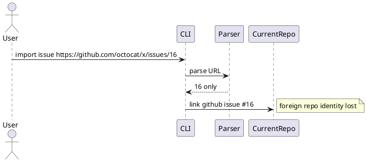

# Discussion: import の wrong-repo URL parsing risk 分析

## 問題

`import` は GitHub issue URL から `owner/repo` を見ず、issue number だけを取り出してリンクする。そのため foreign repo の URL を貼っても、現在 repo の同番号 issue に誤リンクできてしまう。

根拠:

- `manual-tests/reports/2026-03-15-manual-regression-sweep-github-live/summary.md`

## 現状分析

`import_cmd.py` の help でも `owner/repo is ignored` と明記されている。これは現在仕様ではあるが、安全ではない。

## あるべき状態

- URL を渡したら `owner/repo` を検証する
- foreign repo を扱うなら明示 opt-in が必要
- number only と URL の安全性差が利用者に伝わる

## 対策案

### 案 A: URL の `owner/repo` が current repo と一致しない場合は失敗

利点:

- 最も安全
- 誤リンクを強く防げる

欠点:

- cross-repo import を将来やりたい場合は別設計が必要

### 案 B: mismatch 時は warning のみ

利点:

- 柔軟性はある

欠点:

- agent や script では warning 見落としが危険

### 案 C: mismatch 時は失敗、`--allow-foreign-url` で明示解除

利点:

- 安全性と柔軟性のバランスがよい

欠点:

- CLI surface が少し増える

## 推奨案

`案 C` を推奨する。

理由:

- default safe が重要
- 将来 cross-repo 需要があっても逃げ道を残せる

## consultant view

consultant も、不一致時 warning では弱く、`owner/repo` 一致を default で強制し、例外は明示 opt-in にすべきだと評価した。
