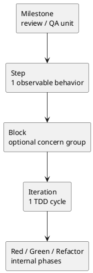

# 013-disc issue 実装計画書に TDD を埋め込むベストプラクティス案

## 結論
- issue 実装計画書には、TDD を補足説明ではなく **構造そのものとして** 埋め込むべきである。
- ただし、TDD の思想と cadence policy の正本は [workflow_issue.md](/srv/mount/spec-dock/src/spec_dock/assets/spec_dock/docs/workflow_issue.md) に置き、issue plan playbook と template では **その policy を `plan.md` にどう落とすか** を定義するのがよい。
- 推奨する粒度対応は次である。
  - `milestone`: 機能群または review / QA の区切り
  - `step`: 1 つの観測可能な振る舞い
  - `block`: optional concern group
  - `iteration`: 1 回の完全な TDD cycle
  - `Red / Green / Refactor`: iteration の内部フェーズ
- したがって、ユーザー案の「TDD を issue plan に構造として埋め込む」は正しい。ただし最も自然な管理構造は、`iteration` を Red / Green / Refactor そのものではなく、**1 回の小さな TDD ループ** として扱う形である。

## このシートの目的
- issue 実装計画書と issue plan playbook に、TDD をどこまで / どの粒度で埋め込むかを決める
- `step / block / iteration` を TDD にどう対応させるかを決める
- review / QA / docs / final diff を TDD cycle とどう分離するかを決める
- consultant の複数視点を統合して、実運用しやすい best practice を提案する

## 背景
- ユーザーが求めているのは「最初にテストを全部書く」方式ではなく、Kent Beck / 和田卓人の系譜にある、小さい Red-Green-Refactor を繰り返す TDD である。
- つまり issue plan には、次が明示されている必要がある。
  - 次に書く failing test は何か
  - そのテストを通す最小実装は何か
  - green を維持したまま何を整えるか
- 一方で、review / QA / docs impact / final diff は TDD cycle の中に混ぜると重くなりすぎる。

## repo から分かる現状

### 事実 1. `workflow_issue.md` はすでに TDD policy を持っている
- [workflow_issue.md](/srv/mount/spec-dock/src/spec_dock/assets/spec_dock/docs/workflow_issue.md) は次を正本として持っている。
  - `Red → Green → Refactor → review → fix → re-review → report → commit/no-op`
  - `1 step = 1 つの観測可能な振る舞い`
  - docs impact step
  - final diff review quality gate

### 事実 2. `issue/plan.md` は nested structure をすでに持っている
- [issue/plan.md](/srv/mount/spec-dock/src/spec_dock/assets/spec_dock/templates/issue/plan.md) は
  - `milestone`
  - `step`
  - `block`
  - `iteration`
を持っており、TDD を構造として入れる余地がある。

### 事実 3. 直近 draft は TDD 埋め込みの ownership までは整理済みである
- [011-disc-scope-specific-plan-playbook-drafts.md](/srv/mount/spec-dock/spec-deps/current/discussions/011-disc-scope-specific-plan-playbook-drafts.md) では、issue plan を execution contract として扱う整理まではできている。
- ただし、`block / iteration` を TDD のどの粒度に対応させるかは、まだ最終固定されていない。

## consultant 観点の比較
- consultant A の主張:
  - `block = 1 tdd slice`
  - `iteration = Red / Green / Refactor`
- consultant B の主張:
  - `block = optional concern group`
  - `iteration = 1 回の完全な tdd cycle`
  - `Red / Green / Refactor = iteration の内部フェーズ`

## 比較

### Option A. `block = 1 tdd slice`, `iteration = Red / Green / Refactor`
利点
- ユーザーの直感に近い
- `block` に slice の意味を強く持たせられる

欠点
- `iteration` という語が phase label になり、意味とズレる
- current template では `iteration` の内側に `Red / Green / Refactor` を置いた方が自然
- 複数の小さな TDD cycle を繰り返す時に、`block` が増えすぎやすい

評価
- 機能するが、用語と構造の一致がやや弱い

### Option B. `block = optional concern group`, `iteration = 1 tdd cycle`
利点
- `iteration` という語と実態が一致する
- 1 iteration ごとに「次の failing test 1 本」を書ける
- `Red / Green / Refactor` を iteration の固定フェーズとして持てる
- `block` を optional にできるので、単純な step では肥大化しにくい

欠点
- `block` の意味を明示しないと空洞化しやすい
- 最初は少し理解コストがある

評価
- 最も自然で拡張しやすい
- current template の骨格にも整合する

## 推奨案
- **Option B** を推奨する。
- つまり、issue plan では次の対応を標準にする。
  - `milestone = review / QA の区切り`
  - `step = 1 observable behavior`
  - `block = optional concern group`
  - `iteration = 1 回の完全な TDD cycle`
  - `Red / Green / Refactor = iteration の内部フェーズ`

## 固定ルール

### ルール 1. `step` は常に 1 observable behavior
- step は feature chunk ではなく、観測可能な 1 行為に絞る。
- 例:
  - `有効な入力でユーザーを作成できる`
  - `重複 email のとき 409 を返す`

### ルール 2. `iteration` ごとに failing test は 1 本だけ書く
- 最初にその step のテストを全部書かない。
- iteration ごとに「次の failing test 1 本」を書く。
- これにより、小さな Red-Green-Refactor を維持できる。

### ルール 3. `Red / Green / Refactor` は iteration の内部フェーズ
- `Red`: 先に失敗する test を書く
- `Green`: test を通す最小実装に留める
- `Refactor`: green を維持したまま整理する

### ルール 4. `block` は optional concern group
- 1 step をそのまま複数 iteration で進められるなら、`block` は 1 つの最小グループで十分である。
- block は次のような時だけ意味を持つ。
  - 同じ step の中で関心を分けたい
  - API / validation / persistence のように slice 群を束ねたい
  - reviewer に途中の grouping を見せたい

### ルール 5. review / QA / docs / final diff は TDD cycle の外側に置く
- implementation review は `step gate` または `milestone gate`
- QA review は `milestone gate` または final
- docs impact は `S90`
- final diff review は `S99`
- つまり TDD cycle の中に review / docs / final diff を混ぜない

## 推奨する対応関係



## playbook に書くべきこと
- ここでは `phase_plan_issue.md` を想定する。

### 書くべきもの
- `step = 1 observable behavior`
- `iteration = 1 tdd cycle`
- `Red / Green / Refactor = iteration の内部フェーズ`
- `block` は optional concern group
- failing test は iteration ごとに 1 本
- review / QA / docs / final diff は TDD cycle の外に置く
- reviewer を入れる粒度は `step gate` / `milestone gate` / `S99` に先置きする

### 書かない方がよいもの
- テストフレームワーク固有の書き方
- 言語固有のテストコード例
- iteration ごとの reviewer 介入
- 実案件固有の block 名の固定

## template に置くべきこと

### 残すべき構造
- `マイルストーン一覧`
- `ステップ一覧`
- `レビュー / QA ゲート方針`
- `実装ステップ`
- `S90 docs impact resolution / docs refresh`
- `S99 final diff review quality gate`

### 変更を推奨するもの
- `実行ルール（全ステップ共通）` に次を入れる
  - `各 iteration は Red / Green / Refactor の順で閉じる`
  - `Red では先に failing test を 1 本書く`
  - `Green は最小実装`
  - `Refactor は green 維持が前提`
- `block` の意味を optional concern group として明記する
- `iteration` の意味を 1 回の TDD cycle として明記する

## template の具体イメージ

```md
### S01 — <observable behavior>
- target:
  - ...
- step boundary:
  - ...

#### B1 — <optional concern group>
- purpose:
  - ...

##### I1 — <tdd cycle>
- slice goal:
  - ...

###### Red
- failing test:
  - ...
- expected failure:
  - ...

###### Green
- minimum implementation:
  - ...
- pass condition:
  - ...

###### Refactor
- cleanup target:
  - ...
- invariants to keep green:
  - ...

#### step gate
- review:
  - ...
- report update:
  - ...
- commit decision:
  - ...
```

### block を最小化した形

```md
### S02 — <simple observable behavior>
- target:
  - ...

#### B1 — minimal wrapper
- note:
  - 単純な step なので concern group は分けない

##### I1 — <tdd cycle>
###### Red
- failing test:
  - ...

###### Green
- minimum implementation:
  - ...

###### Refactor
- cleanup target:
  - ...
```

## 管理方法の推奨
- `milestone`:
  - review / QA を入れる大きめの区切り
- `step`:
  - acceptance traceability と進捗管理の単位
- `block`:
  - step 内の任意 grouping
- `iteration`:
  - TDD の最小ループ
- reviewer を毎 iteration に入れない
- reviewer は `step gate`, `milestone gate`, `S99` に限定する

## なぜこの構造がよいか
- 「最初に failing test を 1 本書く」が plan 構造に現れる
- Green を最小実装に制限しやすい
- Refactor を省略しにくくなる
- review / QA / docs / final diff が TDD cycle と混ざらない
- 単純な step では `block` を最小化できるため、template 全体が重くなりすぎない

## 注意点
- `block` を mandatory にすると plan が肥大化する
- `iteration` を試行回数ではなく TDD cycle として固定しないと記法がぶれる
- Green で機能を盛り込み始めると TDD ではなくなる
- Refactor で振る舞いを変えると traceability が壊れる

## 最終提案
- issue plan playbook に TDD 構造を明記する
- issue plan template に `iteration = 1 tdd cycle` と `Red / Green / Refactor` を埋め込む
- `block` は optional concern group として扱う
- 単純な step では `block` を最小 1 個の wrapper とし、無理に複数 block を作らない
- cadence policy の正本は `workflow_issue.md` に残し、playbook / template はその構造化に集中する
- review / QA / docs / final diff gate は TDD cycle の外に置く
