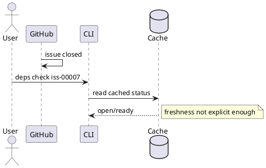

# Discussion: linked issue の stale projection 分析

## 問題

GitHub-linked issue を GitHub 側で close/reopen しても、`deps check` は `--github` なしだと stale な local projection を返す。利用者は最新状態だと誤認しうる。

根拠:

- `manual-tests/reports/2026-03-15-manual-regression-sweep-github-live/summary.md`

## 現状分析

status 解決は `--github` の有無で source が変わる。現在は cached projection が暗黙に返るため、freshness が user に十分伝わらない。

## あるべき状態

- linked issue の status source と freshness が明示される
- stale cache を authoritative と誤読しにくい
- `--github` を使うべき場面が分かる

## 対策案

### 案 A: `--github` なしでも毎回 GitHub fetch する

利点:

- 常に最新

欠点:

- CLI が遅くなる
- offline で壊れる

### 案 B: cache は維持しつつ、linked issue では stale warning / source 表示を強化する

利点:

- 性能と usability のバランスがよい
- local-first を壊さない

欠点:

- latest 保証はしない

### 案 C: linked issue では `--github` を必須にする

利点:

- 誤読は減る

欠点:

- 使い勝手が悪い
- local projection の価値を潰す

## 推奨案

`案 B` を推奨する。

理由:

- 問題は cache の存在自体ではなく、freshness 契約が弱いこと
- `source/stale/last_sync` の明示が本筋

## consultant view

consultant も、毎回 GitHub fetch を強制するより、`source/stale/last_sync` を明示して stale warning を強くする方が現実的だと評価した。
