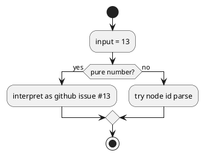

# Discussion: `active set 13` の numeric ambiguity 分析

## 問題

`active set 13` のような入力は GitHub issue number として解釈され、`init-00013` など local id を意図した利用者には曖昧である。

根拠:

- `manual-tests/reports/2026-03-15-manual-regression-sweep-github-live/summary.md`

## 現状分析

`targets.py` では純数字がまず GitHub issue number として扱われる。これは簡便だが、mixed local/github 環境では意図の衝突を起こす。

## あるべき状態

- 利用者が target intent を明示しやすい
- 曖昧入力で誤解釈しにくい
- script/agent では machine-readable に指定できる

## 対策案

### 案 A: `active set --id <node-id>` / `--github-issue <n>` を追加する

利点:

- intent が明示できる
- additive で導入しやすい

欠点:

- 引数が増える

### 案 B: pure number を禁止し、常に `#13` か `iss-00013` を要求する

利点:

- 曖昧さは強く減る

欠点:

- 破壊的変更になりやすい

### 案 C: pure number のまま warning を出す

利点:

- 既存互換を最大化

欠点:

- 誤操作を十分には防げない

## 推奨案

`案 A` を first step として採用するのがよい。

理由:

- additive に導入できる
- human と agent の両方に明示的な surface を提供できる

## consultant view

consultant も、まずは `--id` / `--github-issue` の明示指定を追加し、裸の数値解釈は段階的に縮小する案を推奨した。
