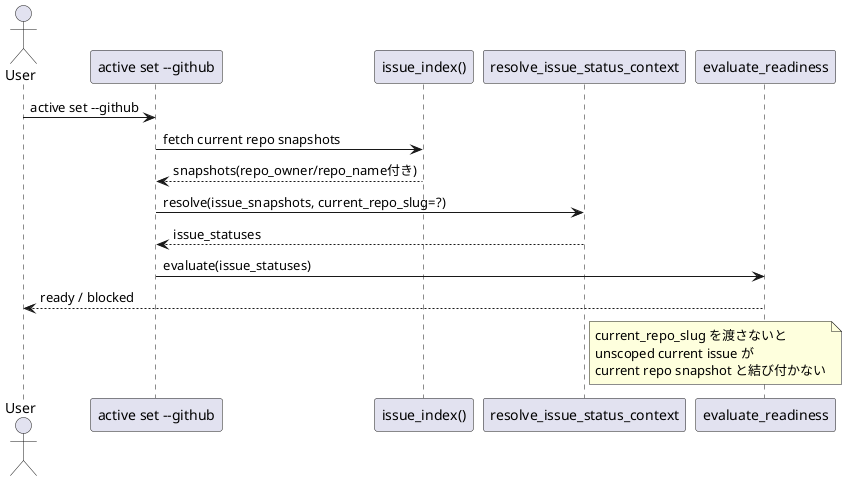

# 要約

- 指摘は妥当
- 修正は必要
- 最善案は `set_active.py` が `sync` / `doctor` と同じく current repo slug を解決し、`resolve_issue_status_context(..., current_repo_slug=...)` へ渡すこと

# 対象レビュー

- path: `src/spec_dock/assets/spec_dock/scripts/spec_dock_runtime/application/set_active.py`
- 指摘要旨:
  - `active set --github` で `issue_index()` が返す snapshot に repo identity が入るようになった
  - しかし `resolve_issue_status_context` 呼び出しに `current_repo_slug` が渡っていない
  - そのため unscoped な current repo issue が current repo snapshot と再結合できず、`unknown/stale` になり readiness guard が誤って block する

# 妥当性評価

- `resolve_issue_status_context` 自体は `current_repo_slug` を受け取れる
- `sync_state.py` と `doctor.py` では current repo slug を解決して渡す方向にすでに寄っている
- 一方、`set_active.py` の現行呼び出しでは `current_repo_slug` が未指定
- したがって current repo linked issue の通常系で `authority=github` なのに `effective_status=unknown` / `stale=true` へ落ちる経路が残る
- これは foreign edge case ではなく、通常の current repo linked issue の活性化に影響するので修正優先度は高い

# 結論

- verdict: `valid`
- action: `fix required`

# 構造理解

# 修正案の比較

## 案A

- `set_active.py` に `_resolve_current_repo_slug(ports)` を追加または既存 helper を再利用し、`resolve_issue_status_context(..., current_repo_slug=current_repo_slug)` を渡す

評価:

- 最小変更
- `sync` / `doctor` と整合
- 問題の根本に直接効く

## 案B

- `resolve_issue_status_context` 側で `issue_snapshots` だけから current repo を推定する

評価:

- 呼び出し漏れには強い
- ただし current repo の概念を status resolution 側で推測し始めるため、責務が曖昧になる
- current/foreign 混在時の推定ロジックが不安定

## 案C

- `issue_index()` が current repo snapshot に特別な marker を付け、unscoped node を marker ベースで再結合する

評価:

- 実現は可能
- ただし application/domain 契約を広く変える割に、今回の欠陥は単なる引数漏れ

# 推奨案

- 案A を採用する

理由:

- 既存アーキテクチャに最も自然
- `sync` / `doctor` / `validate` と同じ「application が current repo 文脈を解決して domain/application 共通処理へ渡す」形に揃う
- 回帰範囲が狭い

# 必要な修正

- `set_active.py`
  - current repo slug 解決 helper を追加または既存 helper を流用する
  - `resolve_issue_status_context(..., current_repo_slug=current_repo_slug)` を渡す
- 必要なら warning / gh_index_incomplete の既存挙動は維持する

# 必要なテスト

- current repo origin が設定された状態で、unscoped current repo issue `#123` を 1 件だけ持つ graph を作る
- `active set --github` 系の readiness 判定が `unknown` ではなく current repo snapshot の state を使うこと
- `guard_reason=unknown` で誤 block しないこと
- foreign same-number issue が併存しても current repo issue が foreign snapshot を拾わないこと

# 修正計画

1. `set_active.py` に current repo slug 解決を追加する
2. status resolution 呼び出しへ `current_repo_slug` を渡す
3. `tests/cli_runtime/test_active.py` に current repo linked issue の `--github` readiness regression を追加する
4. foreign same-number coexist との non-regression を確認する

# リスク

- helper を重複追加すると slug 解決ロジックが散る
- 可能なら issue 内の既存 helper 形に揃えるべき
