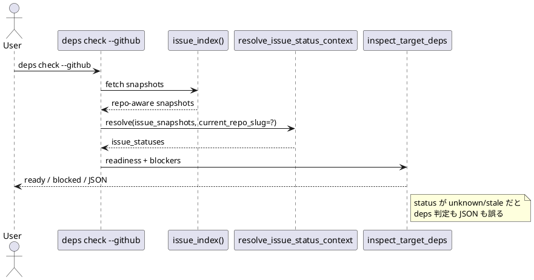

# 要約

- 指摘は妥当
- 修正は必要
- 最善案は `check_deps.py` でも current repo slug を解決し、`resolve_issue_status_context(..., current_repo_slug=...)` を渡すこと

# 対象レビュー

- path: `src/spec_dock/assets/spec_dock/scripts/spec_dock_runtime/application/check_deps.py`
- 指摘要旨:
  - `deps check --github` でも `issue_index()` snapshot に repo identity が乗る
  - しかし status resolution に current repo slug が渡っていない
  - unscoped current repo issue が snapshot に再結合できず、`authority=github` なのに `unknown/stale` になり readiness / JSON 出力が壊れる

# 妥当性評価

- `check_deps.py` の `resolve_issue_status_context(...)` 呼び出しには `current_repo_slug` が未指定
- `status_context.py` は受け取れる
- `sync_state.py` ではすでに渡している
- したがって `deps check` だけ current repo linked issue の通常系が壊れる、という指摘はコードの読みと一致する

# 結論

- verdict: `valid`
- action: `fix required`

# 構造理解

# 修正案の比較

## 案A

- `check_deps.py` で current repo slug を解決し、status resolution に渡す

評価:

- 最小
- `sync` / `doctor` / 修正後の `active set` と整合
- 実害に直接対応

## 案B

- `check_deps` は status resolution を通さず、独自に current repo linked issue を解決する

評価:

- 一時的には直せる
- しかし readiness 契約が command ごとに分岐し、今後またズレる

## 案C

- current repo issue は persisted metadata に常に repo_owner/repo_name を埋めて unscoped を無くす

評価:

- 長期的な設計案にはなりうる
- 今回の bounded fix としてはスコープ過大

# 推奨案

- 案A を採用する

理由:

- 既存 contract を保ったまま横展開漏れを塞げる
- `deps check` の readiness / JSON / warnings を一貫して直せる

# 必要な修正

- `check_deps.py`
  - current repo slug 解決 helper を追加または既存 helper を流用する
  - `resolve_issue_status_context(..., current_repo_slug=current_repo_slug)` を渡す

# 必要なテスト

- current repo origin が設定された repo で、unscoped current repo linked issue の `deps check --github` が `unknown/stale` にならない
- JSON 出力にも正しい GitHub state が出る
- foreign same-number coexist 時も current repo issue が foreign snapshot を拾わない

# 修正計画

1. `check_deps.py` に current repo slug 解決を追加
2. status context 呼び出しへ渡す
3. `tests/cli_runtime/test_deps.py` に current repo linked issue の `--github` regression を追加
4. JSON 出力と readiness の両方を固定

# リスク

- `active set` と `deps check` を別々に直すと同種ロジックの重複が増える
- 可能なら issue 完了時に helper 整理も検討したいが、今回の first fix は最小でよい
