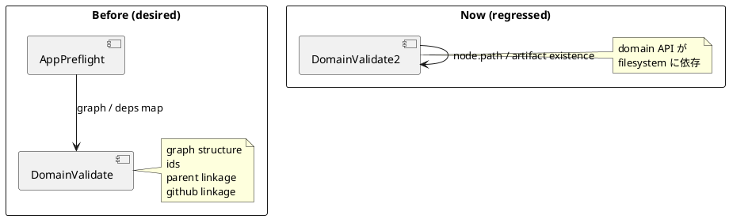

# 要約

- 指摘は妥当
- 修正は必要
- 最善案は domain の `validate_graph_and_deps()` から on-disk artifact existence check を分離し、artifact matrix validation は application/use-case 層の preflight へ戻すこと

# 対象レビュー

- path: `src/spec_dock/assets/spec_dock/scripts/spec_dock_runtime/domain/validation.py`
- 指摘要旨:
  - `validate_graph_and_deps()` が `node.path` 配下の artifact existence を直接見るようになり、純粋な graph validation API ではなくなった
  - その結果、in-memory graph や partially-written tree の検証で、構造エラーより先に `Missing required artifact` が出てしまう
  - 既存の domain test でも `issue parent_id mismatch` より前に artifact 欠損へ落ちる回帰が起きうる

# 妥当性評価

- `domain.validation` は現在 `_validate_required_artifacts(node, repo_root=repo_root)` を各 node validation の途中で呼んでいる
- これは `node.path` の実 filesystem に依存する
- domain 層の graph validation が「構造と規則」だけでなく「現在のディスク状態」へ結合しているため、レビュー指摘の API 退行は妥当
- 既存 test の `validate_graph_and_deps(graph, repo_root=Path(\"/repo\"))` が in-memory graph 前提であることとも整合する

# 結論

- verdict: `valid`
- action: `fix required`

# 構造理解

# 修正案の比較

## 案A

- `validate_graph_and_deps()` から required artifact existence check を外す
- application 層に `validate_required_artifacts_for_graph(...)` のような preflight を置き、`validate` / `sync` / `doctor` が必要な時だけそれを呼ぶ

評価:

- 層責務が最もきれい
- domain API の純度を回復できる
- 現在の issue で求めていた artifact matrix 契約も維持できる

## 案B

- `validate_graph_and_deps()` に `validate_artifacts: bool = False` のような flag を追加する

評価:

- 移行はしやすい
- ただし domain API に filesystem-aware 分岐が残る
- 呼び出し漏れや flag 組み合わせが再び複雑化する

## 案C

- 現状維持し、domain validation は「graph + on-disk projection validation API」だと定義し直す

評価:

- 実装コストは低い
- しかし既存 test・既存利用者・層分離方針に逆行する
- 今回のアーキテクチャ方針とも合わない

# 推奨案

- 案A を採用する

理由:

- domain は graph rules、application は on-disk preflight という責務分離に戻せる
- `validate` / `sync` / `doctor` の artifact matrix 契約は application で維持できる
- テストの説明力も上がる

# 必要な修正

- `domain/validation.py`
  - required artifact existence check を graph/domain validation から外す
- application 層
  - graph を入力に artifact matrix を検証する helper/use-case preflight を追加または既存ロジックを移設する
  - `validate_tree.py` / `sync_state.py` / `doctor.py` など artifact 契約を要する呼び出し側でそれを実行する

# 必要なテスト

- `tests.domain_runtime.test_runtime_domain_s01`
  - in-memory graph の structural error が artifact 欠損に先回りされず報告されること
- runtime/application 側
  - on-disk artifact 欠損は引き続き `validate` / `sync` / `doctor` で failure/finding になること
- 回帰確認
  - `issue parent_id mismatch` と `missing required artifact` の責務境界が明確に固定されること

# 修正計画

1. domain validation から filesystem artifact check を外す
2. application preflight へ artifact matrix validation を移す
3. domain test と runtime test を分離して更新する
4. `report` / 必要なら `design` に「domain validates graph only / application validates on-disk artifact contract」を明記する

# リスク

- 呼び出し側の移設漏れがあると artifact 欠損を見逃す
- そのため first fix では application の artifact-sensitive entrypoint を網羅してテスト固定する必要がある
