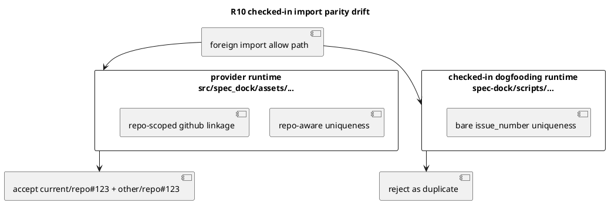

# PR29 R10 分析

## 対象レビュー
- PR: `#29`
- review comment id: `2958695577`
- reviewed commit: `c41b0138c4c2ed938c7293cab357f365bb4e782d`
- path: `spec-dock/scripts/spec_dock_runtime/application/create_node.py`
- 指摘要旨:
  - checked-in dogfooding runtime 側の import/create uniqueness guard が bare `github_issue_number` のままで、`other/repo#123` と `current/repo#123` を区別できていない

## 結論
- 妥当性: `valid`
- 修正要否: `必要`
- 優先度評価: `high`

## 根拠
- provider-side source of truth である
  - `src/spec_dock/assets/spec_dock/scripts/spec_dock_runtime/application/create_node.py`
  には、`github_repo_owner` / `github_repo_name` / `current_repo_slug` を考慮した `guard_github_issue_uniqueness(...)` と `plan_node_creation(..., current_repo_slug=...)` が入っている
- 一方で checked-in dogfooding runtime である
  - `spec-dock/scripts/spec_dock_runtime/application/create_node.py`
  には、同じ repo-aware uniqueness 修正が入っておらず、まだ `guard_github_issue_uniqueness(graph, int(req.github_issue_number))` の旧契約のまま
- そのため、この repo 上で `python spec-dock/scripts/spec-dock import issue <foreign-url> --allow-foreign-url` を dogfooding すると、provider では修正済みの cross-repo overlap が checked-in runtime では再発しうる

## 構造

## 影響
- issue-28 で追加した foreign URL import の修正が、provider runtime では成立していても dogfooding runtime では未成立になる
- この repo 自体を consumer として使う手動検証や日常運用で、PR の修正内容を正しく追試できない
- 「source of truth は provider だが dogfooding workspace も検証対象」という repo ルールに反する parity drift

## 修正案
1. checked-in runtime の対象ファイルだけを provider から refresh する
2. checked-in runtime 全体を `spec-dock update .` 相当で再生成する
3. checked-in runtime の parity regression を検知するテストを追加する

## 推奨案
- 最善案は `1 + 3`
- まず `spec-dock/scripts/spec_dock_runtime/application/create_node.py` を provider 契約へ refresh する
- あわせて、checked-in dogfooding runtime で foreign import overlap を再現する最小回帰テストを追加する
- `2` は広すぎる mirror churn を生みやすいので、この review 対応としては過剰

## 推奨テスト
- checked-in runtime の `import issue <foreign-url> --allow-foreign-url` が
  - current repo issue `#123` 既存時でも
  - foreign repo issue `other/repo#123` を duplicate 扱いしないこと

## 判定メモ
- この指摘は provider 実装の欠陥ではなく、checked-in dogfooding runtime の parity drift を指している
- したがって「設計自体が誤り」ではなく「checked-in consumer mirror が未同期」という分類が適切
