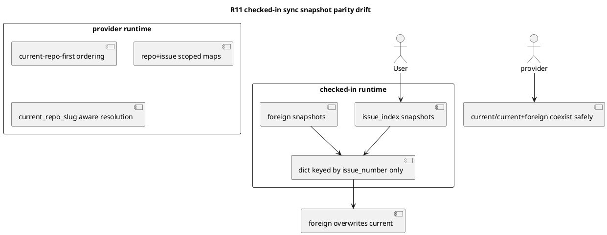

# PR29 R11 分析

## 対象レビュー
- PR: `#29`
- review comment id: `2958695578`
- reviewed commit: `c41b0138c4c2ed938c7293cab357f365bb4e782d`
- path: `spec-dock/scripts/spec_dock_runtime/application/sync_state.py`
- 指摘要旨:
  - checked-in dogfooding runtime 側の GitHub snapshot 集約が bare `issue_number` key のままで、current repo と foreign repo が同番号を持つと sync 表示が混線する

## 結論
- 妥当性: `valid`
- 修正要否: `必要`
- 優先度評価: `medium-high`

## 根拠
- provider-side source of truth である
  - `src/spec_dock/assets/spec_dock/scripts/spec_dock_runtime/application/sync_state.py`
  には、
  - current repo index snapshots を先頭に置く順序制御
  - `github_snapshot_by_repo_and_issue_number`
  - `github_snapshot_by_repo_scope_and_issue_number`
  - `current_repo_slug` を使った repo-aware status/snapshot resolution
  が入っている
- 一方で checked-in dogfooding runtime である
  - `spec-dock/scripts/spec_dock_runtime/application/sync_state.py`
  では、
  - `issue_snapshots.extend(issue_index_snapshots)`
  - `issue_snapshots.append(snapshot)`
  - `github_snapshot_by_issue_number = {int(snapshot.issue_number): snapshot ...}`
  の旧ロジックが残っている
- そのため、この repo 上の checked-in runtime で `sync --github` を行うと、foreign snapshot が later write で current repo snapshot を上書きし、JSON/markdown/active 判定が混線しうる

## 構造

## 影響
- checked-in dogfooding runtime で `sync --github` の status/URL/rendered state が誤る
- issue-28 の main risk だった「同番号の current repo / foreign repo 混線」が dogfooding 上では残留する
- manual test や local repro が provider と checked-in runtime で一致しなくなる

## 修正案
1. checked-in `sync_state.py` を provider と同じ repo-aware 実装に refresh する
2. checked-in runtime で current+foreign same-number の sync regression を固定するテストを追加する
3. checked-in runtime 全体をまとめて refresh する

## 推奨案
- 最善案は `1 + 2`
- review で指摘された parity drift は `sync_state.py` 単体で観測可能なので、対象ファイルを provider と整合させるのが最小
- あわせて checked-in runtime 実行系で same-number coexistence を固定する回帰テストを追加する
- `3` は広すぎるため、この review の bounded fix としては非推奨

## 推奨テスト
- checked-in runtime で
  - current repo unscoped issue `#123`
  - foreign scoped issue `other/repo#123`
  を同居させた状態で `sync --github`
- current repo node が foreign snapshot に上書きされないことを確認する

## 判定メモ
- この指摘も provider 実装ではなく checked-in consumer mirror の stale 状態を捉えている
- よって、分類は「mirror parity bug」であり、issue-28 の core design を否定するものではない
