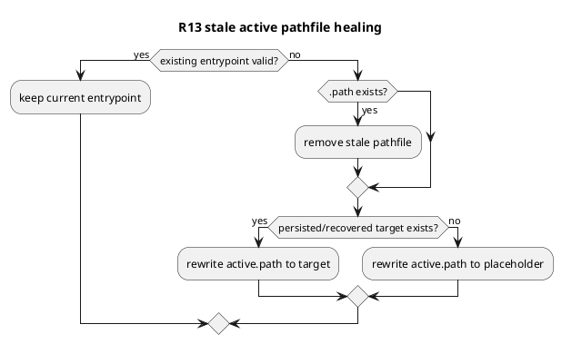

# PR29 R13 分析

## 対象レビュー
- review comment id: `2959331239`
- path: `src/spec_dock/cli.py`
- 指摘要旨:
  - symlink 制限環境で fallback として使う `spec-dock/active/*.path` が stale になっても、`spec-dock update` が削除/再生成せず healing できない

## 結論
- 妥当性: `valid`
- 修正要否: `必要`
- 優先度評価: `medium-high`

## 根拠
- `_resolve_existing_active_entrypoint()` が `None` を返した時点で entrypoint は壊れている
- それにもかかわらず `_ensure_active_fallback_entrypoints()` は `pathfile.exists()` だと即 `continue` する
- そのため symlink 不可環境の通常 fallback である `.path` が stale になった場合、`update` の self-healing 契約が成立しない

## 修正案
1. stale `.path` を常に placeholder へ戻す
2. stale `.path` を削除し、persisted manifest / recovered target があればそこへ、なければ placeholder へ再生成する
3. active ディレクトリ全体を毎回再生成する

## 推奨案
- 最善案は `2`
- `existing_entrypoint is None` かつ `pathfile.exists()` を stale pathfile とみなし削除したうえで、既存の resolved target 判定へ流す
- symlink 制限環境でも persisted active が有効なら実体へ戻り、persisted target も壊れていれば placeholder に戻る

## 推奨テスト
- symlink 制限下で stale `.path` が persisted active target に repair される
- symlink 制限下で persisted target も壊れている場合、placeholder に戻る

## 構造

