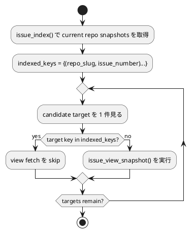

# PR #29 review #2959804501 same-repo URL-linked fetch dedup analysis

## 対象レビュー

- review id: `2959804501`
- path: `src/spec_dock/assets/spec_dock/scripts/spec_dock_runtime/application/sync_state.py`
- 論点:
  - current repo の issue を canonical GitHub URL で link/import すると `github_repo_owner/name` が保存される
  - 現在の `_collect_foreign_issue_targets()` は repo 情報を持つ node を一律で foreign target とみなす
  - その結果、same-repo issue でも `issue_index()` 済みの後に `issue_view_snapshot()` を重ねる冗長 fetch が発生する

## 妥当性評価

- verdict: `valid`
- 理由:
  - current repo URL import でも repo identity は persist される
  - `sync_state` は current repo 全体に `issue_index()` を投げた後、repo identity を持つ node 全件に追加 `issue_view_snapshot()` を行う
  - `issue_index()` と `issue_view_snapshot()` は同じ snapshot shape を返すため、same-repo indexed target への追加 fetch は correctness 改善ではなく N+1 fetch になる

## 修正要否

- verdict: `fix required`
- 優先度:
  - `P2`
- 判断理由:
  - correctness blocker ではない
  - ただし URL import の通常運用で毎回発生する冗長 fetch であり、rate limit / latency / future drift の温床になる
  - merge 前に低リスクで除去できる

## 修正案比較

### 案A: `repo_slug == current_repo_slug` を単純除外する

- 長所:
  - 差分が小さい
- 短所:
  - `issue_index()` が limit などで current repo target を取りこぼした場合も fallback fetch が消える
  - `sync_state` / `check_deps` / `set_active` 間の fetch selection drift が残りやすい

### 案B: indexed key 既知 target だけ skip する

- 長所:
  - current repo indexed target の冗長 fetch を止めつつ、index missing 時の fallback fetch を維持できる
- 短所:
  - helper が `sync_state` に閉じると他 command との parity drift が残る

### 案C: indexed key dedup helper を shared 化して github-aware read path 全体へ適用する

- 長所:
  - same-repo indexed skip と index-missing fallback を両立できる
  - `sync_state` / `check_deps` / `set_active` の fetch selection drift をまとめて防げる
  - current repo slug の有無に依存せず、snapshot key の事実だけで判断できる
- 短所:
  - 案A より差分はやや広い

## 推奨案

- recommendation: `案C`

### 推奨理由

- 今回の本質は「same-repo か foreign か」そのものではなく、「すでに index で持っている `(repo_slug, issue_number)` に追加 fetch を重ねない」こと
- この条件なら current repo indexed target の冗長 fetch を止めつつ、index incomplete 時の fallback という安全弁を失わない
- fetch selection helper を共通化すれば、今後の same-repo / foreign-repo 混在 read path でも drift を抑えられる

## 実装方針

- `issue_index()` 後に indexed snapshot key 集合 `(repo_slug, issue_number)` を構築する
- same-repo URL-linked node でも、その key が index に無ければ `issue_view_snapshot()` を許可する
- key が index にある target だけ `issue_view_snapshot()` から除外する
- 同じ helper を `sync_state` / `check_deps` / `set_active` に適用する

## テスト方針

- `sync`:
  - same-repo URL-linked issue が index 済みなら view fetch しない
  - same-repo URL-linked issue が index 未掲載なら fallback view fetch する
- `deps check --github`:
  - same-repo indexed target に redundant view fetch を送らない
- `active set --github`:
  - same-repo indexed target に redundant view fetch を送らない

## 構造図

