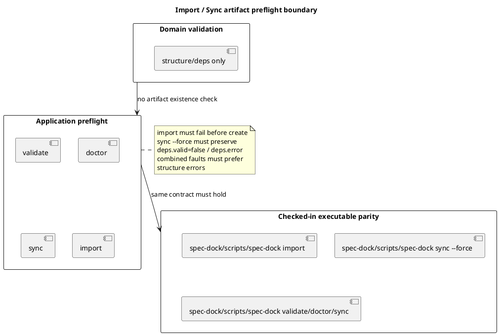

# 目的

- fresh whole-diff review 後の QA follow-up で見つかった 2 点を整理する
  - provider/checked-in runtime の `import` が required artifact 欠損時に create 前 fail-fast を保証していない
  - checked-in runtime の `sync --force` executable-path parity が generated artifact 契約まで固定できていない

# 所見

## F1 import preflight 漏れ

- `domain.validation` から required artifact existence check を外した後、`import_node.py` は `load_graph(validate=True)` のみで preflight を終えている
- このため artifact 欠損時に create が先に進み、post-import sync で落ちると partial write を残しうる
- これは `AC-012 domain/application validation boundary` の適用漏れであり、妥当な指摘

## F2 checked-in sync --force evidence 不足

- checked-in runtime の subprocess parity test は stderr と return code までは確認している
- ただし `.agent/index.json` / `.agent/tree.json` の `deps.valid=false` と `deps.error` を見ていない
- degraded sync の artifact contract 崩れを見逃すため、妥当な指摘

## F3 checked-in combined-fault precedence evidence

- checked-in executable-path parity は `import` fail-fast と `sync --force` degraded artifact contract だけでは閉じない
- structure error と artifact 欠損が同時に存在する時、`validate` / `doctor` / `sync` が構造エラーを優先することも executable-path で固定する必要がある
- これは `AC-012` と dogfooding parity の traceability を保つための補完であり、妥当な追加整理

# 推奨修正

- provider-side `application/import_node.py` に artifact preflight を create 前追加する
- checked-in `application/import_node.py` に同じ preflight を揃える
- `tests/cli_runtime` に provider-side import missing-artifact fail-fast 回帰を追加する
- `tests/test_init_update.py` に checked-in runtime subprocess の
  - import missing-artifact fail-fast
  - sync --force degraded artifact output
  - validate / doctor / sync の combined-fault structure precedence
  を追加/強化する

# 構造図

# 結論

- 2 件とも妥当
- `AC-012` の corrective scope として設計/計画へ追加し、provider/checked-in 両 runtime と executable-path tests で閉じる
