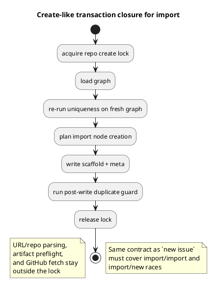

# 目的

- fresh whole-diff review で見つかった `import issue` の create transaction 漏れを整理し、修正方針を固定する

# 所見

- `new initiative|epic|issue|doc` は repo-level create lock と post-write duplicate guard で保護される
- しかし `import issue` は同じ create-like write path でありながら、その契約外にある
- このため `import/import` や `import/new` の並行実行で stale graph を共有し、duplicate id / duplicate GitHub linkage を再び作りうる
- これは issue-28 で解消してきた corruption class の再発であり、妥当な blocker

# 推奨修正

- provider-side `application/import_node.py` を `new issue` と同じ create transaction 契約へ統合する
  - repo-global create lock
  - create 後の post-write duplicate guard
- lock の外に残すもの:
  - URL / repo identity 解析
  - required artifact preflight
  - GitHub issue metadata fetch
- lock の内側で再実行するもの:
  - graph 読み取り
  - uniqueness 再検証
  - node planning / write / post-write duplicate guard
- checked-in `spec-dock/scripts/.../application/import_node.py` にも同じ契約を反映する
- regression test は少なくとも次を固定する
  - provider-side import/import race
  - provider-side import/new race
  - checked-in runtime の import/import race parity
  - checked-in runtime の import/new race parity

# 構造図

# 結論

- 指摘は妥当
- `AC-001 create atomicity` の corrective scope として `S01H` を追加し、provider/checked-in 両 runtime と regression test で閉じる
