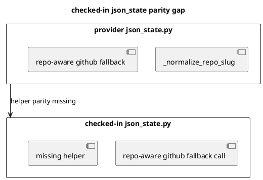

# 結論

- 指摘は妥当
- checked-in `presentation/json_state.py` に provider-side の `_normalize_repo_slug(...)` parity が欠けており、linked import 後の post-sync artifact rendering で `NameError` を起こしうる
- `S90G` で checked-in parity refresh と no-crash regression を追加して閉じる

