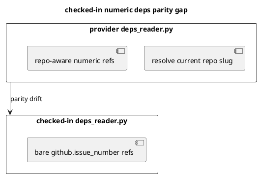

# 結論

- 指摘は妥当
- provider-side `infra/deps_reader.py` は current repo slug aware な numeric dep 解決へ更新済みだが、checked-in runtime は stale reader のままで same-number overlap 時に `Ambiguous github.issue_number=123` を再発しうる
- `S90G` で checked-in `infra/deps_reader.py` を refresh し、numeric deps overlap parity regression を追加して閉じる

