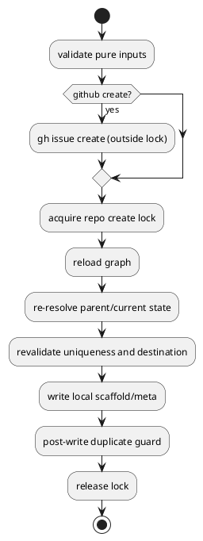

# Discussion: PR #29 R18 `gh issue create` を repo-global create lock の外へ出す corrective analysis

## 背景

PR #29 の latest Codex review `inline #2962195500` は、`new issue --create-github-issue` が `gh issue create` を repo-global create lock の内側で実行しているため、GitHub 側の遅延やハングがあると他の `new` / `new doc` / `import issue` まで 3 秒待ち timeout で巻き添えになる、と指摘している。

現状の `create_node_core()` は次の順で動く。

1. `create.lock` acquire
2. graph load
3. `gh issue create`
4. `plan_node_creation`
5. write
6. post-write duplicate guard
7. lock release

この順序だと、repo file mutation が始まる前から lock を保持し続けるため、local correctness に不要な external latency を critical section に含めてしまう。

## 妥当性評価

結論: `valid`

- 指摘は事実に合っている
  - `application/create_node.py` では `_acquire_create_lock()` の後に `ports.issue_gateway.issue_create(...)` を呼んでいる
  - lock acquire wait は 3 秒 default で bounded なので、slow/hung `gh issue create` は他 create-like command の false contention を引き起こす
- issue-28 の create transaction 契約とも両立する
  - protect すべきなのは repo file mutation と graph-derived uniqueness / allocation であり、external GitHub create 自体ではない
  - `gh issue create` は repo local state を mutate しないため、lock 内に置く必然は弱い

## 修正要否

結論: `修正が必要`

このまま merge すると、GitHub latency が repo-wide create outage に拡大する。correctness bug というより concurrency / operability bug だが、create lock を導入した目的に照らすと放置しない方がよい。

## 修正案

### 案 A: `gh issue create` を create lock の外へ移し、local mutation 直前に lock を取得する

- 手順
  1. pure input validation を先に行う
  2. `gh issue create` を lock 外で実行する
  3. lock acquire
  4. graph reload / parent re-resolve / uniqueness revalidation
  5. local write / post-write duplicate guard
- 利点
  - external latency が repo-wide lock contention に直結しない
  - create transaction の local atomicity は維持できる
  - 既存の `import issue` 契約とも整合する
- 注意点
  - remote issue は local write より先に作られるため、後段 failure で orphan issue が残りうる
  - ただし現行でも `gh issue create` 後に local write failure が起きれば orphan issue は残るため、新しい failure class ではない

### 案 B: lock を 2 段階化し、preflight lock と write lock を分ける

- 利点
  - preflight と write の境界を厳密にできる
- 欠点
  - lock protocol が複雑になり、issue-28 first fix の最小 corrective scopeを超える
  - 2 lock 間の parent / uniqueness drift をどう扱うかで再び設計面積が増える

### 案 C: `gh issue create` は lock 内のままにし、wait を長くする

- 利点
  - 実装が小さい
- 欠点
  - 指摘の本質を解消しない
  - 他 command を長時間 block する設計を温存する

## 推奨案

結論: `案 A`

理由:

- local critical section を守る本来の lock 目的に最も忠実
- `import issue` では既に external GitHub fetch を lock 外に置いており、設計の一貫性がある
- orphan issue risk は現行でも local write failure で存在する
- ただし `gh issue create` を lock の外へ移すと、`lock acquire failure` 自体でも remote-only side effect が起こりうるため、failure message と recovery path を契約に含める必要がある

## 補足 corrective

- この corrective scope の primary target は `new issue` の GitHub create mode 全体とする
- `--create-github-issue` は explicit entrypoint だが、既定の `new issue` create path も同じ create-mode 契約に含む
- `issue_create()` 後に local create が失敗した場合は、phase を問わず created GitHub issue number を failure surface に含める
- operator には次の supported recovery を案内する
  - `new issue --github-issue <n>` で既存 GitHub issue に local node を link する
  - もしくは GitHub 側で close / cleanup してから再実行する
- この経路は no-write failure を維持するが、pure no-side-effect failure ではないため、message と regression test の両方で明示する
- `initiative` / `epic` の GitHub-create path は shared implementation 上は近い挙動をとりうるが、本 issue の acceptance / regression 契約としては固定しない

## 設計反映ポイント

- `create transaction` 節の契約を次へ更新する
  - repo-global create lock は local graph-derived mutation boundary にのみ適用する
  - `new --create-github-issue` の `gh issue create` は lock 外で実行する
  - lock 内では graph reload / parent re-resolve / uniqueness revalidation / write / post-write guard を行う
  - `new issue` の create mode で `gh issue create` 完了後に local create が失敗した場合は created issue number と retry/link guidance を返す
- plan には S01 corrective follow-up を追加する
  - slow/hung `gh issue create` が local-only create を block しない regression
  - GitHub create 後も local write race safety が維持される regression
  - checked-in dogfooding runtime の parity も取る
    - `spec-dock/scripts/spec_dock_runtime/application/create_node.py` も同 create transaction path を持つため

## テスト観点

- `new issue --create-github-issue` で `issue_create()` が sleep しても、別 thread の `new doc` / `new initiative --no-github` が timeout せず進む
- `gh issue create` を lock 外へ出しても、write 直前の graph reload / uniqueness revalidation により duplicate id / stale parent が再導入されない
- invalid title / invalid slug は引き続き `gh issue create` 前に失敗する
- `new issue` の create mode で `gh issue create` 成功後に lock acquire / parent revalidation / uniqueness revalidation / write のいずれかで失敗した場合、error に created issue number と recovery guidance が含まれる
- checked-in dogfooding runtime の executable path でも同じ non-blocking 契約が維持される

## PlantUML

