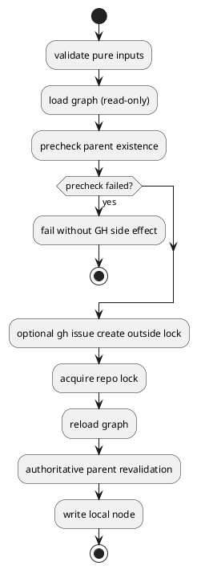

# PR29 R20 Analysis

## Decision

- review: `valid`
- fix required now: `yes`

## Problem

- `create_node_core()` は `gh issue create` を lock 外へ出したが、parent の graph state は `plan_node_creation()` まで読まない。
- そのため `new epic --create-github-issue --initiative init-local-99999` や `new issue --create-github-issue --epic epic-local-99999` のような安定した parent 不在でも、remote issue を作ってから local fail する。

## Why It Is Valid

- parent selector の「欠落」は pre-GH validation で弾いているが、「指定された parent が graph 上に存在しない」はまだ pre-GH で弾いていない。
- これは lock 待ち競合や graph race と違い、少なくとも作成開始時点では事前に検出できる stable local failure である。
- whole-diff review でも、avoid 可能な orphan issue を残している unresolved obligation と判定された。

## Options

### Option 1

- 何もしない
- 問題:
  - known-invalid parent でも orphan GitHub issue を残す
  - create contract の fail-fast 原則に反する

### Option 2

- `gh issue create` 前に pre-lock graph load と parent existence precheck だけ行う
- 長所:
  - avoidable orphan を減らせる
  - R18 の lock narrowing を壊さない
  - authoritative validation は lock 内で再実行できる
- 短所:
  - parent validation が pre-lock / in-lock で二重化する

### Option 3

- parent 解決を含む graph plan 全体を lock 外へ出す
- 問題:
  - stale graph に依存する領域が広がる
  - R18 corrective intent に反する

## Recommended Fix

- Option 2 を採用する。
- `create_node_core()` の pre-GH phase に「read-only graph load + parent existence precheck」を追加する。
- ただし lock 取得後も `plan_node_creation()` による authoritative parent revalidation は維持する。
- pre-GH precheck の対象は create-mode の supported node kind 全体とする。

## Test Implications

- provider runtime:
  - nonexistent initiative で `new epic --create-github-issue` が `issue_create()` 未呼び出しのまま fail する regression
  - nonexistent epic で `new issue --create-github-issue` が `issue_create()` 未呼び出しのまま fail する regression
- checked-in runtime parity:
  - 上記と同じ no-side-effect regression

## PlantUML

