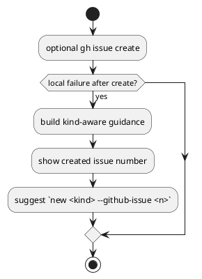

# PR29 R21 Analysis

## Decision

- review: `valid`
- fix required now: `yes`

## Problem

- `_wrap_post_github_create_local_failure()` は `kind == "issue"` のときだけ guidance を返す。
- しかし command surface は `initiative` / `epic` にも `--create-github-issue` と `--github-issue` を expose している。
- そのため `new initiative` / `new epic` で remote issue 作成後に local failure が起きると、created issue number を失う。

## Why It Is Valid

- supported command surface の間で recovery contract が不整合になっている。
- user は remote issue が既に存在することを知らされず、retry / cleanup の判断材料を失う。
- これは create-flow corrective scope の一部であり、whole-diff closure を妨げる。

## Options

### Option 1

- issue だけ guidance を維持し、initiative/epic は現状維持
- 問題:
  - supported kind 間で contract が分岐する
  - orphan remote issue の recovery UX が不足したまま残る

### Option 2

- guidance を全 kind へ拡張し、kind 別の rerun command surface を返す
- 長所:
  - command surface と recovery surface が一致する
  - issue/epic/initiative で一貫した orphan handling になる
- 短所:
  - message builder に kind-aware template が必要

### Option 3

- initiative / epic の GitHub create 自体を禁止する
- 問題:
  - 既存 command surface を狭める breaking change
  - 今回の corrective scope を超える

## Recommended Fix

- Option 2 を採用する。
- post-create local failure guidance を kind-aware にし、`new <kind> --github-issue <n>` を含む recovery guidance を返す。
- issue だけ特別扱いする条件は外す。
- 文言は「同じ `new <kind>` command を `--github-issue <n>` で rerun する」形に一般化する。

## Test Implications

- provider runtime:
  - `new initiative --create-github-issue` の lock failure で created issue number と `new initiative --github-issue <n>` が出る regression
  - `new epic --create-github-issue` の write/template failure で created issue number と `new epic --github-issue <n>` が出る regression
- checked-in runtime parity:
  - initiative / epic の post-create local failure guidance parity regression

## PlantUML

