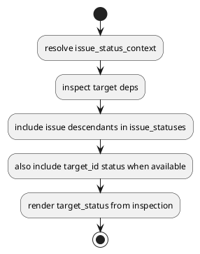

# PR29 R22 Analysis

## Decision

- review: `valid`
- fix required now: `yes`

## Problem

- `inspect_target_deps()` は `inspection.issue_statuses` を `target_issue_ids` と `reachable_issue_ids` だけで構成している。
- target が `initiative` / `epic` の場合、render 側が参照する `inspection.issue_statuses[target_id]` が欠落し、`target_status` が `unknown/stale` に退行する。

## Recommended Fix

- `inspection.issue_statuses` を構築するとき、target 自身の resolved status が存在するなら `target_id.value` も明示的に含める。
- `node_states` は issue-only contract のまま維持し、presentation へ status 解決責務を漏らさない。

## Test Implications

- `deps check init-local-... --json` の `target_status` regression
- `deps check epic-local-... --json` の `target_status` regression
- text render の `target_status` regression
- 必要なら checked-in parity / executable smoke

## PlantUML

