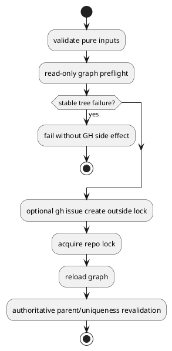

# PR29 R23 Analysis

## Decision

- review: `valid`
- fix required now: `yes`

## Problem

- `create_node_core()` は parent absence の一部だけを pre-GH で見ているが、create-mode 全 kind の stable tree failure を網羅していない。
- そのため `new initiative --create-github-issue` などで既存 tree が壊れていると、local write 不能が分かっていても remote issue を先に作りうる。

## Recommended Fix

- create-mode 全 kind で `gh issue create` 前に read-only graph preflight を実行する。
- `epic` / `issue` はその preflight graph を使って stable parent existence も確認する。
- lock 取得後は引き続き graph reload と authoritative parent/uniqueness revalidation を再実行する。

## Tradeoff

- pre-GH preflight で orphan issue を減らせる一方、lock 後の race までは防げない。
- ただしこれは `S01I` / `S01J` の契約と整合する意図的な境界である。

## Test Implications

- broken existing tree で `new initiative --create-github-issue` が no-GH-call failure する regression
- broken existing tree で `new epic` / `new issue` が no-GH-call failure する regression
- checked-in runtime parity regression

## PlantUML

