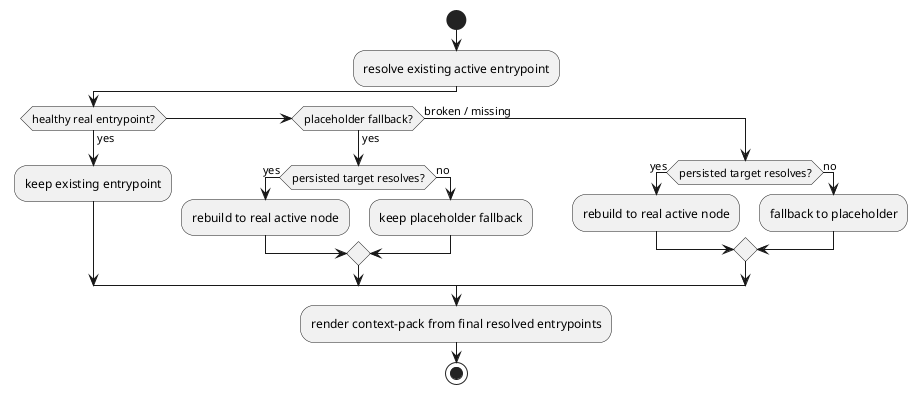

# PR29 R24 placeholder active entrypoint recovery analysis

## 指摘

- review id: `2969337514`
- file: `src/spec_dock/cli.py`
- 要旨:
  - `spec-dock/active/{initiative,epic,issue}` が `system/active-none/{layer}` を向く placeholder のままでも、`.agent/active.json` に実 active が保存されている場合、`spec-dock update` が placeholder を healthy entrypoint と誤認して recovery を skip する

## 妥当性

- verdict: `valid`
- severity: `P2`
- 根拠:
  - `_resolve_existing_active_entrypoint()` は placeholder を見つけると `(candidate, None)` を返す
  - `_ensure_active_fallback_entrypoints()` は `existing_entrypoint is not None` で即 `continue` する
  - その結果 placeholder は active fallback としては存在するが、persisted active manifest による real node 復元が走らない
  - `context-pack.md` は最終 entrypoint 実体から再生成されるため、placeholder が残ると `(none)` 側へ退行する

## 原因

- stale/broken entrypoint の recovery と placeholder fallback の扱いが同一ではない
- 現状は placeholder を healthy existing entrypoint と同じ分岐で扱っており、recoverable fallback という意味づけが実装に乗っていない

## 修正案比較

### 案A: placeholder を常に壊して persisted manifest を優先する

- 長所:
  - 実装は単純
- 短所:
  - healthy real entrypoint との優先順位が崩れやすい
  - stale manifest があると正しい existing entrypoint を上書きしやすい

### 案B: placeholder を recoverable fallback として扱い、persisted target が解決できる時だけ rebuild する

- 長所:
  - `healthy real entrypoint > valid persisted target > placeholder fallback` を維持できる
  - 既存 `context-pack.md` source-of-truth 方針と整合する
  - symlink と `.path` fallback の両経路へ同じ契約を適用しやすい
- 短所:
  - placeholder 判定分岐を明示的に増やす必要がある

## 推奨案

- 採用: 案B

## 設計反映

- `design.md`
  - active entrypoint recovery に「placeholder は healthy active state ではなく recoverable fallback」と明記する
- `plan.md`
  - `S04I` として step を追加し、placeholder symlink / `.path` / mixed state / broken manifest の回帰を固定する

## テスト観点

- placeholder symlink が残っていても persisted target へ rebuild される
- placeholder `.path` fallback でも persisted target へ rebuild される
- mixed state で healthy real entrypoint は維持され、placeholder layer だけ rebuild される
- broken persisted manifest では placeholder を維持し、`context-pack.md` も `(none)` を維持する

## 構造

