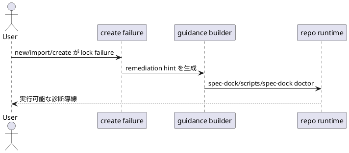

# 結論

- 妥当性: `valid`
- 修正要否: `required`
- 推奨案:
  - create lock failure guidance を `spec doctor` のような PATH 前提表現ではなく、managed repo 上で安定して実行できる command surface に統一する
  - provider runtime と checked-in dogfooding runtime の両方で同じ guidance を返す

# 根拠

- installer の repo-root shortcut `./spec` は best-effort であり、存在しない場合がある
- recovery hint は blocked create 時の一次導線なので、「存在するかもしれない shortcut」ではなく「その repo で確実にある runtime entrypoint」を案内する必要がある
- `doctor` 自体は既に supported flow なので、問題は診断ロジックではなく guidance surface の executable 性にある

# 修正案比較

- 案A:
  - guidance を `./spec doctor` にする
  - 却下理由:
    - shortcut 未生成 repo で再び詰まる
- 案B:
  - guidance を `spec-dock/scripts/spec-dock doctor` にする
  - 利点:
    - managed repo 内の shipped runtime へ直接到達できる
    - PATH や shortcut に依存しない
- 案C:
  - guidance を `python spec-dock/scripts/spec-dock doctor` にする
  - 利点:
    - shebang 非依存
  - 懸念:
    - 既存 repo 内 guidance surface としては冗長
    - 実行方法の一貫性が崩れる

# 推奨

- 案Bを採用する
- 必要なら将来 `./spec` の存在を検知して短い表記へ寄せる余地はあるが、本 issue では stable command を 1 つに固定する

# 構造メモ

