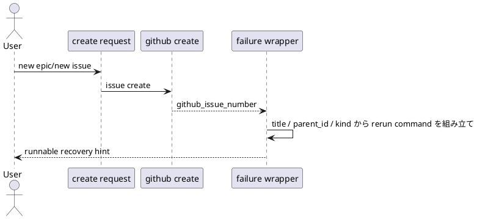

# 結論

- 妥当性: `valid`
- 修正要否: `required`
- 推奨案:
  - post-create local failure guidance builder に original request context を渡し、`--title` と kind ごとの required parent selector を含む rerun command を返す

# 根拠

- `new` subcommand は `--title` 必須で、`epic` / `issue` は parent selector も必須
- 現在の `new <kind> --github-issue <n>` だけの guidance は argparse で失敗し、relink 導線として実行不能
- failure 発生時点では request context を保持しているので、必要 flags を復元して guidance に埋め込める

# 修正案比較

- 案A:
  - help text で「title や parent も付けて再実行してほしい」と説明する
  - 却下理由:
    - runnable command にならない
- 案B:
  - guidance に `--title` と required parent selector を埋め込んだ exact command を返す
  - 利点:
    - operator/agent がそのまま再実行できる
    - initiative / epic / issue の surface を統一できる
- 案C:
  - rerun command ではなく generic cleanup instructions のみ返す
  - 却下理由:
    - 本来の relink path を弱める

# 推奨

- 案Bを採用する
- title は original request title をそのまま quoting して埋め込み、epic/issue は `parent_id` から `--initiative` / `--epic` を復元する

# 構造メモ

