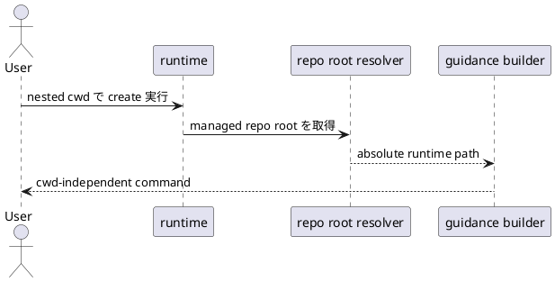

# 結論

- 妥当性: `valid`
- 修正要否: `required`
- 推奨案:
  - doctor guidance と post-create retry hint の両方で、managed repo root から runtime entrypoint の absolute path を導出して案内する

# 根拠

- `spec-dock/scripts/spec-dock` は repo root から見れば安定だが、nested cwd からは相対 path になって壊れる
- runtime は nested cwd からの利用を既に許容しており、guidance だけ repo root 前提なのは契約不整合
- absolute path であれば shortcut / PATH / cwd のいずれにも依存しない

# 修正案比較

- 案A:
  - `./spec` や `spec-dock/scripts/spec-dock` の相対 path を維持する
  - 却下理由:
    - cwd に依存する
- 案B:
  - `cd <repo-root> && spec-dock/scripts/spec-dock ...` を案内する
  - 利点:
    - 相対 path を維持できる
  - 懸念:
    - guidance が長くなり quoting が複雑
- 案C:
  - managed repo root から absolute executable path を導出し、その path を command prefix に使う
  - 利点:
    - cwd 非依存
    - doctor guidance と retry hint の両方で共通化しやすい

# 推奨

- 案Cを採用する
- `specdock_dir` または `repo_root` から `spec-dock/scripts/spec-dock` を絶対 path 化し、shell-safe quoting をかけて guidance に埋め込む

# 構造メモ

