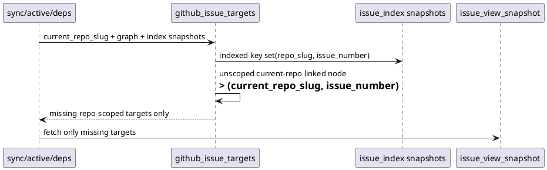

# 結論

- 妥当性: `valid`
- 修正要否: `required`
- 推奨案:
  - `collect_repo_scoped_issue_view_targets()` に `current_repo_slug` を渡し、unscoped linked `initiative` / `epic` / `issue` を `(current_repo_slug, issue_number)` として fallback fetch 対象へ含める

# 根拠

- 現状 helper は persisted `repo_owner/repo_name` を持つ node しか fallback target にしない
- そのため `new ... --create-github-issue` で作られた unscoped current-repo linked epic / initiative は、`gh issue list --limit` から漏れると `issue_view_snapshot()` fallback が一切走らない
- `resolve_issue_status_context(..., current_repo_slug=...)` 自体は repo-aware binding できるので、欠けているのは fetch target の生成だけである
- 影響面は `sync --github` だけでなく、同 helper を使う `active set --github` / `deps check --github` に横展開される

# 修正案比較

- 案A:
  - helper はそのままにし、各 call site で unscoped current-repo linked node を個別補正する
  - 却下理由:
    - `sync` / `active` / `deps` で再び伝播漏れを起こしやすい
- 案B:
  - helper に `current_repo_slug` を追加し、repo-aware fallback target 生成を一元化する
  - 利点:
    - 既存の indexed dedup 契約を維持したまま current repo linked node を救済できる
    - `gh_index_incomplete` の扱いを command 間で揃えやすい
- 案C:
  - unscoped current-repo linked node も常に `issue_view_snapshot()` へ送る
  - 却下理由:
    - index 済み same-repo target に対する N+1 fetch が再発する

# 推奨

- 案Bを採用する
- helper の入力に `current_repo_slug` を加え、`normalize_repo_slug(node.github_repo_owner, node.github_repo_name) or current_repo_slug` を fallback target key に使う
- 同時に、indexed key 判定は引き続き `(repo_slug, issue_number)` で行い、same-repo indexed target への余計な view fetch は復活させない

# 構造メモ

