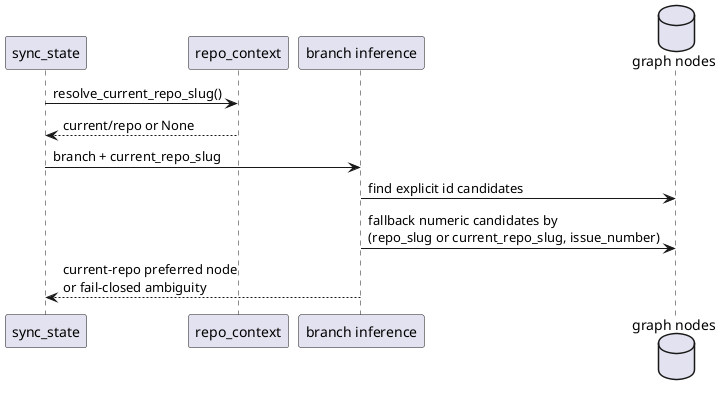

# 結論

- 妥当性: `valid`
- 修正要否: `required`
- 推奨案:
  - `infer_active_node_from_branch()` の numeric fallback を current-repo-aware にし、`sync_state.maybe_auto_update_from_branch()` から `current_repo_slug` を渡す

# 根拠

- 現状の numeric fallback は bare `github_issue_number` 一致だけで候補を集める
- repo-aware uniqueness 導入後は `current/repo#123` と `other/repo#123` の正常共存がありうるため、numeric branch 名だけで ambiguity へ落ちる
- active auto-update は `sync_state.maybe_auto_update_from_branch()` 経由でこの関数を使うため、同番号 overlap があるだけで `spec-dock/active` 自動更新が止まる
- explicit node id を branch に含めた場合の経路は既に十分 specific であり、問題は numeric fallback に限定される

# 修正案比較

- 案A:
  - 現行の bare number 判定を維持し、同番号 overlap 時は常に ambiguity fail にする
  - 却下理由:
    - current repo issue を主に扱う既存 numeric branch naming を実質破壊する
- 案B:
  - current repo slug が解決できるときだけ numeric fallback を repo-aware にし、current repo candidate を優先する
  - 利点:
    - 既存の current repo numeric branch 運用を守れる
    - repo context 不明時は従来どおり fail-closed を維持できる
- 案C:
  - foreign overlap がある repo では numeric branch inference 自体を無効化する
  - 却下理由:
    - regress が大きく、今回 scope の最小修正から外れる

# 推奨

- 案Bを採用する
- explicit id match はそのまま維持し、numeric fallback だけ `normalize_repo_slug(node.github_repo_owner, node.github_repo_name) or current_repo_slug` で candidate key を比較する
- `current_repo_slug` が解決できない場合だけ、従来どおり ambiguity / no-match を返して fail-closed を守る

# 構造メモ

