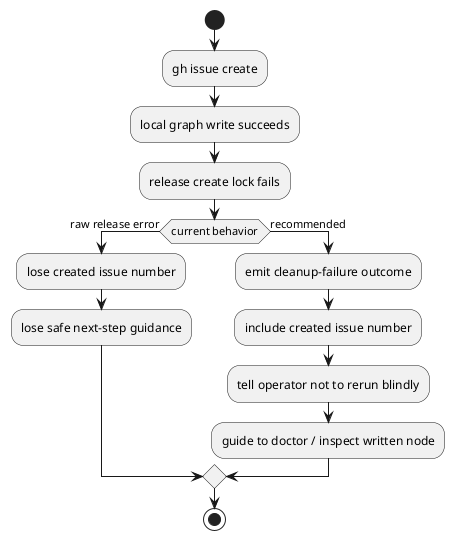

# 結論

- 妥当性: `valid`
- 修正要否: `required`
- 重要度: `merge-blocker 寄り`
- 推奨案:
  - `gh issue create` 済みかつ local write 済みの `cleanup failure` を、通常の post-create local failure とは別 failure class として扱う

# 事実

- 最新 review comment は `2973591749`
- 対象は [create_node.py](/srv/mount/spec-dock/src/spec_dock/assets/spec_dock/scripts/spec_dock_runtime/application/create_node.py)
- 現状の `create_node_core()` は:
  - `gh issue create` 後の `lock acquire failure` と `body failure` は `_wrap_post_github_create_local_failure(...)` で guidance を補う
  - しかし `body_error is None` かつ `release_error` のみ発生した場合は、生の `release_error` をそのまま投げる
- その結果:
  - `created_github_issue_number`
  - 作成済み node の存在可能性
  - rerun 禁止 / doctor 優先の guidance
  が失われる

# 問題の本質

- 指摘の wording は「orphaned-issue recovery の欠落」だが、より正確には
  - `gh issue create` 済み
  - local write 済み
  - cleanup のみ失敗
  という outcome を独立 failure class として表現できていない点が本質
- この枝は retry を促すと危険で、単純な rerun hint 追加では不十分

# 修正案比較

- 案A:
  - `release_error` にも既存 `_wrap_post_github_create_local_failure()` をそのまま適用する
  - 却下理由:
    - remote-only failure 向け rerun hint を committed-local failure に誤適用しうる
- 案B:
  - cleanup failure 専用の message/outcome builder を追加し、`created_github_issue_number` と node 作成済み可能性を含める
  - 利点:
    - rerun 禁止と doctor 優先 guidance を明示できる
    - post-create failure matrix を outcome ベースで整理しやすい
- 案C:
  - `_release_create_lock()` 自体に GitHub context を渡して全 message を吸収させる
  - 懸念:
    - infra/helper が use-case 文脈を抱え込み、責務が崩れる

# 推奨

- 案Bを採用する
- 最低限、次を満たす
  - non-zero exit は維持
  - `created_github_issue_number` を message に残す
  - 「create は成功している可能性が高い。再実行するな。まず doctor と作成済み node を確認せよ」と案内する
  - provider / checked-in runtime parity を同時に修正する

# 必要テスト

- provider:
  - `gh create + local write success + release failure` で cleanup-failure guidance が出る
  - rerun hint ではなく doctor-first guidance になる
- checked-in parity:
  - 同枝で provider と同じ message class / evidence surface を返す

# PlantUML

