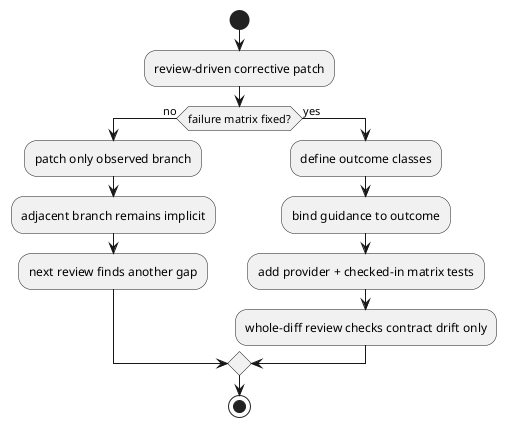

# 結論

- 潜在的な問題は `review を受けるたびに新しい欠陥が偶発的に見つかる` こと自体ではなく、`failure contract が outcome matrix で閉じていないまま、枝ごとの corrective patch を積み増してきた` 点にある
- 今回の latest review `R30` は個別の release-failure bug であると同時に、その根本問題を示す代表例である
- 最も費用対効果が高い根本対処は、`create/post-create failure` を例外発生箇所ではなく `outcome class` 単位で集約し、provider / checked-in runtime parity と test matrix を同時に固定することである

# 最新レビューの位置づけ

- latest inline comment `2973591749` は妥当である
- 指摘内容:
  - `gh issue create` 済み
  - local write 済み
  - `_release_create_lock()` だけ失敗
  の枝で、生の `release_error` だけが表面化し、`created_github_issue_number` と安全な recovery guidance を失う
- これは単独 bug だが、同時に `post-create failure contract が state machine として閉じていない` ことの症状でもある

# 潜在的な問題

## P1. create / recovery contract が branch patch の集合になっている

- individual fix は入っているが、`pre-GH fail`、`post-GH remote-only fail`、`local write fail`、`local write success + cleanup fail` の全枝を 1 つの contract として扱えていない
- そのため、1 枝を直すたびに隣接枝や合成枝が review で発見される

## P2. guidance 生成が outcome 中心ではなく exception-point 中心

- guidance message は「どこで失敗したか」に依存しており、「何が既に成功しているか」に依存していない
- その結果、`created_github_issue_number`、`kind`、`title`、`parent selector`、`local write 済みか` といった復旧に必要な文脈が枝によって脱落する
- `R30` は `release_error` が raw で露出し、`remote-only/local-committed` の区別が崩れる典型

## P3. provider runtime と checked-in runtime の parity drift

- `src/spec_dock/assets/spec_dock/...` と `spec-dock/scripts/...` の二重面があり、片側だけ補修されると review で再び gap が見つかる
- issue-28 では repo-aware uniqueness、deps resolver、doctor surface、create guidance など複数回この drift が再発した

## P4. exit criteria が representative regression 止まり

- targeted regression は多数追加されているが、`combined fault branch` と `terminal failure guidance branch` が完了条件として十分に matrix 化されていない
- その結果、whole-diff review のたびに未被覆枝が露出しやすい

# なぜ individual fix を積んでも新しい欠陥が出るのか

- create/import/GitHub-linkage の corrective patch が、共通 contract の再設計より先に review 駆動で積み上がった
- 1 つの差分で閉じたつもりでも、隣接する failure branch、checked-in parity、message/guidance surface、test exit criteria のどこかが取りこぼされる
- つまり問題は「レビューが厳しすぎる」ことではなく、「修正単位が state space より細かすぎる」ことにある

# 推奨する根本対処

## 推奨案

- `create/post-create` に限定した小さな outcome matrix を design/plan 上の正本として追加する
- 最低でも次の class を明示的に分ける
  - `pre_github_fail`
  - `post_github_remote_only_fail`
  - `post_github_local_write_fail`
  - `post_github_local_write_success_cleanup_fail`
  - `post_github_body_and_cleanup_fail`
- guidance は exception site ではなく、この outcome class から生成する

## なぜこの案が最善か

- 既存 layered architecture を崩さず、`create_node` 周辺に限定して効く
- message/guidance/test の責務を 1 箇所へ寄せられる
- provider / checked-in parity を同じ matrix で要求しやすい
- review で見つかる新規 defect を「未定義枝」か「実装逸脱」かで判定しやすくなる

# exit criteria の再定義案

- provider-side で create outcome matrix の全 5 class に regression test がある
- checked-in executable path でも同じ 5 class の parity test がある
- `gh issue create` 後の全 failure branch で、raw `release_error` 単独露出が起きない
- guidance は少なくとも `remote-only` と `local-committed` を区別できる
- final whole-diff review では `new review` が新しい未定義 branch を見つけず、既知 contract からの逸脱のみを評価対象にできる

# 人間向けの判断ポイント

- これは `単発の bug 修正不足` というより、`failure contract の収束条件を先に固定しないまま corrective loop を回してきた` ことが原因
- したがって、R30 の修正そのものは必要だが、それだけでは loop 停止の保証にならない
- 次の corrective unit では、個票修正と同時に `outcome matrix` と `exit criteria` を文書へ固定してから実装に入るのが適切

# PlantUML

